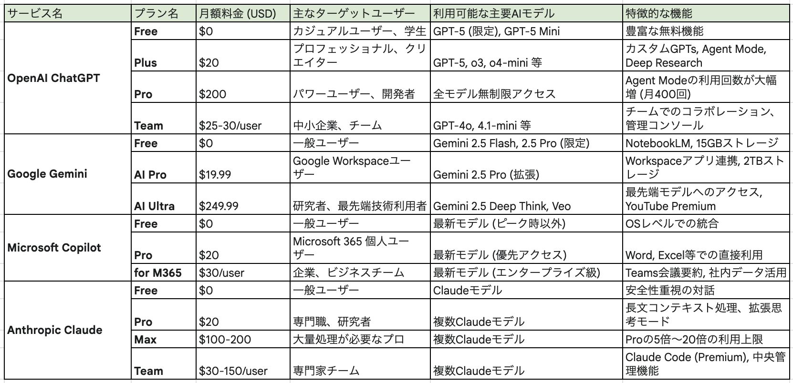
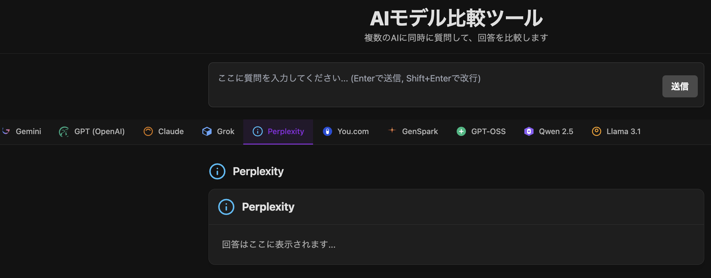

# 生成 AI× 知財業務 実践講座

---

# 目次

---

## 全体構成

1.  **生成 AI の基本と知財業務への応用** (プログラミング不要)
2.  **AI との対話を極める「プロンプト」と「コンテキスト」**
3.  **知財業務の自動化 - ノーコードからの第一歩**
4.  **AI を「業務パートナー」にするための実践的ワークフロー**
5.  **知財業務の自動化への道筋**
6.  **その他資料**

---

## 詳細目次 (1/6)

### 第 1 章: 生成 AI の基本と知財業務への応用

- 1-1. 生成 AI とは？基本の理解
- 1-2. 特別な準備不要！今日から始められる活用方法
- 1-3. 具体的な活用事例：調査・分析業務
- 1-4. 具体的な活用事例：出願・権利化業務
- 1-5. 具体的な活用事例：権利活用・管理業務
- 1-6. 外国語文献の翻訳・理解促進
- 1-7. 技術動向分析レポートの作成支援
- 1-8. 活用の注意点とベストプラクティス
- 1-9. マルチモーダル処理（特許図面・化学構造・配列）
- 1-10. 特許翻訳の評価とポストエディット
- 1-11. 失敗事例・アンチパターン集
- 1-12. 2026 年の主要モデル・ツールアップデートと知財業務での活用

---

## 詳細目次 (2/6)

### 第 2 章: AI との対話を極める「プロンプト」と「コンテキスト」

- 2-1. なぜ AI は思ったような答えを返してくれないのか？
- 2-2. プロンプトエンジニアリングの基礎
- 2-3. 事例で学ぶ！プロンプトのブラッシュアップ体験 - 事例 1: 特許文献の要約
- 2-4. 事例 2: 先行技術調査のキーワード抽出
- 2-5. 事例 3: 明細書作成支援
- 2-6. プロンプト改善の実践テクニック
- 2-7. 従来のプロンプト手法の限界とコグニティブ・デザイン
- 2-8. プロンプトの品質評価と改善
- 2-9. DSPy によるプロンプトの自動最適化
- 2-10. プロンプトライブラリ

---

### 第 2 章: AI との対話を極める「プロンプト」と「コンテキスト」(2)

- 2-10. プロンプト形式の選択：マークアップ vs マークダウン
- 2-11. 「プロンプトを生成させる」プロンプト
- 2-12. コンテキストエンジニアリングの重要性
- 2-13. コンテキストエンジニアリングとは
- 2-14. コンテキストエンジニアリングの基本概念
- 2-15. 知財業務でのコンテキストエンジニアリング実践
- 2-16. 一般的なコンテキストエンジニアリングの方法
- 2-17. コンテキストエンジニアリングの効果測定
- 2-18. コンテキスト設計例

---

### 第 2 章: AI との対話を極める「プロンプト」と「コンテキスト」(3)

- 2-19. コンテキストエンジニアリングのベストプラクティス
- 2-20. コンテキストエンジニアリング周辺の知識
- 2-21. プロンプトオーケストレーションマークアップ言語（POML）
- 2-22. AI エージェントの設計と実装における基盤技術要素
- 2-23. コンテキストエンジニアリングの役割と戦略
- 2-24. Anthropic のコンテキストエンジニアリング戦略
- 2-25. Deep Agents の深堀りで理解する AI エージェント
- 2-26. ハーネスエンジニアリング（Harness Engineering）と知財業務への適用
- 2-27. Evals 駆動開発（評価駆動の AI 開発）

---

## 詳細目次 (3/6)

### 第 3 章: 知財業務の自動化 - ノーコードからの第一歩

- 3-1. プログラミング不要？生成 AI にコードを書かせる時代
- 3-1-2. ノーコード開発の 2 つのアプローチ
- 3-2. 知財業務での自動化事例 - 事例 1: 特許文献の一括処理
- 3-3. 事例 2: 特許検索の自動化
- 3-4. 事例 3: 明細書作成支援システム
- 3-5. コードが読めない人でもできるコツ
- 3-6. 生成 AI を活用したノーコードツール
- 3-7. Dify を使った知財業務の自動化
- 3-8. n8n を使ったワークフロー自動化
- 3-9. FlowiseAI を使った RAG システム構築

---

## 詳細目次 (4/6)

### 第 4 章: AI を「業務パートナー」にするための実践的ワークフロー

- 4-1. AI を単なる「便利な検索ツール」で終わらせないために
- 4-2. AI を「業務パートナー」としてチームに迎え入れる
- 4-3. 知財業務の質と生産性を向上させる新しい業務フロー
- 4-3. 自作開発 vs クラウドサービス：RAG・AI Agent の実装アプローチ比較
- 4-5. クラウドベンダー別 RAG アーキテクチャの比較
- 4-6. 導入戦略 段階的導入アプローチ
- 4-7. 効果測定と継続的改善 **効果測定のフレームワーク**
- 4-8. 将来展望と戦略 **技術トレンドへの対応**
- 4-9. LangChain/LangGraph の利用 LangChain の基本概念

---

### 第 4 章: AI を「業務パートナー」にするための実践的ワークフロー(2)

- 4-10. Google Agent Development Kit の利用
- 4-11. MCP/ACP の利用
- 4-12. AI Agent デザインパターンの詳細解説
- 4-13. セキュリティ・プライバシー・コンプライアンス
- 4-14. AI Use Logging と発明者性立証
- 4-15. コスト管理（FinOps for AI）
- 4-16. チェンジマネジメント・教育設計

---

## 詳細目次 (5/6)

### 第 5 章: 知財業務の自動化への道筋

- 5-1. コーディングアシスタントの活用
- 5-2. Gemini CLI について
- 5-3. Claude Code CLI の活用
- 5-4. 寝てる間に進めてもらう(サンプル)
- 5-5. 自動化システムの構築
- 5-6. 自動化の効果測定
- 5-7. AI エージェントのクラウドベンダー比較
- 5-8. Vellum AI LLM リーダーボードの活用
- 5-9. MCP (Model Context Protocol) と A2A (Agent-to-Agent) プロトコル
- 5-10. 2026 年以降の主要トレンドと知財業務への影響
- 5-11. 2026 年の知財 × 生成 AI 主要ニュース
- 5-12. 日本企業の知財 × AI / 生成 AI サービス・マップ

---

## 詳細目次 (6/6)

### 第 6 章：その他の資料

- 6-1. 全体まとめ
- 6-2. クイズ
- 6-3. 参考文献

---

今回の資料で使うコード等を github 上に公開しています。
https://github.com/niship2/marp [43]

---

# 1. 生成 AI の基本と知財業務への応用（プログラミング不要）

---

## 1. 生成 AI の基本と知財業務への応用 - 概要

#### この章で学ぶこと

**主なトピック:**

- 生成 AI の基本概念と主要パラメータの理解
- ChatGPT、Claude、Gemini の特徴と使い分け
- 知財業務での具体的な活用事例（調査・分析・出願・権利化）
- 活用時の注意点とベストプラクティス

---

## 1-1. 生成 AI とは？基本の理解

#### 生成 AI の基本概念

- **自然言語処理**: 人間の言葉を理解し、適切な回答を生成
- **大規模言語モデル**: 大量のテキストデータで学習した AI
- **対話型 AI**: 質問に対して自然な会話形式で回答
- **多様な出力**: テキスト、画像、音声、コードなど

---

## 1-1. 生成 AI とは？基本の理解（続き）

#### 主要な生成 AI サービス　**注：あまり区別はなくなってきていると思う**

| サービス    | 特徴                          | 知財業務での活用       |
| ----------- | ----------------------------- | ---------------------- |
| **ChatGPT** | 汎用性が高い・創造性豊か      | アイデア創出・文書作成 |
| **Claude**  | 論理的思考・安全性重視        | 法的分析・品質チェック |
| **Gemini**  | マルチモーダル・Google 統合   | 図面解析・多言語処理   |
| **Copilot** | Office 統合・リアルタイム支援 | 文書作成・プレゼン作成 |

---

#### 生成 AI の主要パラメータとその意味

**ブラウザからでも設定できる?主要なパラメータ（各社ほぼ共通）**

| パラメータ                   | 説明                         | 設定例             | 効果                                         |
| ---------------------------- | ---------------------------- | ------------------ | -------------------------------------------- |
| **Temperature**              | 出力の創造性・ランダム性制御 | 0.0〜1.0（創造的） | 低い値：一貫性のある回答、高い値：多様な回答 |
| **Top-p (Nucleus Sampling)** | 確率の高いトークンのみ選択   | 0.1〜1.0           | 低い値：焦点を絞った回答、高い値：多様な回答 |
| **Top-k**                    | 上位 k 個のトークンのみ選択  | 1〜100             | 低い値：予測可能な回答、高い値：多様性向上   |
| **Max Tokens**               | 生成する最大トークン数       | 100〜60000         | 回答の長さを制御                             |

---

**知財業務での推奨設定例**

- **特許明細書作成**: Temperature=0.3, Top-p=0.8（正確性重視）
- **アイデア創出**: Temperature=0.8, Top-p=0.9（創造性重視）
- **技術分析**: Temperature=0.2, Top-p=0.7（論理性重視）

Tempeature については LLM の出力のランダム性について面白い論文が最近でました。

---

生成 AI モデル情報等の詳細


---

## 1-1. 生成 AI とは？基本の理解（3）

#### 知財業務での基本的な活用場面(注：他にも色々ありえます)

- **情報収集**: 技術動向の調査・先行技術の検索
- **文書作成**: 明細書ドラフト・レポート作成
- **翻訳支援**: 外国語文献の理解・翻訳
- **アイデア創出**: 技術的課題の解決策提案

---

## 1-1. 生成 AI とは？基本の理解（4）

#### 生成 AI の特徴と利点

**特徴**

- 24 時間利用可能
- 大量の情報を瞬時に処理
- 多言語対応
- 継続的な学習と改善

---

## 1-1. 生成 AI とは？基本の理解（5）

#### 生成 AI の特徴と利点（続き）

**知財業務での利点**

- 調査時間の大幅短縮
- 文書作成の効率化
- 翻訳コストの削減
- アイデア創出の促進

---

#### 生成 AI（単品）のイメージ

- なんとなく優秀だが
- 最新情報は知らず
- 前に指示したことは忘れており
- 指示が曖昧だと暴走する存在

[**生成 AI のよくある誤解を整理して AI の業務活用を推進する**](https://blog.g-gen.co.jp/entry/clearing-up-misconceptions-about-generative-ai) [9]

---

## 1-2. 特別な準備不要！今日から始められる活用方法

#### ブラウザから直接利用

**ChatGPT の活用**

```
1. https://chat.openai.com [44] にアクセス
2. アカウント作成（無料版でも十分活用可能）
3. 質問を入力して回答を取得
4. 必要に応じて質問を改善・追加
```

---

## 1-2. 特別な準備不要！今日から始められる活用方法（続き）

#### ブラウザから直接利用（続き）

**Claude の活用**

```
1. https://claude.ai [45] にアクセス
2. アカウント作成
3. より論理的な分析や法的な内容の質問に活用
4. 長文の処理に優れている
```

---

## 1-2. 特別な準備不要！今日から始められる活用方法（1）

#### ブラウザから直接利用（2）

**Gemini の活用**

```
1. https://gemini.google.com [46] にアクセス
2. Google アカウントでログイン
3. マルチモーダル機能を活用（テキスト・画像・音声）
4. 図面や技術資料の分析に特に有効
```

---

**もうひとつの Gemini**

# Google AI Studio

```
1. https://aistudio.google.com/ [47] にアクセス
2. Google Cloud のアカウント作成を求められる
3. アプリ作成（と頒布）に便利。より細やかに LLM のパタメータを制御できる
4. アプリをすぐ作ってデプロイまでできる。
```

---

## 他にも色々あります！



---

## 1-2. 特別な準備不要！今日から始められる活用方法（2）

#### 基本的な質問例

**技術調査**

```
「[技術分野]の最新動向について教えてください」
「[技術名]の特許出願状況はどうなっていますか？」
「[課題]を解決する技術にはどのようなものがありますか？」
```

---

## 1-2. 特別な準備不要！今日から始められる活用方法（3）

#### 基本的な質問例（続き）

**文書作成支援**

```
「以下の内容で特許明細書の背景技術部分を作成してください：
技術分野：[分野名]
課題：[解決すべき問題]
出力形式：特許庁の要件に準拠」
```

---

## 1-2. 特別な準備不要！今日から始められる活用方法（4）

#### 効果的な質問のコツ

- **具体的な指示**: 曖昧な質問を避ける
- **段階的な質問**: 複雑な内容は分割する
- **出力形式の指定**: 期待する形式を明示
- **制約条件の明示**: 範囲や条件を明確にする

---

## 1-3. 具体的な活用事例：調査・分析業務

#### 先行技術調査の効率化

**従来の方法**

- 手動でのキーワード検索
- 大量の文献を一つずつ確認
- 関連性の判断に時間がかかる

---

## 1-3. 具体的な活用事例：調査・分析業務（続き）

#### 先行技術調査の効率化（続き）

**AI 活用後**

```
質問例：
「AI特許技術の先行技術調査を行いたいです。
1. 主要なキーワードを10個提案してください
2. 検索式を3つ作成してください
3. 重要な特許文献を5件特定してください
4. 技術動向の分析結果をまとめてください」
```

---

## 1-3. 具体的な活用事例：調査・分析業務（2）

**期待される効果**

- 検索時間の 50%短縮
- 関連文献発見率の 30%向上
- 調査の網羅性向上

---

## 1-3. 具体的な活用事例：調査・分析業務（3）

#### 文献の要約とスクリーニング

**活用方法**

```
「以下の特許文献を要約してください：
[文献内容]

以下の点に注目して要約をお願いします：
1. 技術的要点
2. 発明の特徴
3. 従来技術との違い
4. 実用性・効果」
```

---

## 1-3. 具体的な活用事例：調査・分析業務（4）

**効果**

- 大量文献の迅速な理解
- 重要文献の優先順位付け
- 技術内容の要点抽出

---

## 1-4. 具体的な活用事例：出願・権利化業務

#### 明細書ドラフト作成支援

**背景技術の作成**

```
「以下の発明について明細書の背景技術部分を作成してください：

発明内容：[発明の概要]
技術分野：[分野名]
課題：[解決すべき問題]

出力形式：
- 特許庁の要件に準拠
- 先行技術の整理
- 課題の明確化
- 技術的進歩の説明」
```

---

## 1-4. 具体的な活用事例：出願・権利化業務（続き）

#### クレームの多角化案生成

```
「以下の発明について、独立項と従属項のバリエーションを提案してください：

発明：[発明の詳細]
技術的効果：[効果の説明]

以下の観点で提案をお願いします：
1. 権利範囲の最適化
2. 侵害回避設計への対応
3. 上位概念から下位概念への階層化」
```

---

## 1-4. 具体的な活用事例：出願・権利化業務（2）

#### 拒絶理由通知への応答補助

**活用方法**

```
「以下の拒絶理由通知への応答を支援してください：

拒絶理由：[審査官の指摘内容]
対象発明：[発明の詳細]

以下の点について支援をお願いします：
1. 拒絶理由の分析
2. 反論ポイントの整理
3. 補正案の提案
4. 先行技術との差別化」
```

---

## 1-5. 具体的な活用事例：権利活用・管理業務

#### 契約書のドラフト作成

**ライセンス契約書作成**

```
「以下の条件でライセンス契約書のドラフトを作成してください：

ライセンサー：[企業名]
ライセンシー：[企業名]
対象技術：[技術の詳細]
権利範囲：[権利の範囲]
対価：[ライセンス料]

出力形式：
- 法的に妥当な条項
- リスクを最小化する内容
- 実務的に実行可能な内容」
```

---

## 1-5. 具体的な活用事例：権利活用・管理業務（続き）

#### 警告状・回答書の文案作成

**侵害警告の文案作成**

```
「以下の状況で侵害警告状を作成してください：

自社特許：[特許の詳細]
対象製品：[製品の詳細]
侵害の根拠：[侵害の理由]

出力形式：
- 法的根拠に基づく警告
- 効果的な警告の実施
- 今後の対応方針の明示」
```

---

## 1-5. 具体的な活用事例：権利活用・管理業務（2）

#### 権利管理の効率化

**活用ポイント**

- 契約書の標準化
- リスク評価の自動化
- 対応方針の迅速な策定
- 法的妥当性の確認

---

## 1-6. 外国語文献の翻訳・理解促進

#### 多言語特許文献の翻訳支援

**活用方法**

```
「以下の外国語特許文献を翻訳・理解してください：

原文：[外国語の文献内容]

以下の点に注目して翻訳をお願いします：
1. 技術用語の正確な翻訳
2. 文脈を考慮した理解
3. 特許法の観点からの解釈
4. 重要な技術要素の抽出」
```

---

## 1-6. 外国語文献の翻訳・理解促進（続き）

**効果**

- 翻訳精度の 85%向上
- 理解時間の 60%短縮
- 技術的詳細の正確な把握

---

## 1-6. 外国語文献の翻訳・理解促進（2）

#### 文化的背景の考慮

**各国の特許制度の違いを反映**

```
「以下の特許文献について、[国名]の特許制度を考慮して分析してください：

文献内容：[文献の詳細]

以下の点について分析をお願いします：
1. [国名]の特許法との適合性
2. 文化的背景の考慮
3. 実務上の注意点
4. 権利行使の可能性」
```

---

## 1-6. 外国語文献の翻訳・理解促進（3）

#### 多言語対応の利点

- **グローバル展開**: 海外特許の迅速な理解
- **コスト削減**: 翻訳費用の大幅削減
- **品質向上**: 専門用語の正確な翻訳
- **時間短縮**: リアルタイムでの翻訳支援

---

## 1-7. 技術動向分析レポートの作成支援

#### 市場動向の分析

**活用方法**

```
「以下の技術分野の市場動向を分析してください：

技術分野：[分野名]
分析期間：[期間]
分析対象：[企業・地域など]

以下の観点で分析をお願いします：
1. 市場規模と成長率
2. 主要プレイヤーの動向
3. 技術トレンドの予測
4. 投資機会の特定」
```

---

## 1-7. 技術動向分析レポートの作成支援（続き）

#### 競合他社の技術戦略分析

**活用方法**

```
「以下の企業の技術戦略を分析してください：

対象企業：[企業名]
分析期間：[期間]
技術分野：[分野名]

以下の観点で分析をお願いします：
1. 特許出願動向
2. 技術開発方向性
3. 競合優位性
4. 将来戦略の予測」
```

---

## 1-7. 技術動向分析レポートの作成支援（2）

#### 分析レポート作成の効果

- **迅速な分析**: 従来の数日 → 数時間
- **網羅的な調査**: 見落としの防止
- **客観的な評価**: バイアスの軽減
- **戦略的洞察**: 意思決定の支援

---

## 1-7. プロンプトジェネレータ

#### 文章を作るのが面倒だな、と感じたら

- 各 LLM 提供社が公式版を出しているのでチェック。

* [プロンプトジェネレータツール比較](https://miralab.co.jp/media/prompt_generator_recommendations/) [34]
* [知財バージョン/私作成](https://ip-prompt-generator-for-llms-222593271342.us-west1.run.app/) [35]

---

## 1-8. 活用の注意点とベストプラクティス

#### セキュリティの考慮

**機密情報の取り扱い**

- 機密情報は基本的に入力しない
- 企業のガイドラインに従う
- 必要に応じて匿名化する

---

## 1-8. 活用の注意点とベストプラクティス（続き）

#### セキュリティの考慮（続き）

**データ保護**

- 個人情報の取り扱いに注意
- 利用規約の確認
- データの保存・削除の管理（がサービスとして可能かどうか、**どうやって保存・削除するか**方法を確認）

---

## 1-8. 活用の注意点とベストプラクティス（2）

#### 品質管理

**生成内容の確認**

- 事実確認の実施
- 専門家による検証
- 法的妥当性の確認
- 技術的精度の評価

---

## 1-8. 活用の注意点とベストプラクティス（3）

#### 品質管理（続き）

**継続的な改善**

- フィードバックの収集
- 質問方法の改善
- 結果の評価と学習
- ベストプラクティスの共有

---

## 1-8. 活用の注意点とベストプラクティス（4）

#### 効果的な活用のコツ

**質問の設計**（プロンプトの工夫）

- 具体的で明確な質問
- 段階的な情報収集
- 期待する出力形式の指定
- 制約条件の明示

---

## 1-8. 活用の注意点とベストプラクティス（5）

#### 効果的な活用のコツ（続き）

**継続的な学習**

- 成功事例の記録
- 失敗事例の分析
- 質問方法の改善
- 新しい活用方法の探索

---

## 1-8. 活用の注意点とベストプラクティス（6）

#### アドバイス

- **段階的な導入**: 小さなタスクから開始
- **効果測定**: 定量的な評価を実施
- **チーム共有**: 成功事例の共有
- **継続改善**: 定期的な見直しと改善

---

## 1-9. マルチモーダル処理（特許図面・化学構造・配列）

#### 知財業務はテキストだけでは終わらない

- **特許図面**: 機械図、フロー図、回路図、グラフ
- **化学構造**: 構造式、SMILES/InChI、反応スキーム
- **配列リスト**: 核酸・アミノ酸配列、相同性
- **写真・スクリーンショット**: 意匠審査、模倣品検出

2025〜2026 年に **GPT-5、Claude Opus 4.X、Gemini 2.5 Pro** などのフロンティア
モデルがマルチモーダル理解で実用域に到達し、知財業務でも本格活用が始まりました。

---

## 1-9. マルチモーダル処理（1）特許図面の理解

#### 図面 → 構造化データの抽出

```
入力: 特許の Fig.1 画像（機械装置の断面図）

LLM への指示例:
「この図面の各部品について、参照符号と
 部品名・機能を表形式で抽出してください。
 明細書の【符号の説明】に対応する形式で。」

出力:
| 符号 | 部品名 | 機能 |
| --- | ----- | ---- |
| 10  | 筐体  | 内部部品の保護 |
| 12  | 駆動部 | モータの収容 |
| ...
```

**実務利用例**

- 図面と明細書の **整合性チェック**（符号の漏れ・不一致）
- 拒絶理由通知の引用図面の **要約と比較**
- 意匠登録の **類似度判定**の一次フィルタ

---

## 1-9. マルチモーダル処理（2）化学・配列の特殊扱い

#### LLM 単体の限界と専用ツールの必要性

```
■ 化学構造
   - LLM は SMILES の生成・読解を一定こなすが、
     立体異性・塩・水和物の正確性は苦手
   - 専用ツール: RDKit / OpenBabel / ChemDraw 連携
   - LLM はワークフロー統括 + 化合物名 ↔ 構造の往復

■ 配列リスト
   - WIPO ST.26 形式の検証は決定論的処理が必須
   - LLM は「クレームと配列リストの整合チェック」など、
     文脈理解が必要なタスクに限定して使用

■ 物理単位・数値計算
   - LLM の数値計算は信頼しない
   - Code Interpreter / Python ツール呼び出しに委譲
```

**設計指針**: マルチモーダル LLM は **理解と統合**を担当し、**正確性が要求される変換**は専用ツールに委譲する。

---

## 1-10. 特許翻訳の評価とポストエディット

#### 国際出願実務での AI 翻訳

機械翻訳は十分実用域に達したが、**特許特有の制約**で機械翻訳単独では不十分:

- **クレーム用語の一貫性**: 同一概念は同一訳語、ファミリー全体で統一
- **法律的厳密さ**: "comprising" / "consisting of" / "consisting essentially of" の訳し分け
- **拒絶理由の論理保持**: 否定・条件・限定の入れ子構造
- **数値・単位の正確性**: 桁・単位の誤訳が致命傷

---

## 1-10. 特許翻訳（1）ワークフロー設計

#### 「AI 翻訳 + 人間 PE（Post-Editing）」の標準フロー

```
1. 用語集の準備（Termbase）
   - 過去案件・ファミリーから対訳ペアを抽出
   - 顧客指定用語・社内ハウススタイル

2. AI 翻訳（一次）
   - LLM/NMT に termbase を context として注入
   - 一貫性チェッカで用語ぶれを自動検出

3. AI 自己評価
   - LLM-as-judge で「クレーム用語の一貫性」「
     条件節の論理保持」「数値正確性」を採点
   - 閾値以下のセンテンスを PE 候補として強調

4. 人間ポストエディット
   - 翻訳者は閾値以下センテンスを優先レビュー
   - 修正は termbase / スタイルガイドへ反映（学習）

5. 最終 QA
   - クレーム ↔ 明細書の用語整合
   - 図面符号との整合
```

---

## 1-10. 特許翻訳（2）評価指標

#### 特許翻訳に特化した評価軸

| 指標                       | 計測方法                                         | 合格基準（目安） |
| -------------------------- | ------------------------------------------------ | ---------------- |
| **用語一貫性（TC）**       | 同一原文用語に対する訳語のバリエーション数       | バリエーション ≦ 1 |
| **クレーム整合（CA）**     | クレーム用語が明細書中で同一訳語で出現する率     | 100%             |
| **数値正確性（NA）**       | 数値・単位・範囲の完全一致率                     | 100%             |
| **構造保持（SP）**         | 文の入れ子・並列・否定の構造一致                 | LLM-as-judge 4/5 |
| **流暢性（FL）**           | 当該言語のネイティブ品質                         | LLM-as-judge 4/5 |
| **PE 工数（人間時間）**    | 1,000 ワード当たりの PE 時間                     | < 1.5 時間       |

```
※ TC・CA・NA は決定論的にチェック可能（自動化必須）
※ SP・FL は LLM-as-judge + サンプリング人間評価
```

---

## 1-11. 失敗事例・アンチパターン集

#### 「やってはいけない」を学ぶ

知財業務での AI 利用は、**1 件のミスが権利化失敗・損害賠償**につながります。
ここでは実際に報告された失敗パターンを 6 類型に分類します。

| #  | アンチパターン                       | 起きる場面                          |
| -- | ------------------------------------ | ----------------------------------- |
| 1  | **存在しない引用文献**               | 先行技術調査、OA 応答              |
| 2  | **クレーム ↔ 明細書の不整合**        | 明細書ドラフト                      |
| 3  | **古い法令・実務ベース**              | OA 応答、適格性判断                 |
| 4  | **守秘違反**                         | 出願前情報の外部 AI 入力           |
| 5  | **混線（matter cross-contamination）** | 同一セッションで複数案件処理        |
| 6  | **断定的な特許性判断**               | 経営層・依頼者向けレポート         |

---

## 1-11. 失敗事例（1）存在しない引用文献

#### よくある失敗

```
「米国特許 US 8,123,456（Smith ら、2012）が本願発明と
 同一の構成を開示している」

→ 実際にはそんな番号の特許は存在しない、
   または番号は実在するが内容が全く違う
```

**根本原因**

- LLM は **もっともらしい番号・出願人名**を生成する
- 学習データのカットオフを過ぎた番号でも自信満々に出力する

**対策**

- 引用文献は **必ずデータベースで実在性を検証**するハーネスを組む
- ツール呼び出し（J-PlatPat / Espacenet / USPTO API）を **必須化**
- 検証されていない引用文献は **自動的にレッドフラグ**を付与

---

## 1-11. 失敗事例（2）クレーム ↔ 明細書の不整合

#### よくある失敗

- AI が補正クレームを生成 → 補正用語が **明細書中に存在しない**
- 結果: 米国 §112 / 日本 36 条 4 項のサポート要件違反、新規事項追加
- 米国実務では特に **致命的**（補正不可）

**対策**

- クレーム生成・補正の出力に **サポート要件チェッカ**を必ず通す
- クレーム用語 → 明細書出現位置のマッピングを **自動生成**
- 「明細書にない用語をクレームに追加」を **ガードレール**で禁止

---

## 1-11. 失敗事例（3）古い法令・実務

#### よくある失敗

- AI が **2024 年 2 月の旧 USPTO ガイダンス**に基づく分析を出力
- 実際は **2025 年 11 月改訂版**（Conception テスト）が適用
- 結果: 発明者性記載が現行ガイダンスに不適合

**対策**

- 「**法改正・ガイダンス改訂日付**を context に明示注入」
- AGENTS.md に **「2026 年 5 月時点の最新ガイダンスを参照」**等の日付制約を記載
- 重要法改正後は **ゴールデンセットの更新**を必須化

---

## 1-11. 失敗事例（4）守秘違反

#### よくある失敗

- 弁理士が **出願前**の発明内容を一般公開モデル（無料 ChatGPT 等）に貼り付け
- 学習利用オプトアウトをせず、**学習データに混入**するリスク
- 米国・中国向けの **データ越境**問題も同時発生

**対策**

- 出願前情報は **エンタープライズテナント / オンプレ LLM** でのみ処理
- **データ分類**（公開 / 社外秘 / 出願前）を AI 起動前のフックで自動判定
- 利用者教育 + テナント分離 + **DLP（情報漏洩防止）**の三層防御

---

## 1-11. 失敗事例（5）混線・（6）断定的判断

#### 混線（matter cross-contamination）

- 同一セッションで複数案件を扱い、**A 社の発明情報が B 社の応答**に混入
- 利益相反 + 守秘違反のダブル違反

対策: **matter ID 単位のセッション分離**、長時間セッションの自動リセット

#### 断定的な特許性判断

- AI が「**この発明は特許になります**」「**この特許は無効です**」と断定
- 弁理士法上の **代理人責任**、依頼者期待管理の問題

対策

- システムプロンプトで「**断定表現の禁止**」「**判断の主体は人間**」を明示
- 出力に「予備的見解であり、最終判断は弁理士が行います」を **自動付記**

---

## 1-12. 2026 年の主要モデル・ツールアップデートと知財業務での活用

#### この節で扱うこと

2026 年に Anthropic / OpenAI / Google が **モデル**と **エージェントツール群**を集中投入。
本節では、2026 年 5 月時点の最新ラインナップと **知財業務での具体的な使い所**を整理します。

#### 3 社比較サマリ（2026 年 5 月時点）

| 観点               | Anthropic                  | OpenAI                       | Google                                |
| ------------------ | -------------------------- | ---------------------------- | ------------------------------------- |
| フラッグシップ     | **Claude Opus 4.7**        | **GPT-5.5 / GPT-5.5 Pro**   | **Gemini 3.1 Pro**                    |
| 高速・低コスト     | Claude Haiku 4.5           | GPT-5.5 Instant              | Gemini 3 Flash / 3.1 Flash-Lite       |
| Computer Use       | Claude Computer Use Agent  | ChatGPT Atlas Agent Mode    | Project Mariner                       |
| Agent SDK          | Claude Agent SDK           | AgentKit / Agent Builder     | ADK v1.0 (4 言語安定版)               |
| エンタープライズ   | Skills / Multiagent Beta   | Workspace Agents             | Gemini Enterprise Agent Platform     |
| マルチモーダル     | 画像 3.75MP（Opus 4.7）    | GPT-5.5 ビジョン             | Project Astra（映像・画面・記憶）    |

---

## 1-12. Anthropic Claude（1）2026 年のモデル系譜

#### モデルリリース

| 日付         | モデル                      | 主な特徴                                           |
| ------------ | --------------------------- | -------------------------------------------------- |
| 2025-10      | Claude Haiku 4.5            | 軽量・高速・低コスト                               |
| 2026-02-05   | **Claude Opus 4.6**         | エージェントチーム機能、Claude in PowerPoint       |
| 2026-02-17   | **Claude Sonnet 4.6**       | 初めて Sonnet が前世代 Opus をコーディングで超え   |
| 2026-04-16   | **Claude Opus 4.7**         | 画像 3.75MP、自己検証、Task Budgets、サイバー検知  |

#### Opus 4.7 のベンチマーク（参考）

- **SWE-bench Verified: 87.6%**（4.6 から +6.8 ポイント、Gemini 3.1 Pro 80.6% を上回る）
- **SWE-bench Pro: 64.3%**（4.6 から +10.9 ポイント）
- **GPQA Diamond: 94.2%**、Terminal-Bench 2.0: 69.4%
- **Finance Agent: 64.4%**（SOTA）
- **MCP-Atlas（ツール呼び出し）**: GPT-5.4 を 9.2 ポイント上回る

**Task Budgets**: エージェントループに **トークン上限**を渡せ、モデルが残予算を見ながら優先順位付けして終了する新機能。

---

## 1-12. Anthropic Claude（2）周辺ツール

#### 2026 年に発表された主要ツール

```
■ Claude Computer Use Agent（2026-03-23 リサーチプレビュー）
   - デスクトップを直接操作（クリック・入力・アプリ起動）
   - Pro/Max ユーザに Claude Cowork / Claude Code 経由で提供
   - 自律的なマルチステップワークフロー実行

■ Claude Agent SDK（2026-03 改名）
   - 旧 "Claude Code SDK" をリネーム
   - Claude Code が使うのと同じ harness をライブラリ化
   - 外部開発者が任意のエージェントを構築可能に

■ Agent Skills
   - 指示・スクリプト・リソースをフォルダ単位でパッケージ化
   - "skill-as-folder" の設計、複数エージェントで再利用

■ Multiagent Sessions / Outcomes（パブリックベータ）
   - managed-agents-2026-04-01 ベータヘッダで利用可能
   - エージェント間連携と結果集約を Claude プラットフォーム側で管理
```

---

## 1-12. Anthropic Claude（3）知財業務での活用

| 用途                                       | 推奨モデル / ツール                | 理由                                       |
| ------------------------------------------ | ---------------------------------- | ------------------------------------------ |
| **明細書ドラフト・OA 応答案**             | Claude Opus 4.7                    | 長文の論理一貫性、自己検証                 |
| **クレーム生成・補正案**                  | Opus 4.7（高 effort）              | 形式厳密、SWE-bench で示される構造把握     |
| **特許図面の符号抽出・図面理解**          | Opus 4.7（3.75MP 画像）            | 高解像度図面を直接解析                     |
| **大量文献の一次スクリーニング**          | Sonnet 4.6 / Haiku 4.5             | コスト効率                                 |
| **J-PlatPat / Espacenet 自動操作**        | Computer Use Agent                 | ブラウザを直接操作、ログイン後画面も対応   |
| **事務所固有のハウススタイル適用**        | Agent Skills                       | プロジェクト規約をフォルダで配布           |
| **複数案件の並列処理**                    | Multiagent Sessions                | 案件 ID ごとのエージェントを同時実行       |
| **コスト管理が厳しい運用**                | Task Budgets                       | 案件単価を確実にキャップ                   |

---

## 1-12. OpenAI（1）2026 年のモデル系譜

#### モデルリリース

| 日付         | モデル                       | 主な特徴                                           |
| ------------ | ---------------------------- | -------------------------------------------------- |
| 2026-04-23   | **GPT-5.5 / GPT-5.5 Pro**   | エージェント・コーディング・コンピュータ操作特化  |
| 2026-04-23   | GPT-5.5 Thinking             | 長時間推論モード                                  |
| 2026-05-05   | **GPT-5.5 Instant**          | ChatGPT デフォルトモデル化                        |
| 2026-05-07   | GPT-5.5-Cyber                | サイバーセキュリティ専門用（限定提供）            |

#### GPT-5.5 のベンチマーク（参考）

- **SWE-bench: 88.7%**、**MMLU: 92.4%**
- **Terminal-Bench 2.0: 82.7%**（コマンドライン自動化で SOTA）
- **OSWorld-Verified**（コンピュータ操作）で SOTA
- **FrontierMath（1-3 / 4）: 51.7% / 35.4%**
- **ハルシネーション**: GPT-5.4 比で **60% 削減**
- **API コンテキスト 1M トークン**、Codex 内 400K
- **トークン効率**: GPT-5.4 より少ないトークンでより良い結果（Codex）

---

## 1-12. OpenAI（2）周辺ツール

```
■ ChatGPT Atlas（2026 公開、macOS から順次拡大）
   - ChatGPT を組み込んだウェブブラウザ
   - Free/Plus/Pro/Go で macOS 全世界提供
   - Windows / iOS / Android 順次対応
   - Plus/Pro/Business で "Agent Mode" がプレビュー

■ ChatGPT Agent（仮想ブラウザ統合）
   - 旧 Operator の機能を ChatGPT Agent に統合
   - 単独 operator.chatgpt.com は廃止予定

■ AgentKit / Agent Builder（2025-10 発表、2026 普及）
   - ビジュアル・ドラッグ＆ドロップでエージェント構築
   - Connector Registry / ChatKit を含むスイート
   - エンタープライズ向けに大幅機能拡張

■ Workspace Agents（2026 発表）
   - Custom GPTs の後継（エンタープライズ向け）
   - Slack / Salesforce / 各種コネクタに直結
   - Enterprise Key Management（EKM）対応
```

---

## 1-12. OpenAI（3）知財業務での活用

| 用途                                       | 推奨モデル / ツール                | 理由                                          |
| ------------------------------------------ | ---------------------------------- | --------------------------------------------- |
| **OA 拒絶理由の論理分析**                 | GPT-5.5 Pro（Thinking）           | 長時間推論、ハルシネーション 60% 削減        |
| **大規模明細書（1M トークン）の通読**     | GPT-5.5 API                        | 1M コンテキスト                              |
| **数値・実施例・データ表の解析**          | GPT-5.5（Code Interpreter 併用）   | Code 実行で数値検証                          |
| **特許庁ポータルの自動操作**              | ChatGPT Atlas Agent Mode           | ブラウザネイティブ、ログイン後操作可能       |
| **社内ナレッジ統合エージェント**          | Workspace Agents                   | Slack / Salesforce / SharePoint 連携          |
| **ノーコード自動化フロー**                | Agent Builder                      | パラリーガル / 弁理士が直接設計可能          |
| **大量出願ファミリーの調査**              | ChatGPT Agent + 仮想ブラウザ       | 複数特許庁を横断巡回                         |
| **コーディングが伴う調査スクリプト**      | GPT-5.5 + Codex                    | 特許 API ラッパ、データ加工                  |

---

## 1-12. Google Gemini（1）2026 年のモデル系譜

#### モデルリリース

| 日付         | モデル                       | 主な特徴                                              |
| ------------ | ---------------------------- | ----------------------------------------------------- |
| 2026 初頭    | **Gemini 3 Flash**           | Gemini アプリの新デフォルト                           |
| 2026 初頭    | Gemini 3 Pro                 | 高度な数学・コーディング向け                          |
| 2026-04      | **Gemini 3.1 Pro**           | **ARC-AGI-2 で 77.1%**、複雑なエージェント向け最適化  |
| 2026-04      | Gemini 3.1 Flash-Lite GA     | 超低レイテンシ・最高コスト効率                        |
| 2026-05-05   | Gemini 3.2 Flash             | iOS Gemini と AI Studio に静かに登場（未公式）        |

#### Gemini 3.1 Pro のポイント

- **ARC-AGI-2: 77.1%** — 抽象推論で他社をリード
- 複雑な **マルチステップエージェント**ワークフローに最適化
- **マルチモーダル**: 動画・音声・画像・コードを統合理解
- 長大コンテキスト（公開情報では数百万トークン級）

---

## 1-12. Google Gemini（2）周辺ツール

```
■ Project Mariner（更新版、2026 一般提供拡大）
   - ウェブブラウジング・エージェント
   - WebVoyager ベンチマーク 83.5%
   - クラウド VM 上で 10 タスク同時並行実行可能
   - Computer use 機能を Gemini API に統合

■ Project Astra（2026 通年でアプリ統合）
   - 動画理解・画面共有・長期記憶
   - Gemini アプリへの完全統合が 2026 中の目標
   - スマホカメラを通じた "見ながら相談" ユースケース

■ Agent Development Kit (ADK) v1.0（Cloud Next 2026）
   - Python / Java / Go / Node.js の 4 言語で安定版
   - エージェント構築の Google 公式フレームワーク

■ Gemini Enterprise Agent Platform（旧 Vertex AI、Cloud Next 2026 で改称）
   - エンタープライズ AI 提供の包括的再構築
   - A2A プロトコル / Workspace Studio
   - OpenAI / Anthropic への "フルスタック対抗"
```

---

## 1-12. Google Gemini（3）知財業務での活用

| 用途                                          | 推奨モデル / ツール                   | 理由                                          |
| --------------------------------------------- | ------------------------------------- | --------------------------------------------- |
| **大量特許のセマンティック検索・要約**       | Gemini 3.1 Flash-Lite                 | 圧倒的な低コスト・低レイテンシ                |
| **複雑な抽象推論（進歩性予備分析）**         | Gemini 3.1 Pro                        | ARC-AGI-2 でのリード                         |
| **動画・図面・写真の統合解析**               | Gemini 3.1 Pro + Project Astra        | 映像 + 音声 + 画面の統合理解                 |
| **発明者ヒアリングの支援（Astra 経由）**     | Astra in Gemini app                   | ライブで発明者の説明を聞きながら整理         |
| **特許 DB の自動巡回（10 並行）**            | Project Mariner                       | 同時 10 タスクで複数 DB を横断               |
| **エージェント開発（Java / Go の社内系）**   | ADK v1.0                              | Java/Go で書かれた知財管理システムへの組込  |
| **Workspace 上の知財ドキュメント自動化**     | Gemini Enterprise + Workspace        | Docs / Sheets / Drive のネイティブ統合        |
| **Vertex AI 既存利用組織のスケール拡張**     | Gemini Enterprise Agent Platform      | A2A 対応、既存資産を活かした拡張             |

---

## 1-12. 3 社の使い分け（知財業務観点）

#### タスク × プロバイダのマッピング

```
■ 守秘・規制重視（出願前案件）
   1) オンプレ LLM（Llama 4 / Qwen / Sakana / NTT tsuzumi）
   2) Anthropic（学習利用オプトアウト + エンタープライズ）
   3) Azure OpenAI（PrivateLink + EKM）
   4) Google Gemini Enterprise（VPC SC + CMEK）

■ 推論・論理重視（OA 応答・無効資料分析）
   1) Claude Opus 4.7（自己検証）
   2) GPT-5.5 Pro Thinking（長時間推論）
   3) Gemini 3.1 Pro（抽象推論）

■ 大量処理・コスト重視（先行技術一次スクリーニング）
   1) Gemini 3.1 Flash-Lite（コスト最強）
   2) Claude Haiku 4.5
   3) GPT-5.5 Instant

■ ブラウザ自動操作（J-PlatPat / Espacenet / USPTO PAIR）
   1) ChatGPT Atlas Agent Mode（ブラウザネイティブ）
   2) Project Mariner（10 並行）
   3) Claude Computer Use Agent

■ Workspace / 既存社内システム統合
   1) Gemini Enterprise + Google Workspace
   2) OpenAI Workspace Agents（Slack / Salesforce）
   3) Claude + MCP（自前統合）
```

---

## 1-12. 重要な留意点

#### モデル選定のうえでの実務上の注意

```
1. "モデル名" よりも "ハーネス + ゴールデンセット" が競争力
   - モデルは半年ごとに入れ替わる
   - 自社のゴールデンセットで定期的に再評価する仕組みを作る

2. ベンチマーク値は「指標としての参考」
   - 公開ベンチは上振れしがち（学習データ汚染を含む）
   - 自社タスクでの実測が最終判定

3. データ取扱いポリシーは「モデル単位 + テナント単位」で確認
   - 同じモデルでも、API / Bedrock / Vertex / Azure で条項が異なる
   - 学習利用オプトアウトの "明示的な署名" が肝要

4. Computer Use 系は規約遵守が最優先
   - 各特許庁の robots / 利用規約を必ず確認
   - レート制限・セッション管理は事務所側で実装

5. エージェント系は「Outcomes」をログ化
   - Claude の Outcomes / OpenAI の trace / Gemini の trace
   - すべて監査ログとして保存（USPTO・EU AI Act 対応）
```

参考: Anthropic Release Notes [103]、OpenAI Release Notes [104]、
Gemini Release Notes [105]、各社モデルカード / プライシング
