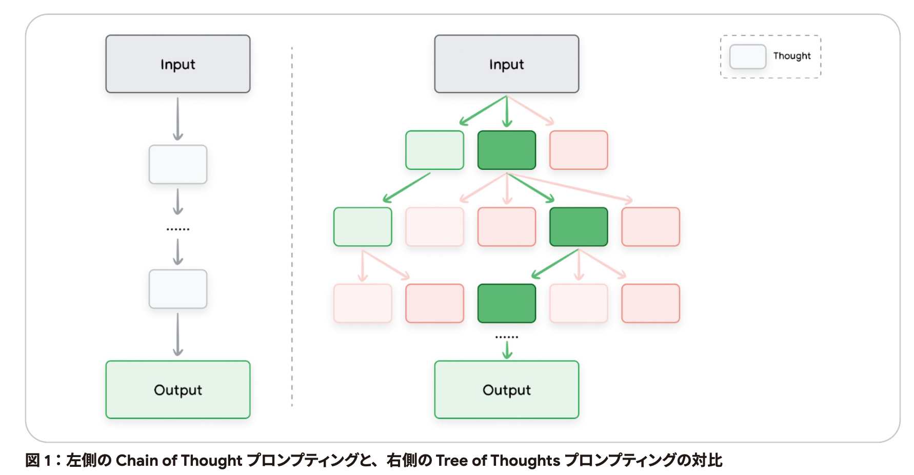
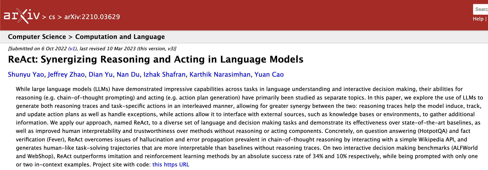
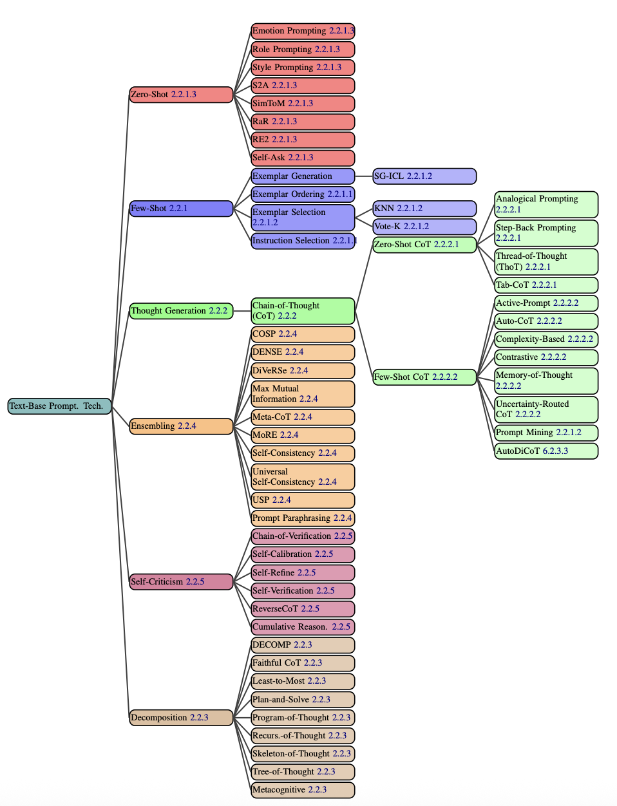
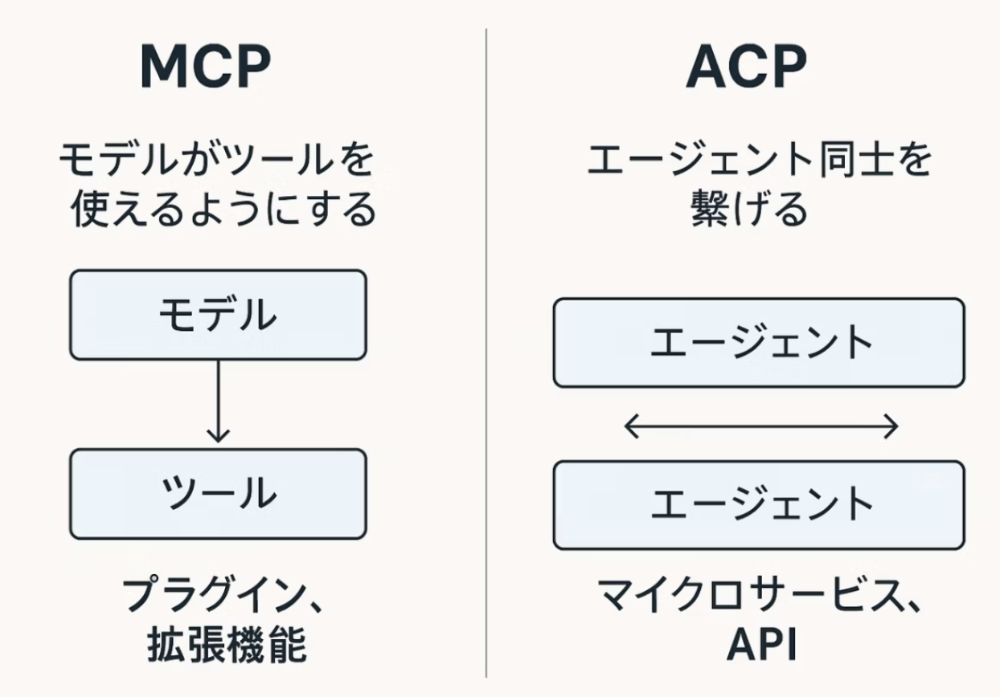
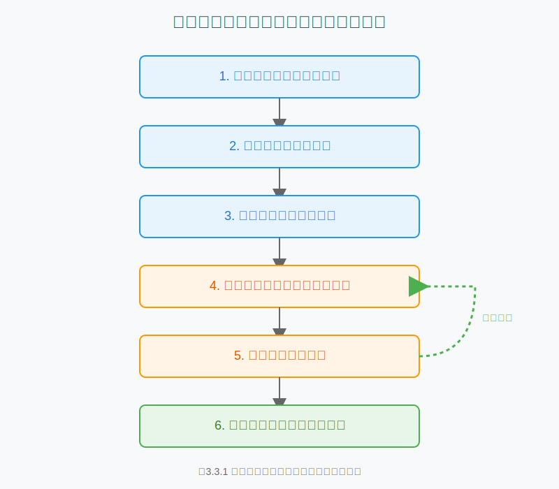
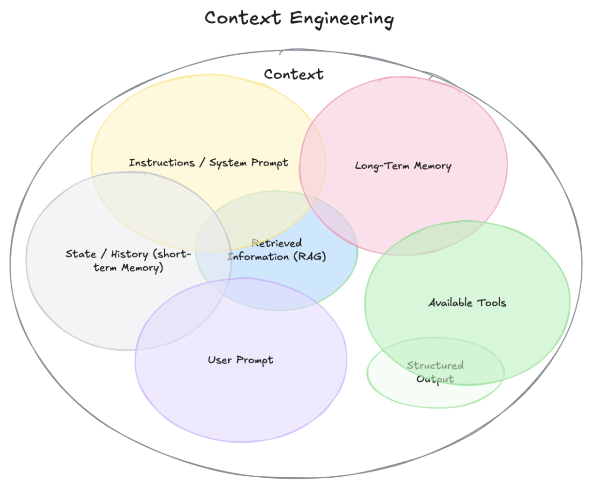
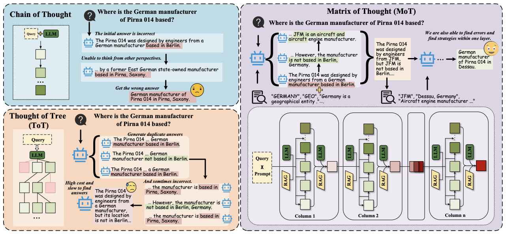
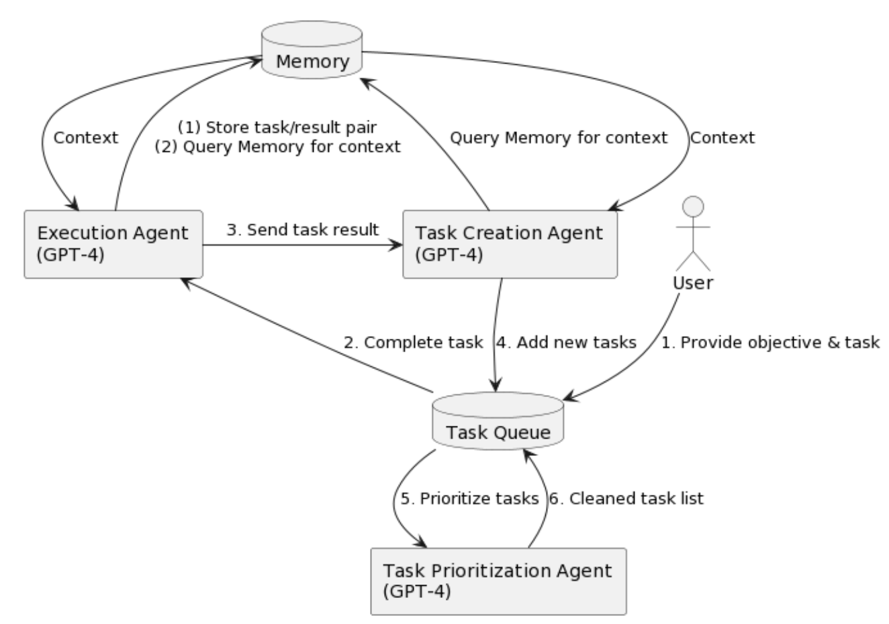
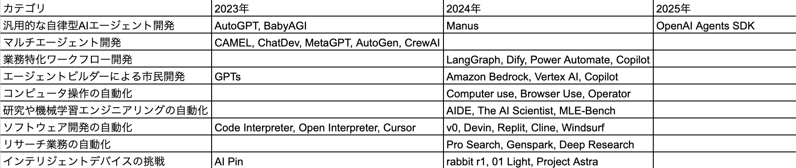

# 2. プロンプトエンジニアリングの基礎と実践

---

## 2. プロンプト・コンテキストエンジニアリング - 概要

#### この章で学ぶこと

**主なトピック:**

- AI が期待通りに答えない理由と対策
- 効果的なプロンプト設計の基本構造と原則
- 知財業務に特化したプロンプトテンプレート
- コンテキストエンジニアリングの重要性と実践方法
- DeepAgents で理解する AI エージェント（Agentic AI）

---

## 2-1. なぜ AI は思ったような答えを返してくれないのか？

#### AI の特性と限界の理解

**AI の基本的な動作原理**

- **統計的学習**: 大量データからパターンを学習
- **文脈依存**: 直前の会話や設定に影響される
- **曖昧性**: 不明確な指示では予測不可能な回答
- **知識の制限**: 学習データの範囲内でのみ回答可能

---

## 2-1. なぜ AI は思ったような答えを返してくれないのか？（2）

#### よくある問題と原因

| 問題                 | 原因                     | 対策               |
| -------------------- | ------------------------ | ------------------ |
| **回答が抽象的**     | 指示が曖昧・具体的でない | 具体的な要件を明示 |
| **期待と異なる形式** | 出力形式の指定がない     | 明確な形式を指定   |
| **情報が古い**       | 学習データの制限         | 最新情報の確認     |
| **一貫性がない**     | 文脈の不足               | 背景情報の提供     |

---

## 2-1. なぜ AI は思ったような答えを返してくれないのか？（3）

#### AI の「思考プロセス」を理解する

**AI の回答生成プロセス**

```
1. 入力の解析 → 2. 文脈の理解 → 3. 知識の検索 → 4. 回答の生成
```

**効果的な指示のポイント**

- **明確性**: 何を求めているかが明確
- **具体性**: 具体的な要件や制約
- **構造化**: 段階的な指示や分類
- **制約**: 回答の範囲や形式の制限

---

## 2-1. なぜ AI は思ったような答えを返してくれないのか？（4）

#### プロンプト設計の重要性

**なぜプロンプト設計が重要か**

- **回答品質の向上**: 適切な指示で高品質な回答
- **効率性の向上**: 一度で期待する回答を得られる
- **一貫性の確保**: 同じような回答パターンの実現
- **コスト削減**: やり直しの削減

---

## 2-2. プロンプトエンジニアリングの基礎

#### プロンプトの基本構造

**効果的なプロンプトの構成要素**

```
1. 役割設定（Role）
2. 背景情報（Context）
3. 具体的な指示（Task）
4. 出力形式（Format）
5. 制約条件（Constraints）
```

---

## 2-2. プロンプトエンジニアリングの基礎（2）

#### プロンプトの基本構造

**基本テンプレート**

```
役割: [AIの役割を明確に]
背景: [必要な背景情報]
指示: [具体的なタスク]
出力: [期待する形式]
制約: [制限事項や注意点]
```

---

## 2-2. プロンプトエンジニアリングの基礎（2）

#### プロンプト設計の基本原則

**Claude ベストプラクティスに基づく設計原則**

**1. 明確で直接的な表現を使用**

- 曖昧さを排除した具体的な指示
- 段階的な論理的構造
- 期待する出力形式の明示

---

## 2-2. プロンプトエンジニアリングの基礎（3）

#### プロンプト設計の基本原則

**2. 役割を与える（システムプロンプト）**

- AI の専門性・能力・制約を明確に定義
- 期待される行動パターンの設定

**3. 例を使用する（マルチショット）**

- 具体的な入力・出力例の提供
- 期待する品質レベルの明示

---

## 2-2. プロンプトエンジニアリングの基礎（4）

#### プロンプト設計の基本原則

**4. 生成 AI に考えさせる（思考の連鎖 Chain of thought）**

- 段階的な思考プロセスの指示
- 根拠の明示を求める

**実践例**

```markdown
<role>
あなたは特許分析の専門家で、技術的詳細と法的観点の両方に精通しています。
正確で実用的な分析を提供することを専門としています。
</role>
```

---

## 2-2. プロンプトエンジニアリングの基礎（5）

#### 実践例

```markdown
<context>
特許文献の分析を行う必要があります。技術的新規性と実用性の評価が求められています。
</context>

<task>
以下の特許文献を分析し、技術的新規性と実用性を評価してください：
[特許文献の内容]

以下の観点で分析をお願いします：

1. 技術的新規性の評価
2. 実用性の評価
3. 先行技術との差別化ポイント
4. 改善提案
   </task>
```

---

## 2-2. プロンプトエンジニアリングの基礎（6）

#### 実践例

```markdown
<output_format>
出力形式：

- 構造化された分析結果
- 具体的な根拠の明示
- 実用的な改善提案
- リスク評価
  </output_format>

<constraints>
制約：
- 客観的な評価
- 具体的な根拠
- 実用性を重視
- 法的妥当性の確保
</constraints>
```

---

## 2-3. 事例で学ぶ！プロンプトのブラッシュアップ体験 - 事例 1: 特許文献の要約

#### 初級レベル：基本的な指示

**改善前のプロンプト**

```
「この特許文献を要約してください」
```

**問題点**

- 何を要約すべきかが不明確
- 出力形式が指定されていない
- 要約の長さや詳細度が不明
- 特許特有の要素が考慮されていない

---

## 2-3. 事例で学ぶ！プロンプトのブラッシュアップ体験 - 事例 1: 特許文献の要約（2）

#### 中級レベル：具体的な指示

**改善後のプロンプト**

```
「以下の特許文献を要約してください：

文献：[特許文献の内容]

以下の点に注目して要約をお願いします：
1. 発明の概要
2. 技術的課題
3. 解決手段
4. 効果

出力形式：箇条書きで簡潔に」
```

---

## 2-3. 事例で学ぶ！プロンプトのブラッシュアップ体験 - 事例 1: 特許文献の要約（2）

#### 上級レベル：構造化された指示

**さらに改善（第 2 段階）**

```markdown
<role>
あなたは特許分析の専門家で、特許文献の要約と分析を専門としています。
技術的詳細と法的観点の両方に精通し、実用的な分析を提供します。
</role>

<context>
特許文献の要約と分析を行う必要があります。
技術的新規性、実用性、先行技術との関係を正確に把握することが求められています。
</context>
```

---

さらに[アプリ](https://ip-prompt-generator-for-llms-222593271342.us-west1.run.app/)にブラッシュアップさせてみる。

---

## 2-3. 事例で学ぶ！プロンプトのブラッシュアップ体験 - 事例 1: 特許文献の要約（3）

#### 上級レベル：構造化された指示

```markdown
<task>
以下の特許文献を要約・分析してください：

文献内容：[特許文献の詳細]

以下の手順で段階的に分析してください：

1. まず、発明の概要を把握
2. 次に、技術的課題を特定
3. そして、解決手段を分析
4. 最後に、効果と新規性を評価
   </task>
```

---

## 2-3. 事例で学ぶ！プロンプトのブラッシュアップ体験 - 事例 1: 特許文献の要約（4）

#### 上級レベル：構造化された指示（2）

```markdown
<output_format>
出力形式：

- 構造化された要約
- 技術的詳細の整理
- 法的観点からの評価
- 実用性の分析
  </output_format>
```

---

```markdown
<constraints>
制約：
- 客観的な分析
- 具体的な根拠
- 特許法の観点
- 実用性の重視
</constraints>
```

---

さらに[アプリ](https://ip-prompt-generator-for-llms-222593271342.us-west1.run.app/)にブラッシュアップさせてみる。

---

## 2-4. 事例 2: 先行技術調査のキーワード抽出

#### 初級レベル：基本的な指示

**改善前のプロンプト**

```markdown
「キーワードを抽出してください」
```

**問題点**

- どのようなキーワードかが不明確
- 抽出する数が指定されていない
- 用途が不明確
- 優先順位が考慮されていない

---

## 2-4. 事例 2: 先行技術調査のキーワード抽出（2）

#### 中級レベル：具体的な指示

**改善後のプロンプト**

```markdown
「以下の技術分野で先行技術調査に使用するキーワードを抽出してください：

技術分野：[分野名]
調査目的：[目的の詳細]

以下の観点でキーワードを抽出してください：

1. 技術用語
2. 関連技術
3. 応用分野
4. 競合技術

出力：各観点で 5 個ずつ、優先順位付き」
```

---

## 2-4. 事例 2: 先行技術調査のキーワード抽出（3）

#### 上級レベル：構造化された指示

**さらに改善（第 2 段階）**

```markdown
<role>
あなたは特許検索の専門家で、効率的な先行技術調査のためのキーワード設計を専門としています。
技術的深さと検索効率の両方を考慮した提案を提供します。
</role>

<context>
先行技術調査のためのキーワード抽出が必要です。
包括的で効率的な検索を実現するキーワードセットの設計が求められています。
</context>
```

---

## 2-4. 事例 2: 先行技術調査のキーワード抽出（4）

#### 上級レベル：構造化された指示

```markdown
<task>
以下の条件で先行技術調査用のキーワードを抽出してください：

技術分野：[分野の詳細]
調査目的：[目的の詳細]
検索範囲：[地理的・時間的範囲]

以下の手順で段階的に抽出してください：

1. まず、核心技術キーワードを特定
2. 次に、関連技術キーワードを抽出
3. そして、応用分野キーワードを追加
4. 最後に、検索式の組み合わせを提案
   </task>
```

---

## 2-4. 事例 2: 先行技術調査のキーワード抽出（4）

#### 上級レベル：構造化された指示（2）

```markdown
<output_format>
出力形式：

- 階層化されたキーワード
- 優先順位付きリスト
- 検索式の提案
- 効果予測
  </output_format>
```

---

```markdown
<constraints>
制約：
- 検索効率の最適化
- 網羅性の確保
- 実用性の重視
- 更新可能性の考慮
</constraints>
```

---

さらに[アプリ](https://ip-prompt-generator-for-llms-222593271342.us-west1.run.app/)にブラッシュアップさせてみる。

---

## 2-5. 事例 3: 明細書作成支援

#### 初級レベル：基本的な指示

**改善前のプロンプト**

```markdown
「明細書を作成してください」
```

**問題点**

- どの部分を作成すべきかが不明確
- 発明の詳細が提供されていない
- 出力形式が指定されていない
- 法的要件が考慮されていない

---

## 2-5. 事例 3: 明細書作成支援（2）

#### 中級レベル：具体的な指示

**改善後のプロンプト**

```markdown
「以下の発明について明細書の背景技術部分を作成してください：

発明内容：[発明の概要]
技術分野：[分野名]
課題：[解決すべき問題]

以下の構成で作成してください：

1. 技術分野の説明
2. 先行技術の整理
3. 課題の明確化
4. 発明の必要性

出力形式：特許庁の要件に準拠」
```

---

## 2-5. 事例 3: 明細書作成支援（3）

#### 上級レベル：構造化された指示

**さらに改善（第 2 段階）**

```markdown
<role>
あなたは特許明細書作成の専門家で、特許法と技術的詳細の両方に精通しています。
法的妥当性と技術的精度を両立した明細書作成を専門としています。
</role>

<context>
特許明細書の作成支援が必要です。
法的要件を満たし、技術的詳細を正確に記載した明細書の作成が求められています。
</context>
```

---

## 2-5. 事例 3: 明細書作成支援（4）

#### 上級レベル：構造化された指示

```markdown
<task>
以下の発明について明細書を作成してください：

発明内容：[発明の詳細]
技術分野：[分野の詳細]
先行技術：[既存技術の状況]
課題：[解決すべき問題]
効果：[期待される効果]

以下の手順で段階的に作成してください：

1. まず、背景技術部分を作成
2. 次に、発明の概要を記載
3. そして、詳細な説明を追加
4. 最後に、実施例とクレームを記載
   </task>
```

---

## 2-5. 事例 3: 明細書作成支援（5）

#### 上級レベル：構造化された指示

```markdown
<output_format>
出力形式：

- 特許庁要件準拠の構成
- 技術的詳細の記載
- 法的妥当性の確保
- 実用性の重視
  </output_format>

<constraints>
制約：
- 特許法の遵守
- 技術的精度
- 明確性の確保
- 実用性の重視
</constraints>
```

---

さらに[アプリ](https://ip-prompt-generator-for-llms-222593271342.us-west1.run.app/)にブラッシュアップさせてみる。

---

## 2-6. プロンプト改善の実践テクニック

#### Few-Shot Learning（少数例学習）

**活用方法**

```markdown
<examples>
入力例 1: 「AI技術の特許文献を要約してください」
出力例 1: 「発明の概要：機械学習による画像認識技術
技術的課題：従来技術の精度不足
解決手段：深層学習アルゴリズムの改良
効果：認識精度の 30%向上」

入力例 2: 「ブロックチェーン技術の特許を分析してください」
出力例 2: 「発明の概要：分散型台帳技術の改良
技術的課題：スケーラビリティの問題
解決手段：レイヤー 2 ソリューションの実装
効果：処理速度の 10 倍向上」
</examples>
```

---

## 2-6. プロンプト改善の実践テクニック（2）

#### Few-Shot Learning

```markdown
<task>
上記の例を参考に、以下の特許文献を同様の形式で要約してください：
[新しい特許文献の内容]
</task>
```

---

## 2-6. プロンプト改善の実践テクニック（2）

#### Chain of Thought（思考の連鎖）

**活用方法**

```markdown
<thinking_process>
以下の手順で段階的に思考してください：

1. まず、問題を理解し、必要な情報を整理する
2. 次に、関連する知識や経験を検索する
3. そして、複数の解決策を検討する
4. 最後に、最適な解決策を選択し、根拠を明示する
   </thinking_process>
```

---

**図 1: Chain of Thought（左）と Tree of Thoughts（右）の比較**


---

## 2-6. プロンプト改善の実践テクニック（3）

#### Chain of Thought

```markdown
<problem>
「この特許技術の市場性を評価してください」

思考プロセス：

1. 技術の基本特性を理解
2. 市場の現状とトレンドを分析
3. 競合技術との比較
4. 市場参入の可能性を評価
5. リスクと機会を分析
6. 最終的な市場性評価を提示
   </problem>
```

---

#### すごく簡単だが性能アップが期待できるもの:Zero-shot Chain-of-Thought

**コード例**: `code-examples/prompt-templates.md` の「Zero-shot Chain-of-Thought」セクションを参照

---

## 2-6. プロンプト改善の実践テクニック（4）

#### ReAct（Reasoning and Acting）

**ReAct の概要**

ReAct は、言語モデルが推論（Reasoning）と行動（Acting）を組み合わせてタスクを遂行する手法。

**基本概念**

- **推論（Reasoning）**: 問題を分析し、解決策を考える
- **行動（Acting）**: 適切なツールを使用して情報を収集・処理
- **反復**: 推論と行動を繰り返して最適解を見つける

---

## 2-6. プロンプト改善の実践テクニック（5）

#### ReAct

**ReAct の構造**

```markdown
1. 思考（Thought）: 現在の状況を分析し、次の行動を計画
2. 行動（Action）: 適切なツールを選択して実行
3. 観察（Observation）: 行動の結果を観察・記録
4. 反復: 目標達成まで 1-3 を繰り返す
```

---



[ReAct のもととなった論文](https://arxiv.org/abs/2210.03629)

---


**図 2: Basic ReAct のフローチャート**

---

**特許業務での活用例**

- **先行技術調査**: 検索ツールを使用した効率的な調査
- **特許分析**: 複数の情報源からの総合的な分析
- **明細書作成**: 技術情報の収集と構造化された文書作成

---

## 2-6. プロンプト改善の実践テクニック（6）

#### ReAct（2）

**ReAct の利点**

- **柔軟性**: 複雑な問題に対応可能
- **効率性**: 適切なツールの自動選択
- **透明性**: 思考プロセスの可視化
- **拡張性**: 新しいツールの追加が容易(重要。いろんな AI エージェントの基礎的な概念になってる)

---

**実装上の課題**

- **ツール選択の精度**: 適切なツールの選択が重要
- **一貫性の確保**: 複数回の実行での結果の安定性
- **エラーハンドリング**: ツール実行失敗時の対応

---

**ReAct の実践例**

```markdown
思考: 特許文献の先行技術調査が必要だ。まず検索ツールを使用して関連文献を探そう。
行動: 特許検索データベースでキーワード検索を実行
観察: 100 件の関連文献が見つかった
思考: 文献が多すぎる。絞り込み検索を行おう。
行動: より具体的なキーワードで再検索
観察: 20 件の関連文献に絞り込まれた
思考: これらの文献を分析して、最も関連性の高いものを特定しよう。
```

---

#### もっとたくさん知りたい方へ

[The Prompt Report: A Systematic Survey of Prompt Engineering Techniques](https://arxiv.org/abs/2406.06608)
[【プロンプト技術 58 種類の 9 割は「無駄」だった ── プロンプト研究 4,247 本の皮肉な結論】実例 2,000 件から学ぶ！LLM 時代の“強いプロンプトテンプレート”設計術](https://recruit.gmo.jp/engineer/jisedai/blog/prompt_template/)
[](https://note.com/rami_engineer/n/n8ecd7ac00cc4)
[【論文紹介】実例 2,000 件から学ぶ！LLM 時代の“強いプロンプトテンプレート”設計術](https://recruit.gmo.jp/engineer/jisedai/blog/prompt_template/)

---

#### こんなにあるプロンプトのテクニック（前ページの[論文](<(https://arxiv.org/abs/2406.06608)>)から）





---

#### プロンプトの反復改善

**改善サイクル**

1. **初回実行**: 基本的なプロンプトで実行
2. **結果評価**: 出力の品質と期待値との差を分析
3. **問題特定**: 改善すべき点を特定
4. **プロンプト改善**: 具体的な改善を実施
5. **再実行**: 改善されたプロンプトで再実行
6. **継続改善**: 満足いく結果まで繰り返し

---

## 2-7. 従来のプロンプト手法の限界とコグニティブ・デザイン

[参考](https://qiita.com/makotosaekit/items/0eccb562bf7d3f66fbfa)

#### 「あなたはプロの〇〇です」をもうやめたい

**従来のロールプレイプロンプトの限界**
**① 陳腐化・没個性化**
みんなが同じ「制服」を着せるためステレオタイプな「プロ像」に収束
あなた自身や、あなたの組織が持つ独自の哲学はそこにはない

**② 効果の希薄化**
AI が賢くなり、タスクの内容から「これは ◯◯ としての視点が必要」と自ら推論
わざわざ指示する意味が薄れ、型通りの指定は本来の高度な推論能力が阻害される

---

## 2-7. 従来のプロンプト手法の限界とコグニティブ・デザイン（1）

#### なぜ AI はあなたの状況を理解できないのか？

**暗黙知の壁**
簡単な前提を書いているつもりでも、その裏にある膨大な「暗黙知」や「文脈」までを、数行の文章で伝えようとしている。
それは原理的に不可能。

AI との対話における困難の正体は、まさにこれです。私たちは AI に Given を渡しているつもりで、
その実、膨大な「信頼関係」の構築をすっ飛ばして「結婚（＝タスク実行）」を迫っている。

---

## 2-7. 従来のプロンプト手法の限界とコグニティブ・デザイン（2）

#### 次のレベルへ：「マニュアル」から「憲法」へ

**マニュアル（旧来のプロンプト）**

- 「こういう場合は、こうしなさい」という具体的な指示
- 既知の問題には強いが、マニュアルにない未知の問題には対応できない

**憲法（新しいメタプロンプト）**

- あらゆる判断の根幹となる最高位の基本原則
- 未知の問題に直面したとき、どの原則に立ち返って判断すべきかという指針を与える

---

**意図されたバイアスの実装**

「憲法」=意図されたバイアスの実装。
「バイアス」＝「無数の選択肢の中から、望ましい判断を行うための意図的な指針」

この価値判断の軸を AI に埋め込むことで初めて、AI は未知の状況でも一貫性のある、あなた「らしい」思考を展開できるようになる。

---

## 2-7. 従来のプロンプト手法の限界とコグニティブ・デザイン（3）

#### 思考のレンズを設計する「コグニティブ・デザイン」

**コグニティブ・デザイン=認知設計**

この「憲法」を AI にインストールする体系的な方法論が、コグニティブ・デザイン=認知設計
AI に外面的な「役割（Role）」を与えるのではなく、内面的な「世界の捉え方のレンズ（Lens）」を与える

---

**思考のレンズを設計する 5 つの要素**

1. **前提 (Premise)**: 思考の「OS・物理法則」。この世界で疑うことのない事実や守るべき価値観

2. **状況 (Situation)**: 思考の「現在地」。今、何が起きていて、どのような変数があるのか

3. **目的 (Purpose)**: 思考の「目的地」。このタスクで何を達成したいのかという具体的なゴール

4. **動機 (Motive)**: 思考の「エンジン」。なぜその目的地を目指すのか？という根源的な理由や哲学

5. **制約 (Constraint)**: 思考の「行動範囲」。目的達成のために、守るべきルールや越えてはならない境界線

---

## 2-7. 従来のプロンプト手法の限界とコグニティブ・デザイン（4）

#### 実践例：コグニティブ・デザインのサンプル

**お題**: 社内向けに、新しい AI チャットボット開発の予算獲得を目指す「企画書」のドラフトを作成する

**NG な指示（旧来のプロンプト）**

```
あなたはプロのコンサルタントです。AIチャットボットを導入するための企画書を作成してください。
```

これでは、誰に向けた、どんな背景を持つ、何を最優先した企画書なのかが全く分からず、ごく一般的で陳腐なアウトプット

---

**OK な指示（コグニティブ・デザイン）**

```markdown
# 思考のレンズ

## 前提 (Premise):

我々のビジネスにおける最優先事項は「顧客満足度の向上」である
経営陣は常に ROI（投資対効果）を重視し、データに基づいた判断を好む
社内向けの企画書は、要点を 3 ページ以内にまとめるのが慣例である

## 状況 (Situation):

顧客からの問い合わせ件数が、前四半期比で 30%増加している
これによりサポート部門の負荷が増大し、応答時間が長期化、顧客満足度が低下傾向にある
競合の X 社は、すでにサポート業務に AI を導入し成果を上げている
```

---

## 2-7. 従来のプロンプト手法の限界とコグニティブ・デザイン（5）

```markdown
## 目的 (Purpose):

経営会議において、AI チャットボット開発プロジェクトの正式な予算（500 万円）の承認を得る
そのための説得材料として、背景・目的・期待効果・開発計画を明確に記した企画書のドラフトを作成する

## 動機 (Motive):

このプロジェクトの根源的な狙いは、単なるコスト削減ではない
**人間のスタッフを単純な問い合わせ対応から解放し、彼らが持つ共感力や高度な問題解決能力を、本当に困っている顧客のために集中させることにある**
これにより、顧客満足度だけでなく、従業員満足度も向上させ、優秀な人材の定着を図る

## 制約 (Constraint):

専門用語の使いすぎを避け、誰が読んでも理解できる平易な言葉遣いをすること
既存のサポート部門の働きを否定するような表現は一切使わず、彼らを支援するためのツールであるという視点を貫くこと
Markdown 形式で出力すること
```

---

## 2.7 参考文献

論文名: "Constitutional AI: Harmlessness from AI Feedback"
論文 URL: https://arxiv.org/abs/2212.08073
公開日: 2022 年 12 月

論文名: "Structure Guided Prompt: Instructing Large Language Model in Multi-Step Reasoning by Exploring Graph Structure of the Text"
論文 URL: https://arxiv.org/abs/2402.13415

論文名: "When "A Helpful Assistant" Is Not Really Helpful: Personas in System Prompts Do Not Improve Performances of Large Language Models"
論文 URL: https://arxiv.org/abs/2311.10054
公開日: 2023 年 11 月

---

## 2-8. プロンプトの品質評価と改善

#### 評価基準の設定

**定量的評価指標**

- **関連性**: 回答が質問に関連しているか
- **正確性**: 技術的・法的に正確か
- **完全性**: 必要な情報が含まれているか
- **一貫性**: 複数回の実行で一貫した結果か
- **実用性**: 実際の業務で使用可能か

---

## 2-8. プロンプトの品質評価と改善（2）

#### 評価基準の設定

**定性的評価指標**

- **明確性**: 回答が理解しやすいか
- **構造性**: 情報が整理されているか
- **創造性**: 新たな視点や洞察があるか
- **適切性**: 用途に適しているか

---

## 2-8. プロンプトの品質評価と改善（2）

#### 改善プロセス

**系統的な改善アプローチ**

1. **ベースライン設定**: 現在のプロンプトの性能を測定
2. **目標設定**: 改善すべき指標と目標値を設定
3. **改善実施**: コンテキスト設計の改善
4. **効果測定**: 改善効果を測定・評価
5. **継続改善**: さらなる改善を実施

---

## 2-8. プロンプトの品質評価と改善（3）

#### フロー図(出典：『AWS 生成 AI アプリ構築実践ガイド』から編集）



---

## 2-8. プロンプトの品質評価と改善（4）

#### それぞれのステップでの留意点

##### タスクと評価基準の定義

- タスクをどのくらい正しく解けるか／応答速度／コスト

##### テストケースの作成

- エッジケース（性能が低下しそうな入力パターンをわざと入れる）

##### 初期プロンプトの作成

- シンプルなもので始める

---

##### テストケースに対するテスト

- スプレッドシートのマクロ、スクリプトなどでテストを早く回す

##### プロンプトの改良

- ルール追加、不要な指示を削除、表現を修正

##### 完成したプロンプトの実装

- 継続的に性能を評価する、作りっぱなしにならないように(POML の章も参考に)

---

## 2-9. プロンプトライブラリ

#### 特許調査テンプレート

```markdown
<role>
あなたは特許調査の専門家で、効率的で網羅的な調査を専門としています。
技術的深さと実用性を両立した調査方法を提供します。
</role>

<context>
特許調査の実施が必要です。包括的で効率的な調査方法の設計が求められています。
</context>
```

---

## 2-9. プロンプトライブラリ（2）

#### 特許調査テンプレート

```markdown
<task>
以下の条件で特許調査を実施してください：

調査対象：[技術分野・企業名など]
調査目的：[目的の詳細]
調査期間：[期間の指定]
調査範囲：[地理的・技術的範囲]

以下の手順で段階的に調査してください：

1. まず、調査戦略を策定
2. 次に、検索式を設計
3. そして、文献を収集・分析
4. 最後に、結果を整理・評価
   </task>
```

---

## 2-9. プロンプトライブラリ（3）

#### 特許調査テンプレート

```markdown
<output_format>
出力形式：

- 調査戦略の概要
- 検索式の詳細
- 収集文献の分析
- 調査結果の評価
- 今後の方針
  </output_format>

<constraints>
制約：
- 効率性の確保
- 網羅性の維持
- 実用性の重視
- 更新可能性の考慮
</constraints>
```

---

## 2-9. プロンプトライブラリ（4）

#### 明細書作成テンプレート

```markdown
<role>
あなたは特許明細書作成の専門家で、法的妥当性と技術的精度を両立した明細書作成を専門としています。
特許庁の要件を満たし、実用的な明細書の作成を提供します。
</role>

<context>
特許明細書の作成が必要です。法的要件を満たし、技術的詳細を正確に記載した明細書の作成が求められています。
</context>
```

---

## 2-9. プロンプトライブラリ（5）

#### 明細書作成テンプレート

```markdown
<task>
以下の発明について明細書を作成してください：

発明内容：[発明の詳細]
技術分野：[分野の詳細]
先行技術：[既存技術の状況]
課題：[解決すべき問題]
効果：[期待される効果]

以下の手順で段階的に作成してください：

1. まず、背景技術部分を作成
2. 次に、発明の概要を記載
3. そして、詳細な説明を追加
4. 最後に、実施例とクレームを記載
   </task>
```

---

## 2-9. プロンプトライブラリ（6）

#### 明細書作成テンプレート

```markdown
<output_format>
出力形式：

- 特許庁要件準拠の構成
- 技術的詳細の記載
- 法的妥当性の確保
- 実用性の重視
  </output_format>

<constraints>
制約：
- 特許法の遵守
- 技術的精度
- 明確性の確保
- 実用性の重視
</constraints>
```

---

## 2-9. プロンプトライブラリ（7）

#### 分析・評価テンプレート

```markdown
<role>
あなたは特許分析・評価の専門家で、技術的観点と法的観点の両方から総合的な評価を専門としています。
客観的で実用的な分析結果を提供します。
</role>

<context>
特許技術の分析・評価が必要です。技術的新規性、実用性、市場性を総合的に評価することが求められています。
</context>
```

---

## 2-9. プロンプトライブラリ（8）

#### 分析・評価テンプレート

```markdown
<task>
以下の特許技術を分析・評価してください：

技術内容：[技術の詳細]
技術分野：[分野の詳細]
市場状況：[市場の状況]
競合状況：[競合の状況]

以下の手順で段階的に分析してください：

1. まず、技術的新規性を評価
2. 次に、実用性を分析
3. そして、市場性を評価
4. 最後に、総合評価を実施
   </task>
```

---

## 2-9. プロンプトライブラリ（9）

#### 分析・評価テンプレート

```markdown
<output_format>
出力形式：

- 構造化された分析結果
- 定量的・定性的評価
- リスク・機会の分析
- 実用的な提案
  </output_format>

<constraints>
制約：
- 客観的な評価
- 具体的な根拠
- 実用性の重視
- 総合的な視点
</constraints>
```

---

ウェブ上にもあった特許用のプロンプト例を見てみましょう。
[参考プロンプト](https://docs.google.com/spreadsheets/d/1bh1X3BGT8x99OSos19TrRpOUQGN9kqhyKK2v-r3tcWI/edit?usp=sharing)

---

## 2-10. プロンプト形式の選択：マークアップ vs マークダウン

#### プロンプト形式の使い分け

**結論：モデルやタスクの複雑さに応じて使い分けるのが最適**

LLM へのプロンプトで、マークアップ（`<tag>`のような形式）とマークダウン（`##`のような形式）、どちらを使うべきか、またモデルによって推奨があるのか？
⇒ どちらか一方が絶対的に優れているわけではなく、それぞれに得意な場面があるので使い分けを

---

## 2-10. プロンプト形式の選択：マークアップ vs マークダウン（1）

#### マークダウン形式（## や - など）

**人間にとっての読みやすさと書きやすさが最大の特徴**

**メリット**

- **可読性が高い**: 人間が読んでも構造が分かりやすい
- **記述が容易**: `## 見出し` や `- リスト` のように、簡単かつ迅速に記述できる
- **広く対応**: ほとんどの LLM（GPT シリーズ、Gemini など）が特別な設定なしでうまく解釈できる
- **明確な階層構造**: 見出し（#, ##）を使うことで、指示の重要度やセクションの区切りをモデルに伝えやすい

---

**デメリット**

- **厳密な区別が難しい場合がある**: 例えば、複数の文書をプロンプトに含める際、「ここからここまでが文書 A」「ここからが文書 B」という境界を厳密に定義するには、マークダウンだけでは少し弱い場合あり。

---

## 2-10. プロンプト形式の選択：マークアップ vs マークダウン（2）

#### マークダウン形式の主な利用シーン

**一般的な質問応答、文章生成、要約など**

- プロンプトの構造が比較的シンプルな場合
- 指示、コンテキスト、質問といったセクションを分かりやすく区切りたい場合

---

**プロンプト例（マークダウン）**

```markdown
## 指示

以下の文章を、小学生にもわかるように要約してください。

## 制約条件

- 3 つの箇条書きでまとめること
- 専門用語は使わないこと

## 元の文章

人工知能（AI）は、人間の知的ふるまいの一部をソフトウェアを用いて人工的に再現したものである。
特に、近年の深層学習（ディープラーニング）技術の発展により、
画像認識や自然言語処理の分野で著しい成果を上げている。
```

---

## 2-10. プロンプト形式の選択：マークアップ vs マークダウン（3）

#### マークアップ形式（<tag> や </tag> など）

**XML や HTML のようにタグで囲むことで、プロンプト内の各要素の「役割」をより厳密に定義**

特に複雑な指示や、複数の異なる種類の情報を入力する際に効果を発揮

**メリット**

- **構造の厳密な定義**: `<document>`や`<instruction>`のようにタグ付けすることで、各部分の役割をモデルに明確に伝えることができる。これにより、モデルが「指示」と「コンテキスト」を混同するのを防ぐ
- **特定のモデルで推奨**: 特に Anthropic 社の Claude は、公式ドキュメントで XML タグの使用を推奨しており、複雑なタスクにおいて性能が向上することが示されている
- **処理の自動化と相性が良い**: プログラムでプロンプトを生成・解析する際に、タグを目印に処理をしやすい

**デメリット**

- **記述が冗長**: タグの開始と終了を記述する必要があり、手書きするには少し手間
- **可読性の低下**: タグが増えると、人間にとっては少し読みにくくなる

---

## 2-10. プロンプト形式の選択：マークアップ vs マークダウン（4）

#### マークアップ形式の主な利用シーン

**複数の文書や例をインプットとして与え、それらを明確に区別させたい場合**

- 指示、コンテキスト、ユーザーからの質問、出力形式の指定など、プロンプトの構成要素が多岐にわたる複雑なタスク
- Anthropic 社の Claude を利用する場合

---

**プロンプト例（マークアップ）**

```xml
<instructions>
以下の<document>で提供される契約書を分析し、重要なポイントを抽出してください。
</instructions>

<document>
第1条（目的）
本契約は、甲と乙との間の業務委託に関する基本的事項を定めることを目的とする。
...（契約書の本文が続く）...
</document>


<output_format>
抽出したポイントは、以下の XML タグを使用してフォーマットしてください。

<summary>
  <point>ここに1つ目のポイント</point>
  <point>ここに2つ目のポイント</point>
</summary>
</output_format>
```

---

## 2-10. プロンプト形式の選択：マークアップ vs マークダウン（5）

**Anthropic (Claude シリーズ)**
マークアップ（XML タグ）を推奨。公式のプロンプトエンジニアリングガイドでは、複雑なプロンプトの各要素を`<example>`や`<document_to_analyze>`のようなタグで囲むことで、モデルの理解度と応答の精度が向上する例多し

**OpenAI (GPT シリーズ)**

特定の形式を強く推奨していないが、プロンプトエンジニアリングのベストプラクティスとして、指示とコンテキストを区切り文字（例：`###` や `"""`）で明確に分けることを推奨。

**Google (Gemini シリーズ)**
推奨は特になし。プロンプト設計のベストプラクティスとして、「明確で具体的な指示を与えること」や「役割（ペルソナ）を与えること」などが挙げられている。

---

## 2-10. プロンプト形式の選択：マークアップ vs マークダウン（6）

#### まとめと使い分けの指針

| 目的・状況                     | 推奨される形式 | 理由                                                                            |
| ------------------------------ | -------------- | ------------------------------------------------------------------------------- |
| 手軽に試したい、一般的なタスク | マークダウン   | 読み書きしやすく、ほとんどのモデルで十分機能するため                            |
| プロンプトの構造が複雑         | マークアップ   | 各要素の役割を厳密に定義でき、モデルの誤解釈を防げるため                        |
| 複数の文書やデータを入力する   | マークアップ   | `<doc1>`, `<doc2>` のように明確に区別できるため                                 |
| 使用モデルが Claude            | マークアップ   | 公式に推奨されており、パフォーマンス向上が期待できるため                        |
| 使用モデルが GPT や Gemini     | マークダウン   | 一般的で十分な性能を発揮する。複雑な場合は区切り文字(`###`など)を併用すると良い |

**最終的な指針**

**「どちらの形式を使えば、自分のタスクで最も良い結果が得られるか」**を試行錯誤必要（めんどいが）。まずは手軽なマークダウンから始め、より複雑な制御が必要になった場合にマークアップを試してみるのがよさそう

---

## 2-11. 「プロンプトを生成させる」プロンプト

#### プロンプト生成の基本概念

**プロンプト生成の重要性**ここも AI に任せた方が性能が出る!?（ex:Manus）

- **効率性の向上**: 手動でのプロンプト作成時間の短縮
- **品質の向上**: 体系的なプロンプト設計の実現
- **一貫性の確保**: 統一されたプロンプトスタイルの維持
- **学習効果**: プロンプト設計のベストプラクティスの習得

---

#### プロンプト生成用の基本テンプレート

```markdown
<role>
あなたはプロンプトエンジニアリングの専門家で、効果的なプロンプト設計と最適化に精通しています。
様々な業務分野に対応した高品質なプロンプトの作成を専門としています。
</role>

<context>
特定の業務やタスクに対応したプロンプトを作成する必要があります。
効率的で実用的なプロンプト設計が求められています。
</context>
```

---

```markdown
<task>
以下の要件でプロンプトを作成してください：

業務分野：[具体的な業務分野]
タスク内容：[実行したいタスク]
期待する出力：[期待する結果の形式]
制約条件：[考慮すべき制約]

以下の手順で段階的に作成してください：

1. まず、役割設定を定義
2. 次に、背景情報を整理
3. そして、具体的なタスクを設定
4. 最後に、出力形式と制約を定義
   </task>
```

---

```markdown
<output_format>
出力形式：

- 構造化されたプロンプト
- 明確な指示内容
- 実用的な制約
- 拡張可能な設計
  </output_format>

<constraints>
制約：
- 実用性の重視
- 明確性の確保
- 一貫性の維持
- 効果性の追求
</constraints>
```

---

#### 参考

[GPT-5 prompting guide](https://cookbook.openai.com/examples/gpt-5/gpt-5_prompting_guide)
[Claude 4 プロンプトエンジニアリングのベストプラクティス](https://docs.anthropic.com/ja/docs/build-with-claude/prompt-engineering/claude-4-best-practices)
[Google prompting guide 101](https://services.google.com/fh/files/misc/gemini-for-google-workspace-prompting-guide-101.pdf)

---

## 2-12. コンテキストエンジニアリングの重要性

---

## 2-13. コンテキストエンジニアリングとは

#### プロンプトエンジニアリングの限界

**従来のプロンプト設計の問題点**

- **単発的な指示**: 個別の質問に対する一時的な回答
- **文脈の欠如**: 背景情報や継続的な関係性の不足
- **一貫性の欠如**: 複数の質問間での**整合性**の欠如
- **学習効果の欠如**: **過去のやり取り**からの学習不足

---

## 2-13. コンテキストエンジニアリングとは（1）

#### コンテキストエンジニアリングの必要性

- **全体的な設計**: AI との対話全体を体系的に設計
- **継続的な関係**: 長期的な対話関係の構築
- **文脈の蓄積**: 過去のやり取りの効果的な活用
- **適応的改善**: 対話を通じた継続的な最適化

---

## 2-13. コンテキストエンジニアリングとは（2）

#### コンテキストエンジニアリングの定義

**定義**

```
コンテキストエンジニアリングとは、
AIとの対話において、
効果的な文脈（コンテキスト）を設計・構築し、
期待する出力を得るための包括的なアプローチである。

```

[Context Engineering](https://blog.langchain.com/context-engineering-for-agents/)

---



[参照 1](https://www.promptingguide.ai/guides/context-engineering-guide),[参照 2](https://www.philschmid.de/context-engineering)

---

## 2-13. コンテキストエンジニアリングとは（3）

#### プロンプトエンジニアリングとの違い

| 項目     | プロンプトエンジニアリング | コンテキストエンジニアリング |
| -------- | -------------------------- | ---------------------------- |
| **範囲** | 個別の指示設計             | 対話全体の設計               |
| **期間** | 短期的・一時的             | 長期的・継続的               |
| **目的** | 特定の回答獲得             | 全体的な対話品質向上         |
| **手法** | 指示の最適化               | 文脈・環境・関係性の設計     |

---

## 2-13. コンテキストエンジニアリングとは（4）

#### コンテキストエンジニアリングの利点

- **一貫性の向上**: 複数の質問間での整合性確保
- **効率性の向上**: 文脈の再利用による時間短縮
- **品質の向上**: 背景情報の活用による精度向上
- **学習効果**: 継続的な改善と最適化

---

## 2-14. コンテキストエンジニアリングの基本概念

#### コンテキストの構成要素

**1. 役割設定（Role Definition）**

AI の専門性・能力・制約を明確に定義

**コード例**: `code-examples/prompt-templates.md` の「Role Definition」セクションを参照

---

## 2-14. コンテキストエンジニアリングの基本概念（2）

#### コンテキストの構成要素

**2. 背景情報（Background Information）**

```
対話に必要な前提知識・状況・制約を提供
例：「現在、AI技術分野の先行技術調査を実施中」
「調査に必要なCPCとその定義は下記のとおり・・・」
「US特許は・・・という特徴があり・・・」

```

**3. 対話履歴（Conversation History）**

```
過去のやり取りの記録と活用
例：「先ほどの検索結果を踏まえて、次の分析を実施」
（注：検索結果の特許出願リストを与えたり、過去の調査事例の情報を追加でもあり）

```

---

## 2-14. コンテキストエンジニアリングの基本概念（3）

#### コンテキストの構成要素

**4. 環境設定（Environment Setup）**

```
利用可能なツール・データ・制約の設定
例：「特許データベースへのアクセス権限があります」
（注：これはこのツールを生成AIが扱えるのが前提。
例えばブラウザを直接生成AIが操作できる、APIにアクセスするツールがある、など）

```

---

## 2-14. コンテキストエンジニアリングの基本概念（4）

#### コンテキスト設計の基本原則

**CONTEXT 原則**

- **C**omprehensive（包括的）: 必要な情報を網羅
- **O**rganized（整理された）: 論理的な構造化
- **N**atural（自然な）: 人間らしい対話の流れ
- **T**argeted（目的指向）: 明確な目標設定
- **E**volving（進化する）: 継続的な改善
- **X**plicit（明示的）: 曖昧さの排除
- **T**imely（適時性）: タイミングの最適化

---

## 2-14. コンテキストエンジニアリングの基本概念（4）

#### コンテキスト設計の実践ポイント

**設計の流れ**

1. **目的の明確化**: 何を達成したいかを明確にする
2. **情報の整理**: 必要な情報を体系的に整理する
3. **構造の設計**: 論理的な構造を設計する
4. **実装とテスト**: 実際に使用して効果を確認する
5. **改善と最適化**: 継続的に改善していく

---

## 2-14. コンテキストエンジニアリングの基本概念（5）

#### コンテキスト設計の実践ポイント

**成功の鍵**

- **段階的な構築**: 一度にすべてを構築せず、段階的に（細かく指示を区切る）
- **継続的な改善**: 使用結果をフィードバックとして活用（Human-in-the-Loop）
- **柔軟性の確保**: 状況に応じて調整可能な設計
- **実用性の重視**: 実際の業務で使いやすい設計

---

## 2-15. 知財業務でのコンテキストエンジニアリング実践

#### 特許調査におけるコンテキスト設計

**基本設計例**

**コード例**: `code-examples/prompt-templates.md` の「Role Definition」セクションを参照

---

## 2-15. 知財業務でのコンテキストエンジニアリング実践（1）

#### 特許調査におけるコンテキスト設計

```markdown
<context>
現在、AI技術分野の先行技術調査を実施中です。
調査対象は2020年以降の特許文献で、特にリアルタイム処理技術に注目しています。
</context>

<environment>
利用可能なツール：
- 特許データベース（J-PlatPat、USPTO）
- 技術文献データベース
- 分析ツール（Excel、Python）
</environment>
```

---

## 2-15. 知財業務でのコンテキストエンジニアリング実践（2）

#### 特許調査におけるコンテキスト設計（2）

```markdown
<conversation_style>
専門的かつ実用的な分析を提供し、具体的な根拠を示してください。
技術的詳細と法的観点の両方を考慮した回答をお願いします。
</conversation_style>

<expertise>
- 特許法の深い理解
- 技術動向の把握
- 検索戦略の設計
- 分析手法の選択
</expertise>
```

---

## 2-15. 知財業務でのコンテキストエンジニアリング実践（3）

#### 明細書作成におけるコンテキスト設計

**基本設計例**

```markdown
<role>
あなたは特許明細書作成の専門家で、25年の実務経験があります。
特許庁の要件に完全準拠した明細書作成と、法的妥当性の確保を得意としています。
</role>
```

---

## 2-15. 知財業務でのコンテキストエンジニアリング実践（4）

#### 明細書作成におけるコンテキスト設計

```markdown
<context>
新規発明の特許出願準備中です。
先行技術との関係を明確にし、発明の新規性・進歩性を適切に説明する必要があります。
</context>

<environment>
利用可能な情報：
- 発明の詳細仕様
- 先行技術文献
- 特許庁の審査基準
- 関連する技術動向
</environment>
```

---

## 2-15. 知財業務でのコンテキストエンジニアリング実践（5）

#### 明細書作成におけるコンテキスト設計（2）

```markdown
<conversation_style>
法的に正確で、技術的に詳細な明細書作成を支援します。
特許庁の要件を満たし、実用的な提案を提供します。
</conversation_style>

<expertise>
- 特許法の深い理解
- 技術的詳細の把握
- 明細書作成の実務
- 審査対応の経験
</expertise>
```

---

## 2-16. 一般的なコンテキストエンジニアリングの方法

#### 段階的なコンテキスト構築

**Step 1: 基本設定の確立**

```
1. 役割の明確化
   - AIの専門性・能力の定義
   - 期待される行動パターンの設定

2. 背景情報の整理
   - 業務の目的・状況の説明
   - 制約条件の明示

3. 環境設定の構築
   - 利用可能なツール・データの定義
   - 制限事項の明確化

```

---

## 2-16. 一般的なコンテキストエンジニアリングの方法（1）

#### 段階的なコンテキスト構築

**Step 2: 対話履歴の活用**

```

1. 過去のやり取りの記録
   - 質問と回答の保存
   - 効果的なパターンの特定

2. 文脈の継承
   - 前回の結果を踏まえた質問
   - 一貫性のある回答の確保

3. 学習効果の活用
   - 成功事例の蓄積
   - 改善点の特定

```

---

## 2-16. 一般的なコンテキストエンジニアリングの方法（2）

#### コンテキストの動的調整

**状況に応じた調整**

- **業務フェーズ**: 調査 → 分析 → 作成 → 評価の各段階
- **重要度**: 高重要度案件と通常案件の使い分け
- **緊急度**: 緊急案件と通常案件の対応方法
- **専門性**: 技術分野による専門性の調整

---

## 2-16. 一般的なコンテキストエンジニアリングの方法（3）

#### コンテキスト設計のチェックリスト

**設計時の確認項目**

□ 役割が明確に定義されているか
□ 背景情報が十分に提供されているか
□ 環境設定が適切に行われているか
□ 対話スタイルが統一されているか
□ 専門性が適切に設定されているか
□ 制約条件が明確になっているか
□ 継続的な改善の仕組みがあるか

---

## 2-16. コンテキストエンジニアリングの高度な活用

#### マルチモーダルコンテキスト

**複数情報源の統合**

- **テキスト情報**: 特許文献、技術資料
- **図面情報**: 発明の図面、フローチャート
- **数値データ**: 実験データ、統計情報
- **音声情報**: 会議録音、インタビュー

---

## 2-16. コンテキストエンジニアリングの高度な活用（1）

#### マルチモーダルコンテキスト

**統合的な分析**

```

1. 情報の収集・整理
2. 関連性の分析
3. 統合的な評価
4. 総合的な提案

```

---

#### 動的コンテキスト管理

**リアルタイム調整**

- **状況変化への対応**: 新しい情報の追加
- **優先度の動的変更**: 重要度の変化への対応
- **専門性の調整**: 技術分野の変更への対応
- **制約条件の更新**: 新しい制約への対応

---

## 2-16. コンテキストエンジニアリングの高度な活用（2）

#### 協調的コンテキスト設計

**チームでの活用**

- **役割分担**: 各メンバーの専門性を活かした設計
- **情報共有**: チーム内での情報共有と活用
- **統一基準**: チーム全体での統一された基準
- **継続改善**: チーム全体での継続的な改善

---

## 2-16. コンテキストエンジニアリングの高度な活用（3）

#### 協調的コンテキスト設計

**組織的な活用**

- **標準化**: 組織全体での標準的な設計
- **ベストプラクティス**: 成功事例の組織内共有
- **トレーニング**: コンテキスト設計スキルの向上
- **評価・改善**: 組織全体での効果測定と改善

---

## 2-16. コンテキストエンジニアリングの高度な活用（4）

#### 高度なテクニック

**自動化と最適化**

- **自動調整**: 状況に応じた自動的な調整
- **学習機能**: 使用履歴からの学習と最適化
- **予測機能**: 次に必要な情報の予測
- **提案機能**: 最適なコンテキストの提案

---

## 2-17. コンテキストエンジニアリングの効果測定

#### 測定指標の設定

**定量的指標**

- **回答精度**: 期待する回答との一致度
- **処理時間**: 回答生成にかかる時間
- **一貫性**: 複数回の実行での一貫性
- **効率性**: 情報収集・処理の効率

---

## 2-17. コンテキストエンジニアリングの効果測定（1）

#### 測定指標の設定

**定性的指標**

- **満足度**: ユーザーの満足度
- **実用性**: 実際の業務での使用可能性
- **創造性**: 新たな視点や洞察の提供
- **適切性**: 状況に適した回答の提供

---

## 2-17. コンテキストエンジニアリングの効果測定（2）

#### 効果測定の方法

**測定プロセス**

1. **ベースライン設定**: 現在の性能を測定
2. **目標設定**: 改善すべき指標と目標値を設定
3. **改善実施**: コンテキスト設計の改善
4. **効果測定**: 改善効果を測定・評価
5. **継続改善**: さらなる改善を実施

---

## 2-17. コンテキストエンジニアリングの効果測定（3）

#### 継続的改善サイクル

**PDCA サイクルの活用**

- **Plan（計画）**: 改善計画の策定
- **Do（実行）**: 改善の実施
- **Check（確認）**: 効果の測定・評価
- **Act（改善）**: さらなる改善の実施

---

## 2-18. コンテキスト設計例

#### 特許調査プロジェクトの完全例

**プロジェクト概要**

**コード例**: `code-examples/prompt-templates.md` の「Project Context」セクションを参照

---

## 2-18. コンテキスト設計例（1）

#### 特許調査プロジェクトの完全例

```markdown
<environment>
利用可能なリソース：
- 特許データベース（J-PlatPat、USPTO、EPO）
- 技術文献データベース
- 分析ツール（Excel、Python、Tableau）
- 専門家チーム（技術者、弁理士）
</environment>

<conversation_style>
専門的かつ実用的な分析を提供し、具体的な根拠を示してください。
技術的詳細と法的観点の両方を考慮した回答をお願いします。
</conversation_style>
```

---

## 2-18. コンテキスト設計例（2）

#### 特許調査プロジェクトの完全例（2）

```markdown
<expertise>
- 特許法の深い理解
- AI技術の専門知識
- 検索戦略の設計
- 分析手法の選択
- プロジェクト管理
</expertise>

<quality_standards>

- 網羅性：関連文献の見落としを最小化
- 精度：技術的・法的に正確な分析
- 効率性：最短時間での調査完了
- 実用性：実際の判断に使用可能
  </quality_standards>
```

---

## 2-18. コンテキスト設計例（3）

#### 調査プロセスの設計

**段階的な調査プロセス**

1. **事前準備フェーズ**

   - 発明の詳細理解
   - 調査範囲の設定
   - 検索戦略の策定

2. **検索実行フェーズ**
   - キーワード検索
   - 分類検索
   - 引用検索

---

## 2-18. コンテキスト設計例（4）

#### 調査プロセスの設計

3. **分析評価フェーズ**

   - 関連性評価
   - 新規性・進歩性評価
   - リスク評価

4. **報告書作成フェーズ**
   - 調査結果の整理
   - 分析結果のまとめ
   - 推奨事項の提示

---

#### 継続的な改善

**改善サイクル**

- **定期的な評価**: 月次での効果測定
- **フィードバック収集**: ユーザーからの意見収集
- **改善実施**: 効果的な改善の実施
- **ベストプラクティス化**: 成功パターンの標準化

---

## 2-19. コンテキストエンジニアリングのベストプラクティス

#### 設計時の注意点

**基本原則**

- **明確性**: 曖昧さを排除した明確な設計
- **一貫性**: 全体を通じて一貫した設計
- **実用性**: 実際の業務で使いやすい設計
- **拡張性**: 将来の拡張に対応できる設計

---

## 2-19. コンテキストエンジニアリングのベストプラクティス（1）

#### 将来展望

**技術的発展**

- **AI 技術の進歩**: より高度なコンテキスト理解
- **自動化の向上**: 自動的なコンテキスト調整
- **統合化の進展**: 複数システムとの統合
- **パーソナライゼーション**: 個別最適化の実現

---

## 2-19. コンテキストエンジニアリングのベストプラクティス（2）

#### 将来展望

**組織的発展**

- **標準化の進展**: 業界標準の確立
- **専門性の向上**: 専門家の育成
- **組織文化の変化**: AI 活用文化の定着
- **競争優位性**: 他社との差別化

#### アドバイス

**導入時のポイント**

- **段階的な導入**: 小さな範囲から開始
- **効果測定**: 定量的な効果測定の実施
- **ユーザー教育**: 適切な使用方法の教育
- **継続的改善**: 継続的な改善の実施

---

## 2-19. コンテキストエンジニアリングのベストプラクティス（3）

#### アドバイス

**成功の鍵**

- **明確な目的**: 何を達成したいかを明確にする
- **適切な設計**: 目的に適した設計の実施
- **継続的な改善**: 継続的な改善の実施
- **組織的な支援**: 組織全体での支援体制

---

## 2-20. コンテキストエンジニアリング周辺の知識

#### RAG(Retrieval Augmented Generation)

**RAG の基本概念**

- **情報検索**: 関連文書の自動検索
- **文脈生成**: 検索結果を基にした回答生成
- **精度向上**: 最新情報の活用による精度向上
- **信頼性向上**: 根拠のある回答の提供

---

**知財業務での活用**

- **特許文献検索**: 関連特許の自動検索
- **技術動向分析**: 最新技術情報の分析
- **先行技術調査**: 効率的な先行技術調査
- **レポート生成**: 自動レポート生成

---

## 2-20. コンテキストエンジニアリング周辺の知識(2)

#### Agent

**Agent の基本概念**

- **自律性**: 独立した意思決定と実行
- **目標指向**: 特定の目標に向けた行動
- **学習能力**: 経験からの学習と改善
- **適応性**: 環境変化への適応

---

**知財業務での活用**

- **自動調査**: 特許調査の自動実行
- **監視システム**: 新規特許の自動監視
- **分析エージェント**: 技術分析の自動実行
- **レポートエージェント**: 定期レポートの自動生成

---

## 2-20. コンテキストエンジニアリング周辺の知識(3)　**Tool**

**Tool の基本概念**

- **機能特化**: 特定の機能に特化したツール
- **連携性**: 他のシステムとの連携
- **拡張性**: 新機能の追加が容易
- **再利用性**: 複数の場面での再利用

**知財業務での活用**

- **特許データ取得ツール**: 技術データの取得（ex: patenfield,PQAI）
- **データ処理ツール**: 特許データの処理
- **可視化ツール**: 分析結果の可視化
- **レポートツール**: レポートの自動生成

---

## 2-20. コンテキストエンジニアリング周辺の知識(4) **Model**

**Model の基本概念**

- **言語モデル**: 自然言語処理の基盤
- **多様性**: 様々な用途に対応
- **カスタマイズ**: 特定用途への最適化
- **進歩性**: 継続的な性能向上

**知財業務での活用**

- **GPT-4**: 高度な自然言語処理
- **Claude**: 論理的思考と安全性
- **Gemini**: マルチモーダル処理
- **専門モデル**: 特許分野特化モデル

---

## 2-20. コンテキストエンジニアリング周辺の知識(5) **Context/Memory/Session**

**Context の基本概念**

- **文脈管理**: 対話の文脈を保持
- **記憶機能**: 過去のやり取りを記憶
- **セッション管理**: 対話セッションの管理
- **状態管理**: システムの状態を管理

**知財業務での活用**

- **調査履歴**: 過去の調査結果の活用
- **分析履歴**: 分析プロセスの記録
- **学習履歴**: システムの学習履歴
- **改善履歴**: 継続的改善の記録

---

## 2-21. プロンプトオーケストレーションマークアップ言語（POML）

#### POML の基本概念

**POML とは**

```
プロンプトの「設計書」
プロンプトオーケストレーションマークアップ言語（POML）は、
大規模言語モデル（LLM）のプロンプト設計と管理を体系化するための
新しいマークアップ言語。Microsoftが提唱中
```

[参考](https://github.com/microsoft/poml)

---

**主な特徴**

- **構造化されたプロンプト設計**: HTML に似たタグ構造を採用
- **多様なデータ統合**: テキスト、表、画像などの外部データを統合
- **プレゼンテーションの分離**: 内容と表示形式の分離
- **動的なプロンプト生成**: テンプレートエンジンによる動的生成

---

## 2-21. プロンプトオーケストレーションマークアップ言語（POML）（2）

#### POML の利点

**システムプロンプトの管理効率化**

- **構造化**: プロンプトをモジュール化して管理
- **再利用性**: 共通部分の再利用による効率化
- **保守性**: 変更や更新が容易
- **一貫性**: 統一されたプロンプトスタイルの維持

---

**動的なプロンプト生成の容易化**

- **テンプレート機能**: 変数、ループ、条件分岐のサポート
- **状況適応**: ユーザー入力や状況に応じた動的生成
- **多様性対応**: 様々なタスクやコンテキストへの適応
- **自動化**: プロンプト生成の自動化

---

## 2-21. プロンプトオーケストレーションマークアップ言語（POML）（2）

#### POML の基本構造

**基本タグ構造**

```xml
<poml>
  <role>AIの役割定義</role>
  <task>実行すべきタスク</task>
  <format>出力形式の指定</format>
  <input>入力データ</input>
  <constraints>制約条件</constraints>
</poml>
```

---

**特許業務での活用例**

```xml
<poml>
  <role>あなたは特許調査の専門家です</role>
  <task>以下の技術分野で先行技術調査を実施してください</task>
  <format>構造化された調査レポート</format>
  <input>
    技術分野：AI技術
    調査期間：2020年以降
    調査地域：日本、米国、欧州
  </input>
  <constraints>網羅性と効率性の両立</constraints>
</poml>
```

---

## 2-21. プロンプトオーケストレーションマークアップ言語（POML）（3）

#### 複雑な AI エージェントでの活用

**システムプロンプト管理**:いつ誰がどんなふうに書いた（編集した）か、をきちんと管理していく

- **モジュール化**: 機能別にプロンプトを分割
- **階層構造**: 親子関係による構造化
- **依存関係管理**: モジュール間の依存関係の管理
- **バージョン管理**: プロンプトの変更履歴管理

---

**動的プロンプト生成**

- **コンテキスト適応**: 状況に応じたプロンプト調整
- **ユーザーカスタマイズ**: 個人の好みやスキルに応じた調整
- **リアルタイム更新**: 最新情報の反映
- **条件分岐**: 状況に応じた分岐処理

---

## 2-21. プロンプトオーケストレーションマークアップ言語（POML）（4）

#### 知財業務での実践例

**特許調査エージェントの設計**

```xml
<poml>
  <role>
    <expertise>特許調査専門家</expertise>
    <experience>15年の実務経験</experience>
    <specialization>AI技術分野</specialization>
  </role>

  <workflow>
    <step1>技術理解とキーワード抽出</step1>
    <step2>検索式設計と実行</step2>
    <step3>関連性評価と分析</step3>
    <step4>レポート作成</step4>
  </workflow>

```

---

```xml

  <tools>
    <database>特許データベース</database>
    <analysis>分析ツール</analysis>
    <visualization>可視化ツール</visualization>
  </tools>
</poml>
```

---

## 2-21. プロンプトオーケストレーションマークアップ言語（POML）（5）

#### 開発ツールとエコシステム

**開発環境**

- **Visual Studio Code 拡張**: POML 専用の開発環境
- **Node.js SDK**: JavaScript/TypeScript での開発
- **Python SDK**: Python での開発
- **統合開発環境**: 既存ワークフローとの統合

---

**品質管理**

- **構文チェック**: POML 構文の自動検証
- **セマンティック検証**: 意味的な整合性の確認
- **パフォーマンス測定**: プロンプトの効果測定
- **A/B テスト**: 異なるプロンプトの比較評価

---

## 2-21. プロンプトオーケストレーションマークアップ言語（POML）（6）

#### 導入と運用のベストプラクティス

**段階的導入**

1. **基本構造の設計**: 基本的な POML 構造の定義
2. **モジュール化**: 機能別のモジュール分割
3. **テンプレート作成**: 再利用可能なテンプレートの作成
4. **統合とテスト**: システムへの統合とテスト

---

**継続的改善**

- **効果測定**: 定期的な効果評価
- **フィードバック収集**: ユーザーからの意見収集
- **最適化**: パフォーマンスの最適化
- **拡張**: 新機能の追加

---

## 2-21. プロンプトオーケストレーションマークアップ言語（POML）（7）

#### テンプレートエンジン機能

**ループ機能**

`for` 属性を使用してループを定義できます。`for item in items` の形式で記述。

---

**基本的なループ例**

```xml
<poml>
  <output-format>
    以下のような鳴き声で返答してください。
    <list for="cry in ['ニャー', 'アオーン', 'シャー!']">
      <item>{{cry}}</item>
    </list>
  </output-format>
</poml>
```

**出力結果**

```markdown
# Output Format

以下のような鳴き声で返答してください。

- ニャー
- アオーン
- シャー!
```

---

**ループ変数の活用**

ループの中では特別な変数 `loop` が定義され、ループの状態を参照可能。

- `loop.index`: 現在のループのインデックス（0 から始まる）
- `loop.length`: ループのアイテム数
- `loop.first`: 最初のアイテムかどうか（boolean）
- `loop.last`: 最後のアイテムかどうか（boolean）

---

**複雑なループ例**

```xml
<poml>
  <let name="examples" value='[
    { "input": "あなたの名前はなんですか？", "output": "私の名前はAIです。" },
    { "input": "好きな食べ物は何ですか？", "output": "私はデータが好きです。" },
    { "input": "趣味は何ですか？", "output": "私は学習することが趣味です。" }
  ]' />

  <examples>
    <example for="example in examples" chat="false" caption="Example {{ loop.index + 1 }}" captionStyle="header">
      <input>{{ example.input }}</input>
      <output>{{ example.output }}</output>
    </example>
  </examples>
</poml>

```

---

**出力結果**

```markdown
# Examples

## Example 1

**Input:** あなたの名前はなんですか？

**Output:** 私の名前は AI です。

## Example 2

**Input:** 好きな食べ物は何ですか？

**Output:** 私はデータが好きです。

## Example 3

**Input:** 趣味は何ですか？

**Output:** 私は学習することが趣味です。
```

---

## 2-21. プロンプトオーケストレーションマークアップ言語（POML）（8）

#### 条件分岐機能

**if 属性による条件分岐**

`if` 属性を使用して条件分岐を定義できます。`if` 属性には JavaScript の式を指定し、条件が真の場合にそのブロックが実行されます。

---

**条件分岐の例**

```xml
<poml>
  <let name="settings" value='{
    "isPlanMode": true
  }' />

  <task>
    あなたはコーディングエージェントです。以下の条件に従って行動してください。

    <list>
      <item if="settings.isPlanMode">コードの読み書きは行わずに、計画を立てることに専念してください。</item>
      <item if="!settings.isPlanMode">ユーザーからの指示に従ってコードを生成してください。</item>
    </list>
  </task>
</poml>
```

---

**出力結果**

```markdown
# Task

あなたはコーディングエージェントです。以下の条件に従って行動してください。

- コードの読み書きは行わずに、計画を立てることに専念してください。
```

---

**知財業務での活用例**

```xml
<poml>
  <let name="taskType" value="'patent_search'" />
  <let name="complexity" value="'high'" />

  <role>
    あなたは特許調査の専門家です。
  </role>

  <task>
    <item if="taskType === 'patent_search'">特許文献の検索と分析を実施してください。</item>
    <item if="taskType === 'prior_art'">先行技術調査を実施してください。</item>
    <item if="taskType === 'infringement'">侵害調査を実施してください。</item>
  </task>

  <approach>
    <item if="complexity === 'high'">詳細な分析と包括的なレポートを作成してください。</item>
    <item if="complexity === 'medium'">標準的な分析とサマリーレポートを作成してください。</item>
    <item if="complexity === 'low'">簡潔な分析と要点レポートを作成してください。</item>
  </approach>
</poml>
```

---

## 2-21. プロンプトオーケストレーションマークアップ言語（POML）（9）

**技術的発展**

- **AI 技術との統合**: より高度な AI 技術との統合
- **自動化の向上**: プロンプト生成の自動化
- **標準化の進展**: 業界標準の確立
- **エコシステムの拡大**: 開発ツールの充実

**組織的課題**

- **スキル開発**: POML スキルの習得
- **組織文化**: AI 活用文化の定着
- **投資判断**: 導入コストと効果の評価
- **競争優位性**: 他社との差別化

---

**参考資料**

- [LLM へのプロンプトを構造化された文書で管理する POML](https://azukiazusa.dev/blog/poml-prompt-structured-document/) - azukiazusa.dev

---

## 2-22. AI エージェントの設計と実装における基盤技術要素

#### AI エージェントの認知アーキテクチャ

**基盤となる技術要素と連携**

AI エージェントは、モデル、ツール、オーケストレーション層という 3 つの不可欠な構成要素から成り立っている。
これらの要素を「コンテキストエンジニアリング」の手法を用いて管理する

---

## 2-22. AI エージェントの設計と実装における基盤技術要素（1）

#### 1. モデル (LLM) - 中核的な意思決定者

**大規模言語モデル（LLM）の役割**

- **予測エンジン**: 訓練データに基づいて次に来るべきトークンを予測するプロセスを繰り返し実行
- **推論・論理フレームワーク**: ReAct、Chain-of-Thought（CoT）、Tree-of-Thoughts（ToT）などの手法に対応
- **モデルタイプ**: 汎用目的、マルチモーダル、ファインチューニングされたモデル

---

**モデルとエージェントの違い**今の chatGPT 等はエージェント

| 項目           | モデル                                      | エージェント                                              |
| -------------- | ------------------------------------------- | --------------------------------------------------------- |
| **知識範囲**   | 訓練データ内の知識に限定                    | ツールを介した外部システムとの接続で知識を拡張            |
| **推論能力**   | ユーザーの問い合わせに基づく単一の推論/予測 | 管理されたセッション履歴により複数ターンの推論/予測が可能 |
| **ツール実装** | ネイティブなツールの実装は通常なし          | ツールがエージェントアーキテクチャにネイティブに実装      |

---

## 2-22. AI エージェントの設計と実装における基盤技術要素（2）

#### 2. ツール - 外部世界との接続

**ツールの役割と重要性**

ツールは、基盤モデルが外部世界とやり取りできないという制約を埋め、エージェントが外部データやサービスと対話できるようにします。これにより、基盤となるモデル単独の能力を超える広範なアクションが可能になります。

---

**主要なツールタイプ**

**拡張機能（Extensions）**

- API とエージェント間のギャップを標準化された方法で埋める
- エージェントサイドで実行
- API 呼び出しの制御を開発者がエージェントに委任

**Function**

- モデルは Function とその引数を出力
- 実際の API 呼び出しのロジックと実行はクライアントサイドのアプリケーションにオフロード
- 開発者がアプリケーション内のデータフローに対して、よりきめ細かい制御を実現

---

## 2-22. AI エージェントの設計と実装における基盤技術要素（3）

#### 2. ツール - 外部世界との接続

**データストア（Datastores）**

- モデルが訓練データを超える、より動的で最新の情報にアクセス可能
- モデルの応答が事実に基づいたものになることを保証
- 通常、ベクトルデータベースとして実装
- 検索拡張生成（RAG）ベースのアプリケーションで活用

---

**知財業務での活用例**

#### このあたりは LLM が扱いやすいデータやツールが充実してくるのを期待

- **特許データベース連携**: 最新の特許情報へのアクセス
- **技術文献検索**: 学術論文や技術レポートの検索
- **市場データ分析**: 競合他社の技術動向分析
- **法規制情報**: 知的財産関連の法規制情報の取得

---

## 2-22. AI エージェントの設計と実装における基盤技術要素（4）

#### 3. オーケストレーション層 - 情報管理と推論プロセス

**オーケストレーション層の役割**

オーケストレーション層は、エージェントが情報を取り込み、内部推論を実行し、その推論を次の行動や意思決定の判断材料とする方法を規定する、周期的なプロセスを記述します。

**主要な機能**

- **記憶の維持**: 過去の対話や行動の記録
- **状態管理**: エージェントの現在の状態の管理
- **推論実行**: 論理的思考プロセスの実行
- **計画立案**: 目標達成のための計画策定

---

**プロセスフロー**

1. 情報の取り込み
2. 内部推論の実行
3. 推論結果の評価
4. 次の行動の決定
5. 目標または停止点に到達するまで継続

---

## 2-22. AI エージェントの設計と実装における基盤技術要素（5）

#### オーケストレーション層における主要なプロンプトエンジニアリングフレームワーク

**ReAct (Reason and Act)**

- **思考・行動ループ**: LLM が自然言語による推論と外部ツールを組み合わせ
- **複雑なタスク解決**: 検索、コードインタプリタなどを活用した問題解決
- **人間の模倣**: 人間が実世界で活動する方法を模倣したアプローチ

**Chain-of-Thought (CoT)**

- **中間推論ステップ**: LLM に中間の推論ステップを生成させる
- **推論能力向上**: より正確な回答を生成しやすくする
- **透明性**: 思考プロセスの可視化

---

**Tree of Thoughts (ToT)**

- **複数推論パス**: 単一の直線的な思考の連鎖だけでなく、複数の異なる推論パスを同時に探索
- **CoT の一般化**: CoT プロンプティングの概念を一般化
- **最適解探索**: より良い解決策の発見

---

**Matrix of Thought(MoT)**

CoT や ToT の一般化したもの。法律系で強いかも。



---

## 2-22. AI エージェントの設計と実装における基盤技術要素（6）

#### 技術要素の連携による全体像

**認知アーキテクチャの中核** モデル、ツール、そしてオーケストレーション層の連携

**連携プロセス**

1. **ユーザー問い合わせ**: ユーザーがエージェントに問い合わせを送信
2. **推論フレームワーク開始**: オーケストレーション層が ReAct のような推論フレームワークを開始
3. **ステップ生成**: モデルに次のステップ（思考、行動、行動入力、観察）を生成
4. **ツール実行**: モデルが必要に応じてツールを選択・実行
5. **コンテキスト更新**: 結果（観察）をコンテキストに追加
6. **継続的実行**: エージェントが問題の解決策に到達するまで繰り返し

---

#### AI エージェントの例：[Baby AGI](https://yoheinakajima.com/task-driven-autonomous-agent-utilizing-gpt-4-pinecone-and-langchain-for-diverse-applications/)



---

**知財業務での実践例**

- **特許調査エージェント**: 技術キーワード抽出 → 検索実行 → 関連性評価 → レポート生成 [参考](https://github.com/niship2/patentsearchagent)
- **競合分析エージェント**: 競合他社特定 → 技術動向分析 → リスク評価 → 戦略提案

---

## AI エージェントのビジネス利用の歴史



[『現場で活用するための AI エージェント実践入門』](https://www.kspub.co.jp/book/detail/5401408.html)「AI エージェントのビジネス状況」章を参照し編集

---

## 2-23. コンテキストエンジニアリングの役割と戦略

#### コンテキストエンジニアリングの重要性

**LLM の能力を最大限に引き出す技術**

これらの要素が効果的に機能するためには、LLM のコンテキストウィンドウを「適切な情報で満たす」技術と科学であるコンテキストエンジニアリングが不可欠です。

**プロンプトエンジニアリングとの違い**

- **より広範な概念**: プロンプトエンジニアリングよりも広範な概念
- **事前活動の包含**: プロンプトが作成される前の活動も含む
- **設計全体のカバー**: LLM の能力を最大限に引き出すための設計全体をカバー
- **最重要スキル**: エージェントのビルドにおいて最も重要なスキルの 1 つ

---

## 2-23. コンテキストエンジニアリングの役割と戦略（1）

#### コンテキストエンジニアリングの主要な戦略

**1. Write Context (コンテキストを書き出す)**

- **外部情報保存**: エージェントがタスクを実行するのを助けるために、コンテキストウィンドウの外に情報を保存
- **スクラッチパッド**: メモ取り機能の活用
- **ランタイム状態オブジェクト**: エージェントのランタイム状態オブジェクトへの情報の保存

---

**知財業務での活用例**

このあたりはその人（その企業）しか知らないコンテキストが満載なのですごく重要

- **調査メモ**: 特許調査の過程での発見事項の記録
- **分析履歴**: 技術分析の過程での判断根拠の保存
- **学習データ**: 過去の事例からの学習データの蓄積

---

## 2-23. コンテキストエンジニアリングの役割と戦略（2）

#### コンテキストエンジニアリングの主要な戦略

**2. Select Context (コンテキストを選択する)**

- **関連情報の動的取得**: タスクに関連する情報だけをコンテキストウィンドウに引き込み
- **メモリの活用**: フューショット事例、指示、事実などの関連メモリ
- **ツールと知識の統合**: RAG を含む知識ベースの動的取得・選択

**知財業務での活用例**

- **関連特許の選択**: 調査対象技術に関連する特許文献の動的選択
- **技術動向の抽出**: 最新の技術動向情報の選択的取得
- **法規制情報の取得**: 関連する法規制情報の動的取得

---

## 2-23. コンテキストエンジニアリングの役割と戦略（3）

#### コンテキストエンジニアリングの主要な戦略

**3. Compressing Context (コンテキストを圧縮する)**
※ 普通は AI エージェントが自動でやるので、意識しなくて良いが、作り込みも可能

- **トークン消費削減**: タスクの実行に必要なトークンのみを保持
- **要約手法**: 長い文書や対話履歴の要約
- **トリミング**: 不要な情報の除去

---

**知財業務での活用例**

- **特許文献の要約**: 長い特許明細書の要点抽出
- **調査結果の圧縮**: 大量の調査結果の要約
- **対話履歴の整理**: 過去の対話の重要な部分のみを保持

---

**4. Isolating Context (コンテキストを分離する)**
※ 普通は AI エージェントが自動でやるので、意識しなくて良いが、作り込みも可能

- **コンテキスト分割**: エージェントのタスク実行を助けるためにコンテキストを分割
- **サブエージェント活用**: 複数のサブエージェントにコンテキストを分割
- **サンドボックス環境**: 状態オブジェクトを使用して LLM からトークン量の多いオブジェクトを隔離

---

## 2-23. コンテキストエンジニアリングの役割と戦略（4）

#### 知財業務での活用 **特許調査エージェントの設計例**

---

```
Write Context:
- 調査履歴の外部保存
- 技術キーワードの記録
- 関連企業情報の蓄積

Select Context:
- 関連特許文献の動的取得
- 技術動向情報の選択
- 競合他社情報の取得

Compress Context:
- 特許明細書の要約
- 調査結果の要点抽出
- 対話履歴の整理

Isolate Context:
- 技術分野別のサブエージェント
- 調査段階別のコンテキスト分離
- 機密情報の隔離
```

---

# 2-24 [Deep Agents](https://blog.langchain.com/deep-agents/) の深堀りで理解する AI エージェント


---

[無料のコース](https://academy.langchain.com/courses/deep-agents-with-langgraph)も見てみてください。AI エージェントが何なのかよくわかります
今回は[眺めるだけ](https://github.com/langchain-ai/deep-agents-from-scratch/blob/main/notebooks/4_full_agent.ipynb)ですが、参考になります。
