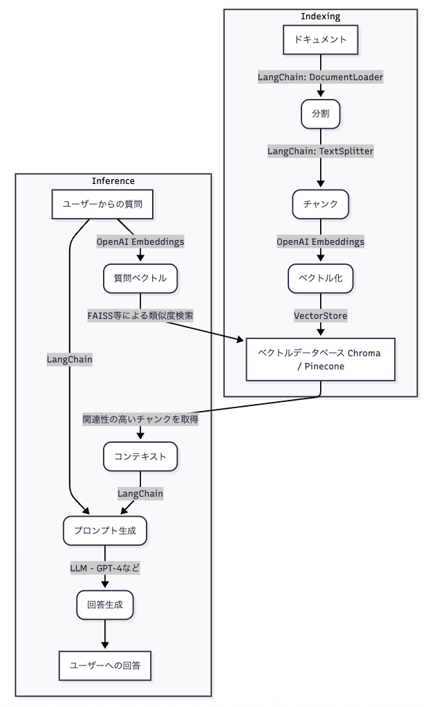
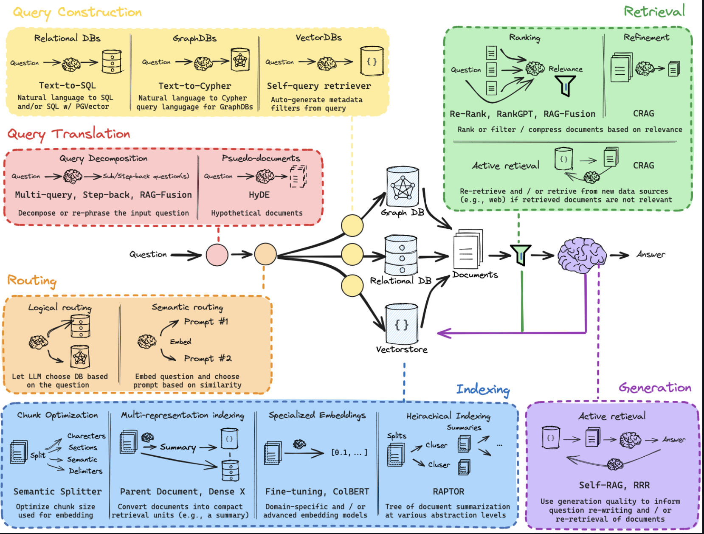
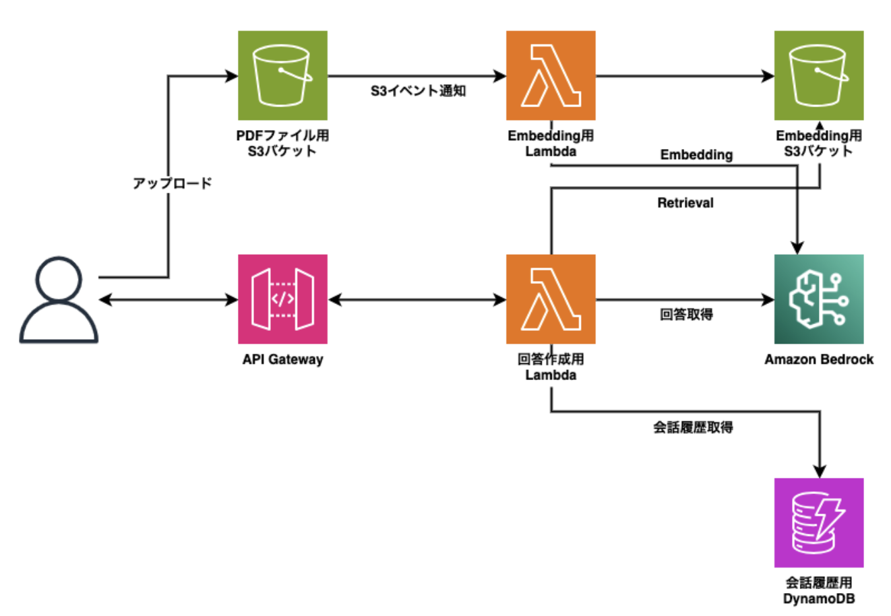
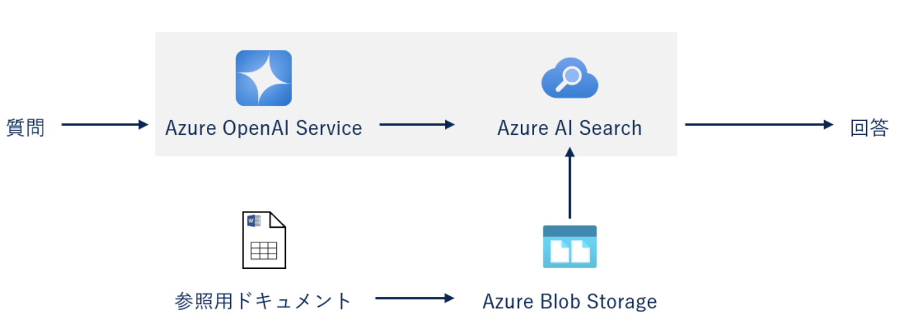
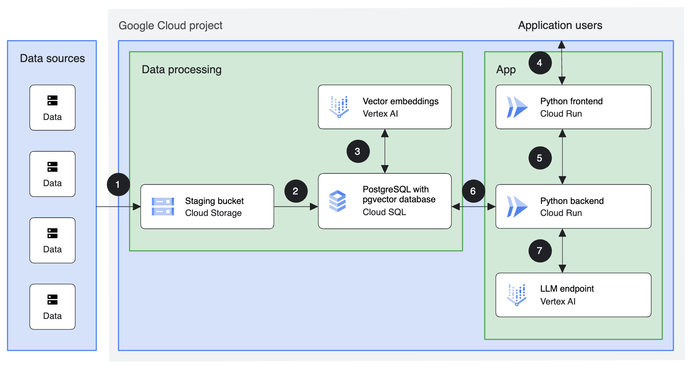
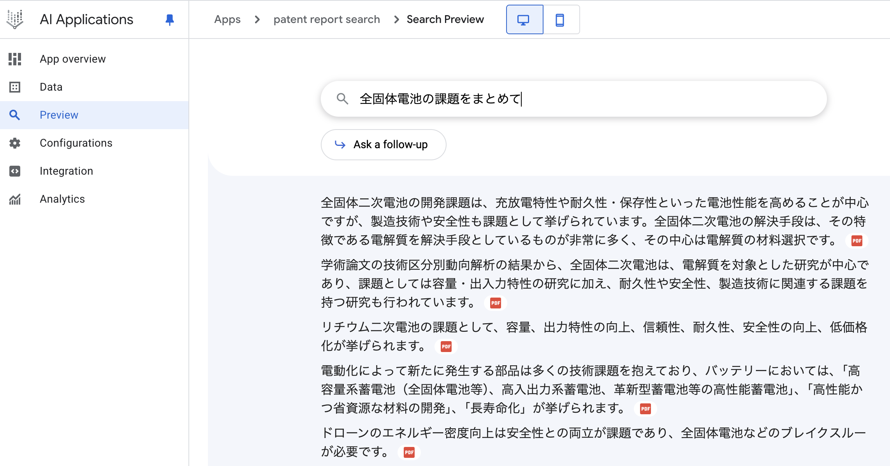
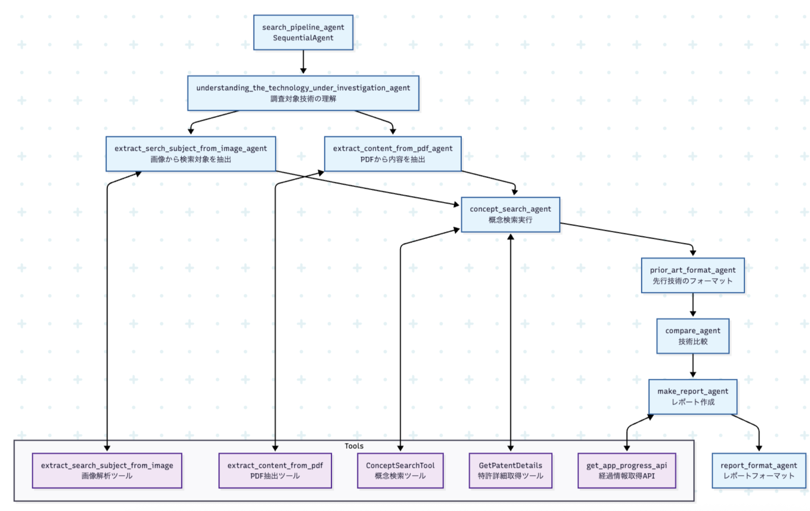
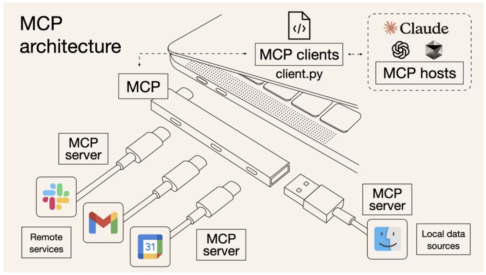

## 4. AI を「業務パートナー」にするための実践的ワークフロー

---

## 4. AI パートナーシップワークフロー - 概要

#### この章で学ぶこと

**主なトピック:**

- AI を単なるツールから業務パートナーへ昇華させる手法
- 自作開発 vs クラウドサービスの選択指針と RAG・AI エージェント実装
- LangChain/LangGraph、Google Agent Development Kit、MCP/ACP の活用
- 組織文化の変革と新しい業務フローの設計
- AI Agent デザインパターンと知財業務への適用事例

---

## 5-1. AI を単なる「便利な検索ツール」で終わらせないために

#### 従来の AI 活用の限界

**一般的な活用パターン**

- **単発的な質問**: 一時的な情報取得のみ
- **受動的な利用**: 人間からの指示を待つだけ
- **断片的な活用**: 業務の一部でのみ使用
- **効果の限界**: 真の業務改善に至らない

---

**AI を「パートナー」として活用する意義**

- **継続的な関係**: 長期的な対話関係の構築
- **能動的な支援**: 予測的・提案的な支援
- **統合的な活用**: 業務全体での最適化
- **創造的協働**: 新たな価値の共創

---

#### AI パートナーシップの基本概念

**パートナーシップの特徴**

```
1. 相互理解: AIと人間の能力・制約の理解
2. 役割分担: 最適な役割分担の設計
3. 継続学習: 相互の学習と改善
4. 信頼関係: 品質と一貫性の確保
5. 創造的協働: 新たな可能性の探索
```

**従来のツール活用との違い**

| 項目       | 従来のツール活用 | AI パートナーシップ |
| ---------- | ---------------- | ------------------- |
| **関係性** | 利用者とツール   | パートナー同士      |
| **役割**   | 受動的な実行     | 能動的な支援        |
| **期間**   | 一時的・断片的   | 継続的・統合的      |
| **効果**   | 効率化           | 変革・創造          |

---

## 5-2. AI を「業務パートナー」としてチームに迎え入れる

#### 組織文化の変革

**AI パートナーシップの文化構築**

- **オープンな姿勢**: AI の可能性を積極的に探索
- **継続的な学習**: AI 技術の進歩に適応
- **実験的なアプローチ**: 失敗を恐れず試行錯誤
- **協働の精神**: 人間と AI の最適な組み合わせ

---

**組織の準備**

```
1. リーダーシップの確立
   - AI活用のビジョン策定
   - 組織全体での推進

2. スキル開発
   - AIリテラシーの向上
   - 活用スキル

3. インフラ整備
   - 技術的基盤の構築
   - セキュリティ・ガバナンス

4. 評価・改善
   - 効果測定の仕組み
   - 継続的改善サイクル
```

---

#### チーム編成の最適化

**AI パートナーの役割設計**

|                                                                                                                                                                                                    |                                                                                                                                                                            |
| -------------------------------------------------------------------------------------------------------------------------------------------------------------------------------------------------- | -------------------------------------------------------------------------------------------------------------------------------------------------------------------------- |
| **1. 情報収集・分析パートナー**<br>• 大量データの処理<br>• パターンの発見<br>• 予測分析の実行<br><br>**2. 創造・発想パートナー**<br>• アイデアの創出<br>• 異分野の組み合わせ<br>• 新たな視点の提供 | **3. 品質管理パートナー**<br>• 一貫性の確保<br>• エラーの検出<br>• 改善提案の提示<br><br>**4. 学習・改善パートナー**<br>• 経験の蓄積<br>• 継続的な最適化<br>• 新技術の導入 |

---

## 5-3. 知財業務の質と生産性を向上させる新しい業務フロー

#### 従来の業務フローの課題

**現在の業務フローの問題点**

- **人的依存**: 専門家の経験・直感に依存
- **非効率性**: 繰り返し作業の多さ
- **品質のばらつき**: 担当者による品質差
- **スケーラビリティ**: 業務量増加への対応困難

---

**AI パートナーシップによる改善**

- **自動化**: 定型作業の自動化
- **標準化**: 品質の一貫性確保
- **拡張性**: 業務量増加への柔軟対応
- **創造性**: 新たな価値の創出

---

#### 新しい業務フローの設計

**特許調査業務の新しいフロー**

```
従来フロー：
1. 手動でのキーワード検索
2. 大量文献の個別確認
3. 担当者の経験による判断
4. 手動でのレポート作成

AIパートナーシップフロー：
1. AIによる自動キーワード生成
2. 自動検索・優先順位付け
3. AI分析＋人間の判断
4. 自動レポート生成＋人間の確認
```

---

**明細書作成業務の新しいフロー**

```
従来フロー：
1. 担当者の経験による作成
2. 手動での先行技術調査
3. 個別での品質チェック
4. 手動での修正・改善

AIパートナーシップフロー：
1. AIによるドラフト生成
2. 自動先行技術調査
3. AI品質チェック＋人間確認
4. 継続的な改善サイクル
```

---

## 5-3. 自作開発 vs クラウドサービス：RAG・AI Agent の実装アプローチ比較

#### 開発アプローチの選択指針

**2 つの主要なアプローチ**

```
1. 自作開発アプローチ
   - Pythonライブラリを組み合わせた独自実装
   - 完全なカスタマイズと制御
   - オープンソース技術の活用

2. クラウドサービスアプローチ
   - 既存のマネージドサービスの利用
   - 迅速な開発と運用負荷の軽減
   - エンタープライズレベルの機能
```

---

**選択時の考慮要素**

| 要素                 | 自作開発 | クラウドサービス |
| -------------------- | -------- | ---------------- |
| **開発時間**         | 長い     | 短い             |
| **カスタマイズ性**   | 高い     | 制限的           |
| **運用負荷**         | 高い     | 低い             |
| **初期コスト**       | 低い     | 中程度           |
| **長期コスト**       | 低い     | 高い             |
| **スケーラビリティ** | 要設計   | 自動             |
| **セキュリティ**     | 自前実装 | 提供済み         |

---

#### 自作開発アプローチの詳細

**使用する主要ライブラリ・フレームワーク**

```
1. RAG システム構築
   - LangChain: AIアプリケーション開発フレームワーク
   - Chroma/Pinecone: ベクトルデータベース
   - OpenAI Embeddings: テキストベクトル化
   - FAISS: 高速類似度検索



2. AI Agent 開発
   - LangGraph: ワークフロー管理
   - AutoGen: マルチエージェントシステム
   - CrewAI: 協調エージェントフレームワーク
   - LlamaIndex: データ統合・検索

```

---

**自作開発のメリット**

```
1. 完全なカスタマイズ
   - 業務要件に完全に適合
   - 独自のアルゴリズム実装
   - 柔軟な機能拡張

2. コスト効率
   - 初期投資は低い
   - 長期運用コストの削減
   - 使用量に応じた最適化

3. データ主権
   - データの完全な制御
   - プライバシーの確保
   - コンプライアンス対応

4. 学習・スキル向上
   - 技術的深い理解
   - チームスキルの向上
   - 将来への投資
```

**自作開発のデメリット**

```
1. 開発・運用負荷
   - 長い開発期間
   - 継続的なメンテナンス
   - 専門知識の要求

2. 技術的リスク
   - 実装の複雑さ
   - 性能最適化の困難
   - セキュリティ対策

3. スケーラビリティ
   - 大規模化への対応
   - 負荷分散の実装
   - 可用性の確保
```

---

#### クラウドサービスアプローチの詳細

**主要クラウドベンダーのサービス**

```
1. AWS (Amazon Web Services)
   - Amazon Bedrock: 基盤モデル統合
   - Amazon OpenSearch: ベクトル検索
   - Amazon SageMaker: 機械学習プラットフォーム
   - AWS Lambda: サーバーレス実行

2. Azure (Microsoft)
   - Azure OpenAI Service: OpenAI統合
   - Azure AI Search: 高度な検索機能
   - Azure Cognitive Services: AI機能群
   - Azure Functions: サーバーレス実行

3. Google Cloud
   - Vertex AI: 統合AIプラットフォーム
   - AI Agent Builder: AIエージェント作成
   - Cloud Run Functions: サーバーレス実行
```

---

**クラウドサービスのメリット**

```
1. 迅速な開発
   - 既存サービスの活用
   - インフラ構築不要
   - プロトタイプの迅速作成

2. 運用負荷の軽減
   - マネージドサービス
   - 自動スケーリング
   - セキュリティ管理

3. エンタープライズ機能
   - 高可用性
   - セキュリティ・コンプライアンス
   - 統合・連携機能

4. 最新技術へのアクセス
   - 最新モデルの利用
   - 継続的な機能更新
   - ベストプラクティスの適用
```

---

**クラウドサービスのデメリット**

```
1. コスト
   - 使用量ベースの課金
   - 長期運用での高コスト
   - 予期しない費用の発生

2. ベンダーロックイン
   - 特定ベンダーへの依存
   - 移行の困難さ
   - 価格・機能の制約

3. カスタマイズの制限
   - 提供機能の範囲内
   - 独自要件への対応困難
   - 柔軟性の制限

4. データ主権
   - 外部サービスでのデータ管理
   - プライバシー・セキュリティ懸念
   - コンプライアンス要件
```

---

#### 4. 実装ステップとサンプルコード

**より手軽に始められる FAISS と Chroma を使った実装例**
**4.1. 環境構築**

まず、必要なライブラリをインストールする。

**コード例**: `code-examples/rag-system-examples.md` の「ライブラリインストール」セクションを参照

環境変数に OpenAI の API キーを設定する。

**コード例**: `code-examples/rag-system-examples.md` の「環境変数設定」セクションを参照

---

**4.2. サンプルデータ準備**

`sample.txt` ：RAG の知識源となるテキストファイルを作成する。

**コード例**: `code-examples/rag-system-examples.md` の「サンプルデータ準備」セクションを参照

---

**4.3. Indexing: データのベクトル化と保存**

**共通コード:**

**コード例**: `code-examples/rag-system-examples.md` の「共通コード」セクションを参照

---

**Chroma を使用する場合**

Chroma は指定したディレクトリにデータを永続化するタイプのベクトル DB。

**コード例**: `code-examples/rag-system-examples.md` の「Chroma 使用例」セクションを参照

---

**4.4. Inference: 検索と回答生成**

作成したベクトルストアを使って、質問応答チェーンを構築する。

**コード例**: `code-examples/rag-system-examples.md` の「検索と回答生成」セクションを参照

---

**コード例**: `code-examples/rag-system-examples.md` の「質問応答チェーン」セクションを参照

---

**実行結果の例:**

```
質問: RAGシステムにおけるベクトルデータベースの役割は何ですか？
回答: RAGシステムにおいて、ベクトルデータベースは外部の知識ベースから関連情報を検索するという中心的な役割を果たします。
これにより、LLMが持つ知識を補強し、ハルシネーションを抑制することができます。

--- 検索された関連チャンク ---
RAGシステムは、外部の知識ベースから関連情報を検索し、その情報を基にLLMが回答を生成する仕組みです。
--------------------
ベクトルデータベースは、この情報検索のステップで中心的な役割を果たします。
--------------------
```

---

**4.5. まとめ**

- 今回提示した技術スタックを利用することで、自由に RAG システムを構築可能
- 市販品や RAG システムでは制御できない部分まで制御可能

* **LangChain** が全体のパイプライン（データ読み込み、分割、LLM 連携）を管理する。
* **OpenAI Embeddings** がテキストの意味を捉えるためのベクトルを生成する。
* **FAISS / Chroma / Pinecone** がベクトルを効率的に保存・検索する。

まずは FAISS や Chroma で小規模なプロトタイプを構築し、その仕組みを理解した上で、要件に応じて Pinecone のようなスケーラブルなソリューションへ移行する。

---

**4.6 参考:RAG システム自作での工夫点~こんなにある** [RAG From Scratch](https://github.com/langchain-ai/rag-from-scratch)



---

[X の投稿](https://x.com/athleticKoder/status/1968658987756224919)


---

**クラウドサービス例（AWS Bedrock）**[参考](https://tech.nri-net.com/entry/aws_bedrock_rag_app)



---

**クラウドサービス例（Azure）**[参考](https://business.ntt-east.co.jp/content/cloudsolution/column-628.html)


---

**クラウドサービス例（GoogleCloud）**[参考](https://cloud.google.com/architecture/ai-ml/generative-ai-rag?hl=ja)



---

**クラウドサービス例（Google Vertex AI）**[参考](https://codelabs.developers.google.com/devsite/codelabs/building-ai-agents-vertexai?hl=ja#2),[参考 2](https://cloud.google.com/architecture/ai-ml/generative-ai-rag?hl=ja)


---

**クラウドサービス例（Google AI Applications）**

Data 作成 ⇒ 　自動でベクトル DB 化 ⇒Application 作成へ



---

**自作開発例（LangGraph + AutoGen）**

> **コード例**: [`code-examples/custom-patent-agent.py`](../code-examples/custom-patent-agent.py)を参照

---

> **コード例**: `code-examples/custom-patent-agent-usage.py`を参照

---

#### 選択指針とガイドライン **自作開発を選択すべき場合**

```
1. 技術的要件
   - 高度なカスタマイズが必要
   - 独自のアルゴリズム実装
   - 特定の性能要件

2. 組織的要件
   - 技術チームのスキルが高い
   - 長期的な技術投資
   - データ主権の重視

3. コスト要件
   - 長期運用でのコスト最適化
   - 予算制約が厳しい
   - 使用量の予測が困難

4. セキュリティ要件
   - 厳格なセキュリティ要件
   - コンプライアンス要件
   - データの完全制御
```

**クラウドサービスを選択すべき場合**

```
1. 技術的要件
   - 迅速な開発が必要
   - 標準的な機能で十分
   - 最新技術の活用

2. 組織的要件
   - 技術リソースが限定的
   - 短期での成果が必要
   - 運用負荷の軽減

3. コスト要件
   - 初期投資を最小化
   - 使用量が予測可能
   - 柔軟なスケーリング

4. セキュリティ要件
   - エンタープライズレベルのセキュリティ
   - コンプライアンス認証
   - 統合セキュリティ機能
```

**ハイブリッドアプローチ**

```
1. 段階的移行
   - 初期はクラウドサービスで開始
   - 段階的に自作開発に移行
   - リスクの最小化

2. 機能別選択
   - 標準機能はクラウドサービス
   - 独自機能は自作開発
   - 最適な組み合わせ

3. 環境別選択
   - 開発・テスト環境はクラウド
   - 本番環境は自作開発
   - コストとリスクの最適化
```

---

#### ベストプラクティス **自作開発でのベストプラクティス**

```
1. モジュラー設計
   - 再利用可能なコンポーネント
   - 明確なインターフェース
   - テスト可能な構造

2. 段階的開発
   - MVP（最小実行可能製品）から開始
   - 継続的な改善
   - ユーザーフィードバックの活用

3. 性能最適化
   - ベクトル検索の最適化
   - キャッシュ戦略の実装
   - 非同期処理の活用

4. セキュリティ対策
   - API キーの安全な管理
   - データ暗号化
   - アクセス制御の実装
```

**クラウドサービスでのベストプラクティス**

```
1. 適切なサービス選択
   - 要件に最適なサービスの選択
   - コスト効率の考慮
   - スケーラビリティの確保

2. 統合・連携
   - 既存システムとの統合
   - データフローの最適化
   - エラーハンドリングの実装

3. 監視・運用
   - パフォーマンス監視
   - コスト監視
   - セキュリティ監視

4. バックアップ・復旧
   - データのバックアップ
   - 災害復旧計画
   - 継続性の確保
```

**共通のベストプラクティス**

```
1. データ品質管理
   - データの前処理
   - 品質チェックの実装
   - 継続的な改善

2. ユーザビリティ
   - 直感的なインターフェース
   - 適切なエラーメッセージ
   - ヘルプ・ドキュメント

3. 継続的改善
   - 定期的な評価
   - フィードバックの収集
   - 新技術の導入検討

4. チーム協働
   - 知識共有の促進
   - ベストプラクティスの蓄積
   - 継続的な学習
```

---

## 5-5. クラウドベンダー別 RAG アーキテクチャの比較

#### 大手クラウドベンダーの RAG サービス比較

**比較対象サービス**

| クラウドベンダー | サービス名                         | 特徴                                 |
| ---------------- | ---------------------------------- | ------------------------------------ |
| **AWS**          | Knowledge bases for Amazon Bedrock | フルマネージド、多様な基盤モデル対応 |
| **Azure**        | Azure OpenAI On Your Data          | OpenAI 統合、エンタープライズ向け    |
| **Google Cloud** | Vertex AI Agent Builder            | Gemini 統合、高度な検索機能          |

**参考**: [G-gen Tech Blog - 生成 AI の RAG 構成を大手 3 社で徹底比較](https://blog.g-gen.co.jp/entry/comparing-rag-architecture-across-cloud-vendors)

---

#### AWS: Knowledge bases for Amazon Bedrock

**構成要素**

```
• Knowledge bases for Amazon Bedrock
• Amazon S3 (データストレージ)
• Amazon OpenSearch Service (ベクトルDB)
• 各種基盤モデル (Claude, Llama等)
```

**主な特徴**

- **多様な基盤モデル**: Claude、Llama、Mistral 等
- **フルマネージド**: 運用負荷の軽減
- **スケーラブル**: 大規模データ対応
- **セキュリティ**: AWS 標準のセキュリティ機能

---

#### Azure: Azure OpenAI On Your Data

**構成要素**

```
• Azure OpenAI Service
• Azure AI Search (ベクトル検索)
• Azure Blob Storage (データストレージ)
• OpenAI GPT-4/GPT-3.5
```

**主な特徴**

- **OpenAI 統合**: GPT-4/GPT-3.5 の直接利用
- **エンタープライズ向け**: 企業のセキュリティ要件対応
- **高度な検索**: Azure AI Search の強力な検索機能
- **統合性**: Microsoft 365 との連携

---

#### Google Cloud: Vertex AI Agent Builder

**構成要素**

```
• Vertex AI Agent Builder
• Vertex AI Search
• Cloud Storage (データストレージ)
• Gemini Pro/Gemini Flash
```

**主な特徴**

- **Gemini 統合**: 最新の Gemini モデル活用
- **高度な検索**: セマンティック検索とハイブリッド検索
- **エージェント機能**: 自律的なタスク実行
- **マルチモーダル**: テキスト・画像・音声対応

---

作成例：


---

#### 料金比較と選択指針

**料金構造の違い**

| 項目            | AWS             | Azure             | Google Cloud       |
| --------------- | --------------- | ----------------- | ------------------ |
| **基盤モデル**  | 使用量ベース    | 使用量ベース      | 使用量ベース       |
| **ベクトル DB** | OpenSearch 料金 | AI Search 料金    | 内蔵（無料）       |
| **ストレージ**  | S3 料金         | Blob Storage 料金 | Cloud Storage 料金 |
| **検索**        | 内蔵（無料）    | AI Search 料金    | 内蔵（無料）       |

---

**選択指針**

```
1. 既存インフラとの親和性
2. 使用したい基盤モデル
3. 予算とスケール要件
4. セキュリティ・コンプライアンス要件
5. 開発・運用チームのスキル
```

---

#### LangChain を使用した RAG システムの構築例


---

**特許文献検索・分析システム**

> **コード例**: `code-examples/patent-rag-system.py`を参照

---

# 使用例

> **コード例**: `code-examples/patent-rag-system.py`の`main()`関数を参照

**高度な RAG システムの機能拡張**

> **コード例**: `code-examples/advanced-patent-rag-system.py`を参照

---

### 高度な RAG の技術: HyDE

**HyDE (Hypothetical Document Embeddings)** 検索精度を向上させるための先進的な手法。

1.  **課題**: ユーザーのクエリが曖昧だったり、検索対象の文書と表現が異なると、最適な文書を見つけられない。
2.  **解決策**:
    1.  まず、LLM がユーザーのクエリに対して「架空の（Hypothetical な）回答」を生成
    2.  次に、その架空の回答を埋め込み（Embedding）に変換
    3.  最後に、その埋め込みを使ってベクトル検索を行い、関連文書を探す
3.  **効果**: クエリの意図をより正確に捉えた検索が可能になり回答の精度が向上

---

### 高度な RAG の技術: Multi-Query Retriever

ユーザーの単一のクエリを、LLM を使って複数の異なる視点からのクエリに変換し、並行して検索を実行する手法

1.  **クエリ生成**: LLM が元のクエリを複数のバリエーション（例：異なる言い回し、専門用語での問い）に**書き換え**
2.  **並列検索**: 生成された複数のクエリで同時に検索を実行
3.  **結果統合**: すべての検索結果を統合し、重複を除去して最終的な文書セットを作成

**効果**: 単一のクエリでは見逃しがちな関連文書を、多角的なアプローチで捉える

---

### 高度な RAG の技術: RAG-Fusion

Multi-Query の考え方をさらに発展させ、検索結果の「再ランク付け」を組み合わせて最も関連性の高い情報を特定する手法

1.  **複数クエリ生成**: **元のクエリから複数のバリエーション**を生成
2.  **並列検索**: 各クエリで文書を検索
3.  **ランクフュージョン**: Reciprocal Rank Fusion (RRF) 等のアルゴリズムで各検索結果の順位を統合し、全体で高くランク付けされた文書を上位に引き上げる

**効果**: 複数の検索結果の良い部分を組み合わせることで、ノイズを減らし、核心的な情報を効果的に抽出

---

### 高度な RAG の技術: Rerank（再ランク付け）

ベクトル検索で大まかに取得した文書群を、より精度の高いモデル（Reranker）で関連順に並べ替える手法

1.  **取得 (Retrieve)**: ベクトル検索で、関連する可能性のある文書を多めに（例: 100 件）取得
2.  **再ランク付け (Rerank)**: 取得した各文書とクエリのペアを、より高性能なモデル（クロスエンコーダー等）で関連度スコアを再計算
3.  **選択 (Select)**: 新しいスコアに基づき、本当に LLM に渡す文書（例: 5 件）を選ぶ

**効果**: 検索の「速度」と「精度」を両立させ、最終的な回答の品質を大幅に向。

---

## 5-6. 導入戦略 段階的導入アプローチ

**Phase 1: 基盤構築期（1-3 ヶ月）**

```
目標: AIパートナーシップの基盤構築

実施項目:
1. 組織の現状分析
   - 現在の業務フロー把握
   - 改善機会の特定
   - リソース・制約の確認

2. AI活用方針の策定
   - ビジョン・目標の設定
   - 優先業務の選定
   - 成功指標の定義

3. 基盤整備
   - 技術的インフラ構築
   - セキュリティ・ガバナンス
   - スキル開発プログラム
```

---

**Phase 2: パイロット運用期（3-6 ヶ月）**

```
目標: 特定業務でのAIパートナーシップ実証

実施項目:
1. パイロット業務の選定
   - 効果測定しやすい業務
   - リスクの低い業務
   - 成功可能性の高い業務

2. AIパートナーの設計
   - 役割・能力の定義
   - 対話設計の構築
   - 品質基準の設定

3. 実証実験の実施
   - 小規模での運用開始
   - 効果測定の実施
   - 改善点の特定
```

---

**Phase 3: 本格展開期（6-12 ヶ月）**

```
目標: 全業務でのAIパートナーシップ実現

実施項目:
1. 展開計画の策定
   - 全業務への展開計画
   - リソース配分の最適化
   - リスク管理の強化

2. 組織体制の整備
   - AIパートナーシップチーム
   - 継続改善の仕組み
   - 知識共有の基盤

3. 継続的改善
   - 定期的な効果測定
   - 新技術の導入
   - ベストプラクティスの共有
```

---

## 5-7. 効果測定と継続的改善 **効果測定のフレームワーク**

**定量的指標**

```
1. 効率性指標
   - 処理時間の短縮率
   - 処理量の増加率
   - コスト削減率
2. 品質指標
   - 精度向上率
   - エラー率の削減
   - 一貫性の向上
3. 満足度指標
   - 利用者満足度
   - 顧客満足度
   - 従業員満足度
4. 創造性指標
   - 新規アイデア創出数
   - イノベーション指標
   - 競争優位性の向上
```

---

**定性的指標**

```
1. 組織能力
   - 学習能力の向上
   - 適応能力の強化
   - 創造性の向上

2. 業務品質
   - 意思決定の質
   - 問題解決能力
   - 戦略実行力

3. 競争力
   - 市場での地位
   - 技術的優位性
   - 顧客価値の向上
```

---

## 5-8. 将来展望と戦略 **技術トレンドへの対応**

**短期（1-2 年）**

```
1. マルチモーダルAI
   - 画像・音声・動画の統合処理
   - 図面・図表の自動解析
   - 会議内容の自動記録・分析

2. リアルタイム処理
   - 即座の応答と分析
   - 動的な状況適応
   - 予測的な支援

3. パーソナライゼーション
   - 個人・組織固有の最適化
   - 学習履歴の活用
   - カスタマイズされた支援
```

---

**中期（3-5 年）**

```
1. 自律的AI
   - 完全自動化された業務実行
   - 自己学習・自己改善
   - 創造的な問題解決

2. 予測分析
   - 将来の技術動向予測
   - リスクの事前検知
   - 戦略的意思決定支援

3. 人間-AI協働
   - シームレスな協働
   - 相互理解の深化
   - 新たな価値の共創
```

---

**長期（5 年以上）**

```
1. AGI統合
   - 汎用人工知能との協働
   - 人間の能力拡張
   - 新たな社会システム

2. 量子コンピューティング
   - 超高速計算による分析
   - 複雑問題の解決
   - 新たな可能性の探索

3. 脳型AI
   - 人間の思考プロセスの模倣
   - 直感的な理解
   - 創造的な協働
```

---

## 5-9. LangChain/LangGraph の利用 LangChain の基本概念

**LangChain とは**

- **フレームワーク**: AI アプリケーション開発のためのフレームワーク
- **モジュラー設計**: 再利用可能なコンポーネント
- **統合性**: 様々な AI モデルとの統合
- **拡張性**: カスタム機能の追加が容易

---

**主要機能**

- **チェーン**: 複数の処理を連結(LCEL 形式が便利！)
- **エージェント**: 自律的なタスク実行
- **メモリ**: 対話履歴の管理
- **ツール**: 外部 API との連携

---

#### LangChain の活用例 **特許分析システムの構築**

> **コード例**: `code-examples/langchain-patent-analysis.py`を参照

---

#### LangGraph の基本概念

**LangGraph とは**

- **ワークフロー管理**: 複雑な AI ワークフローの管理
- **状態管理**: ワークフローの状態を管理
- **条件分岐**: 動的な処理フローの制御
- **並列処理**: 複数の処理の並列実行

主要機能

**知財業務での活用**

- **特許調査ワークフロー**: 自動化された調査プロセス
- **分析パイプライン**: 段階的な分析処理
- **レポート生成**: 自動レポート生成システム
- **監視システム**: 継続的な監視システム

---

#### LangGraph の活用例

**特許監視ワークフロー**

> **コード例**: `code-examples/langgraph-patent-monitoring.py`を参照

---

## 5-10. Google Agent Development Kit の利用

#### Google Agent Development Kit の基本概念

**Google Agent Development Kit とは**

- **エージェント開発**: AI エージェントの開発フレームワーク
- **Google 統合**: Google の各種サービスとの統合
- **マルチモーダル**: テキスト、画像、音声の統合処理
- **スケーラビリティ**: 大規模システムへの対応

---

**主要機能**

- **エージェント作成**: カスタムエージェントの作成
- **ツール統合**: 外部ツールとの統合
- **会話管理**: 自然な会話の管理
- **学習機能**: 継続的な学習と改善

#### 知財業務での活用例

**特許調査エージェント**

> **コード例**: `code-examples/google-patent-research-agent.py`を参照

---

#### [参照](https://github.com/niship2/patentsearchagent)



---

#### 活用方法

**設定とカスタマイズ**

- **エージェント設定**: 専門性と能力の設定
- **ツール統合**: 必要なツールの統合
- **会話設計**: 自然な会話フローの設計
- **品質管理**: 回答品質の管理

**効果測定と改善**

- **性能評価**: エージェントの性能評価
- **ユーザーフィードバック**: 実際の使用感の収集
- **継続改善**: 継続的な改善の実施
- **ベストプラクティス**: 成功パターンの蓄積

---

## 5-11. MCP/ACP の利用

#### MCP (Model Context Protocol) の基本概念

**MCP とは**

- **標準化プロトコル**: AI モデルとアプリケーション間の標準プロトコル
- **相互運用性**: 異なるシステム間の連携
- **拡張性**: 新機能の追加が容易
- **オープンソース**: オープンな標準規格

---



[参照](https://blog.cloudnative.co.jp/27994/)

---

#### MCP (Model Context Protocol) の基本概念

**MCP の主要機能**

- **モデル統合**: 様々な AI モデルの統合
- **ツール連携**: 外部ツールとの連携
- **データ管理**: 効率的なデータ管理
- **セキュリティ**: セキュアな通信

---

#### ACP (Agent Communication Protocol) の基本概念

**ACP とは**

- **エージェント間通信**: AI エージェント間の通信プロトコル
- **協調作業**: 複数エージェントの協調
- **タスク分担**: 効率的なタスク分担
- **結果統合**: 複数結果の統合

**知財業務での活用**

- **分散調査**: 複数エージェントによる並列調査
- **専門分野分担**: 分野別の専門エージェント
- **結果統合**: 複数結果の自動統合
- **品質保証**: 複数エージェントによる品質チェック

---

#### ACP と MCP の違い


[参照](https://qiita.com/okikusan-public/items/196f1a781b3bf33536aa)

---

- 詳細や具体例は次の章で

---

#### パターン参考：Agent Design Pattern **現状の AI Agent 作成のベストプラクティス**


- 参考 1:(https://arxiv.org/html/2405.10467v4),
- 参考 2:(https://qiita.com/Chi_corp_123/items/cf26215878cad285599b)

---

## 1. 知財業務への適用例：先行技術調査エージェント

### 目的

特許出願前に、発明の新規性や進歩性を判断するため、関連する先行技術文献を網羅的に調査・分析する。

---

### 使用するデザインパターン

- **Retrieval Augmented Generation (RAG)**: 最新の特許データベース、学術論文、技術ブログなど、社内外の膨大な知識ソースから関連情報をリアルタイムで検索・取得
- **Single-Path Plan Generator**: 「発明内容の理解 → キーワード抽出 → データベース検索 → 関連度スクリーニング → レポート生成」という一連の調査プロセスを計画し、効率的に実行
- **Human Reflection**: AI が生成した先行技術リストに対し、弁理士や知財担当者がフィードバックを行い、AI はそのフィードバックを学習して調査精度を継続的に向上

---

## 1. 知財業務への適用例：先行技術調査エージェント

### 動作例

1. 開発者が発明の概要を入力
2. エージェントが RAG を用いて複数の特許・論文データベースを横断的に検索
3. Single-Path Plan Generator に基づき、関連性の高い文献を抽出し、要約付きのレポートを作成
4. 人間の専門家がレビューを行い、そのフィードバック(Human Reflection)を反映して、より精度の高い最終報告書を完成

---

## 2. 知財業務への適用例：商標監視・侵害検知エージェント

### 目的

自社が保有する商標と類似する商標の出願や、EC サイト・SNS 上での不正使用を継続的に監視し、ブランド価値の毀損を防ぐ。

---

### 使用するデザインパターン

- **Proactive Goal Creator**: 定期的に各国の商標データベースをスキャンするだけでなく、画像認識や自然言語処理技術を用いて、ウェブ上のロゴの無断使用や紛らわしい商品説明を能動的に検知
- **Multimodal Guardrails**: 商標のロゴ（画像）と名称（テキスト）の両方を監視対象とし、検知した情報が法的に問題のない文脈で使われているかを判断
- **Prompt/Response Optimiser**: 侵害の可能性が高い事案を発見した際に、法務部への報告書を標準化されたフォーマットで自動生成

---

## 2. 知財業務への適用例：商標監視・侵害検知エージェント

### 動作例

1. 監視対象の商標を登録
2. エージェントが Proactive Goal Creator により、ウェブ上を常時パトロール
3. 類似のロゴや名称を発見すると、Multimodal Guardrails がその文脈を分析し、侵害の可能性を判断
4. 危険度が高いと判断されると、Prompt/Response Optimiser が整形されたレポートを作成し、担当者にアラートを送信

---

## 3. 知財業務への適用例：知財契約書レビュー・ドラフト作成支援エージェント

### 目的

ライセンス契約や共同研究開発契約などのドラフト作成を支援し、レビュー時には契約内容に潜むリスクを指摘する。

---

### 使用するデザインパターン

- **Role-based Cooperation**: 「ドラフト作成担当」「リスク分析担当」「条項修正提案担当」など、役割が明確に分かれた複数のエージェントが協調して動作
- **Cross-Reflection**: 作成されたドラフトに対し、「法務エージェント」が法的な観点から、「技術エージェント」が技術的な実現可能性の観点からレビューを行い、多角的なフィードバックを生成
- **Retrieval Augmented Generation (RAG)**: 過去の契約書データベース、最新の法規制や判例を参照し、不利な条項や市場慣行から逸脱した条件がないかをチェック

---

## 3. 知財業務への適用例：知財契約書レビュー・ドラフト作成支援エージェント

### 動作例

1. ユーザーが契約の目的を入力
2. 「ドラフト作成担当」エージェントが RAG を使い、雛形を作成
3. そのドラフトを複数の専門エージェントが Cross-Reflection の仕組みで多角的にレビュー
4. Role-based Cooperation によって効率的に管理され、最終的にリスク分析と修正提案が付記された契約書ドラフトを提示

---

## 4. 知財業務への適用例：発明創出ブレインストーミングエージェント

### 目的

研究開発者との対話を通じて、既存技術の新たな組み合わせや異分野技術の応用を提案し、革新的な発明のアイデア創出を促進する。

---

### 使用するデザインパターン

- **Multi-Path Plan Generator**: 一つの技術課題に対し、複数の異なる解決アプローチをツリー構造で提示し、ユーザーは各分岐点で興味のある方向性を選択してアイデアを深掘り
- **Debate-based Cooperation**: 異なる専門知識を持つエージェント同士が、あるアイデアについて討論を行い、アイデアを多角的に発展
- **Incremental Model Querying**: 一度に完璧な答えを提示するのではなく、ユーザーとの対話を重ねるごとに段階的に情報を追加・修正し、アイデアを徐々に具体化

---

## 4. 知財業務への適用例：発明創出ブレインストーミングエージェント

### 動作例

1. 研究者が「バッテリーの長寿命化」という課題を入力
2. エージェントが Multi-Path Plan Generator を用いて複数の技術的アプローチを提示
3. ユーザーが特定のアプローチを選ぶと、Debate-based Cooperation に基づき、関連分野の専門エージェントがそのアイデアの実現性や課題について議論
4. Incremental Model Querying によって継続され、新たな発明の種を生み出し

---

## 5. 知財業務への適用例：知財ポートフォリオ最適化エージェント

### 目的

企業が保有する特許群（ポートフォリオ）を分析し、事業戦略との整合性を評価

---

### 使用するデザインパターン

- **Retrieval Augmented Generation (RAG)**: 自社の特許情報だけでなく、競合他社の出願動向、市場レポート、M&A 情報などの外部データをリアルタイムで取得し、分析に追加
- **Voting-based Cooperation**: 個々の特許の価値を評価する際、「技術的価値評価エージェント」「市場性評価エージェント」「法的安定性評価エージェント」などがそれぞれの専門的観点からスコアを付け、その結果を投票によって統合
- **Agent Evaluator**: ポートフォリオの最適化戦略を実行した場合の財務的影響や市場での競争力への影響をシミュレーションし、提案の妥当性を事前に検証

---

## 5. 知財業務への適用例：知財ポートフォリオ最適化エージェント

### 動作例

1. エージェントが、RAG を駆使して自社および競合の知財情報と市場データを収集・分析
2. 各特許の重要度について、複数の評価エージェントが Voting-based Cooperation の仕組みで総合スコアを算出
3. その結果に基づき、特許の「維持・強化・放棄」などを提案
4. 提案された戦略は Agent Evaluator によってその効果がシミュレーションされ、意思決定のための詳細なレポートとして経営層に提出

---

## 5-14. AI Agent デザインパターンの詳細解説

#### 1. Retrieval Augmented Generation (RAG) / 検索拡張生成

**目的**
AI エージェントが、自身の学習データに含まれていない最新の、あるいは専門的な外部知識ソースにアクセスし、回答の正確性と網羅性を向上させる。

**仕組み**
ユーザーからの質問に対し、まず関連する情報をデータベースやウェブから検索（Retrieval）する。そして、その検索結果をコンテキスト（文脈）としてプロンプトに含め、大規模言語モデル（LLM）に回答を生成（Generation）させる。

**具体例**
最新の法律情報に基づいて質問に答える法律相談 AI。AI は回答を生成する前に、最新の判例データベースを検索する。

---

#### 2. Human Reflection / 人間による省察

**目的**
AI エージェントの出力や行動に対し、人間がフィードバック（評価、修正、指示）を与えることで、エージェントの性能を継続的に改善・調整する。

**仕組み**
エージェントが生成した結果を人間がレビューし、「良い/悪い」の評価や、より適切な回答例を提供する。エージェントはこのフィードバックを学習し、将来のタスクに活かす。

**具体例**
AI が作成した報告書を上司が添削し、その内容を AI が学習して次回の報告書作成精度を上げる。

---

#### 3. Cross-Reflection / 相互省察

**目的**
複数の AI エージェントが互いの生成物やアイデアをレビューし、フィードバックを交換することで、単一のエージェントでは到達できない高品質な成果物を生み出す。

**仕組み**
あるエージェントが作成したドラフトを、別の専門性を持つエージェントが批評・改善提案を行う。このプロセスを繰り返すことで、多角的な視点を取り入れた成果物が完成する。

**具体例**
「文章作成 AI」が書いたブログ記事を、「SEO 分析 AI」がキーワードの観点からレビューし、改善案を提示する。

---

#### 4. Guardrails / ガードレール（安全策）

**目的**
AI エージェントが不適切、有害、あるいは倫理に反するコンテンツを生成したり、危険な行動を実行したりするのを防ぐための制約やルールを設定する。

**仕組み**
入力（プロンプト）と出力（生成結果）の両方にフィルターをかける。特定の禁止ワード、トピック、行動パターンを検知し、ブロックしたり、安全な応答に修正したりする。

**具体例**
医療相談 AI が、診断や処方箋の提示といった医師法に抵触する可能性のある回答を生成しないように制限する。

---

#### 5. Multimodal Guardrails / マルチモーダル・ガードレール

**目的**
テキストだけでなく、画像、音声、動画など複数のデータ形式（モダリティ）にわたってガードレールを適用し、より包括的な安全性を確保する。

**仕組み**
画像認識技術で不適切な画像を検知したり、音声分析で攻撃的な口調を検知したりするなど、各モダリティに応じた安全チェックを行う。

**具体例**
ユーザーがアップロードした画像に不適切なコンテンツが含まれていないか、AI が自動でチェックし、問題があれば処理を中断する。

---

#### 6. Single-Path Plan Generator / 単一経路プラン生成

**目的**
複雑なタスクを達成するために、実行すべき一連のステップ（行動計画）を直線的に生成する。

**仕組み**
タスクの最終目標を達成するために必要な手順を、順番にリストアップする。例えば、「1. 情報を検索する → 2. 内容を要約する → 3. レポートを作成する」といった計画を立てる。

**具体例**
旅行計画 AI が、「目的地調査 → 航空券予約 → ホテル予約 → 旅程作成」というステップを順番に計画し、実行する。

---

#### 7. Multi-Path Plan Generator / 複数経路プラン生成

**目的**
一つの目標に対し、複数の異なるアプローチや代替案を含む計画を生成し、柔軟性や網羅性を高める。

**仕組み**
タスク達成のための計画をツリー構造やグラフで表現する。各ステップで複数の選択肢を提示し、状況に応じて最適な経路を選べるようにする。

**具体例**
新製品のマーケティング戦略を立案する AI が、「A 案: SNS 広告中心」「B 案: インフルエンサー活用」「C 案: イベント開催」など、複数の実行プランを同時に提案する。

---

#### 8. Proactive Goal Creator / 能動的な目標設定

**目的**
指示を待つだけでなく、AI エージェントが自ら周囲の状況やデータを分析し、達成すべき新たな目標や解決すべき課題を能動的に発見・設定する。

**仕組み**
継続的にデータを監視・分析し、パターンや異常、改善の機会を見つけ出す。そして、それを基に「〜を最適化すべき」「〜のリスクを調査すべき」といった新しいタスクを自ら生成する。

**具体例**
工場の生産ラインを監視する AI が、特定の工程で遅延が頻発していることを発見し、「この工程のボトルネック解消」を新たな目標として設定し、解決策の検討を始める。

---

#### 9. Incremental Model Querying / 段階的なモデル照会

**目的**
一度に完全な情報を LLM に問い合わせるのではなく、対話や思考プロセスを段階的に進め、文脈を維持しながら少しずつ情報を引き出していく。

**仕組み**
長い対話や複雑な問題解決において、過去のやり取りの要約を次のプロンプトに含めるなどして、文脈を失わずに思考を継続させる。

**具体例**
ユーザーとの長文対話において、AI が直前の会話の要点を記憶し、それを踏まえた上で次の質問を投げかける。

---

#### 10. Prompt/Response Optimiser / プロンプト・レスポンス最適化

**目的**
LLM とのやり取り（プロンプトとレスポンス）を、より効果的で効率的なものに自動で改善・最適化する。

**仕組み**
ユーザーの曖昧な指示を、LLM が理解しやすい明確なプロンプトに変換したり、LLM からの出力を、ユーザーが求める形式（表、箇条書きなど）に整形したりする。

**具体例**
ユーザーが「市場について教えて」と入力すると、AI が「どの市場の、どのような情報（規模、トレンド、競合など）について知りたいですか？」と問い返し、プロンプトを具体化する。

---

#### 11. Role-based Cooperation / 役割ベースの協調

**目的**
複数の AI エージェントにそれぞれ専門的な役割（例：リサーチャー、ライター、レビューア）を割り当て、分業と協調作業によって複雑なタスクを効率的に遂行する。

**仕組み**
タスクをサブタスクに分解し、各サブタスクを専門のエージェントに担当させる。オーケストレーター（指揮者）役のエージェントが全体の進捗を管理する。

**具体例**
ソフトウェア開発において、「要件定義エージェント」「コーディングエージェント」「テストエージェント」が連携して一つのプログラムを作り上げる。

---

#### 12. Debate-based Cooperation / 討論ベースの協調

**目的**
ある議題に対して、異なる視点や意見を持つ複数のエージェントに討論（ディベート）させることで、より深く、多角的な分析や、創造的なアイデアを生み出す。

**仕組み**
特定のテーマに対し、賛成、反対、あるいは異なる専門的立場からエージェントが意見を出し合う。その議論のプロセスを通じて、問題の長所・短所や新たな解決策が浮かび上がる。

**具体例**
新規事業の是非を判断するために、「楽観的な市場予測 AI」と「悲観的なリスク分析 AI」を討論させ、事業計画の妥当性を検証する。

---

#### 13. Voting-based Cooperation / 投票ベースの協調

**目的**
同じ問題に対して複数のエージェントがそれぞれ独立して出した回答や判断を、投票や多数決によって統合し、最も信頼性の高い結論を導き出す。

**仕組み**
一つの質問に対し、複数のエージェントに同時に答えさせる。それぞれの回答を比較し、最も多くのエージェントが支持した回答を最終的な結論として採用する。

**具体例**
画像に写っている物体が「犬」か「猫」か判断する際に、5 体の画像認識 AI に判定させ、3 体以上が「犬」と答えたら最終結果を「犬」とする。

---

#### 14. Contextual Prompt Generation / 文脈に応じたプロンプト生成

**目的**
ユーザーの過去の行動、好み、現在の状況といった文脈（コンテキスト）を動的にプロンプトに組み込むことで、パーソナライズされた応答を生成する。

**仕組み**
ユーザープロファイル、対話履歴、使用中のアプリケーションなどの情報を取得し、それを基に LLM への指示（プロンプト）をリアルタイムで調整する。

**具体例**
EC サイトのチャットボットが、ユーザーの閲覧履歴や過去の購入履歴を考慮して、「お客様におすすめの商品はこちらです」とパーソナライズされた提案をする。

---

#### 15. Dynamic Task Prioritisation / 動的なタスク優先順位付け

**目的**
複数のタスクや目標を抱えるエージェントが、状況の変化に応じて、どのタスクを優先的に処理すべきかを動的に判断・再計画する。

**仕組み**
各タスクに緊急度や重要度といったスコアを付け、常に全体の状況を監視する。より緊急で重要なタスクが発生した場合、現在の作業を中断してでもそちらを優先するようにスケジュールを調整する。

**具体例**
自律走行車が、通常の「目的地への走行」タスクよりも、突如現れた障害物を回避する「緊急停止」タスクを最優先する。

---

#### 16. Context Window Optimiser / コンテキストウィンドウ最適化

**目的**
LLM が一度に処理できる情報量（コンテキストウィンドウ）の制限に対処するため、限られたウィンドウ内に最も重要で関連性の高い情報を効率的に詰め込む。

**仕組み**
長い文書や対話履歴を要約したり、古い情報を削除したり、関連性の低い情報をフィルタリングしたりして、プロンプトのサイズを管理する。

**具体例**
長時間にわたる会議の議事録を AI に要約させる際、本筋から外れた雑談部分を自動的に除外し、重要な決定事項だけをコンテキストウィンドウに入れる。

---

#### 17. LLM Finetuner / LLM ファインチューナー

**目的**
特定のドメインやタスクに特化したデータセットを用いて、汎用的な LLM を再トレーニング（ファインチューニング）し、専門性と性能を向上させる。

**仕組み**
医療、法律、金融といった専門分野の大量のテキストデータや Q&A データを LLM に追加学習させ、その分野における専門用語の理解や応答精度を高める。

**具体例**
医療論文のデータセットでファインチューニングされた LLM が、一般的な LLM よりも正確に医学的な質問に答えられるようにする。

---

#### 18. Agent Evaluator / エージェント評価機

**目的**
開発・運用中の AI エージェントの性能、信頼性、安全性を客観的かつ体系的に評価するための仕組み。

**仕組み**
事前に定義された評価基準（正答率、応答速度、安全性など）に基づき、シミュレーション環境やテストデータセットを用いてエージェントの能力を測定する。評価結果を基に、改善点を発見する。

**具体例**
新しく開発した顧客対応チャットボットに対し、想定される様々な質問シナリオを流し込み、どれだけ正確かつ丁寧に対応できるかを自動でスコアリングする。

---

#### デザインパターンの活用指針

**知財業務での適用例**

```
1. 特許調査業務
   - RAG + Single-Path Plan Generator
   - Human Reflection + Cross-Reflection

2. 明細書作成業務
   - Role-based Cooperation + Cross-Reflection
   - Guardrails + Prompt/Response Optimiser

3. 特許監視業務
   - Proactive Goal Creator + Multimodal Guardrails
   - Dynamic Task Prioritisation

4. 知財戦略立案
   - Multi-Path Plan Generator + Debate-based Cooperation
   - Voting-based Cooperation + Agent Evaluator
```

---

**実装時の注意点**

1. パターンの組み合わせ

   - 単一パターンではなく、複数パターンの組み合わせ
   - 業務要件に応じた最適な組み合わせの選択

2. 人間との協調

   - AI エージェントの自律性と人間の制御のバランス
   - 適切なガードレールの設定

3. 継続的な改善
   - パフォーマンスの定期的な評価
   - 新しいパターンの導入検討
