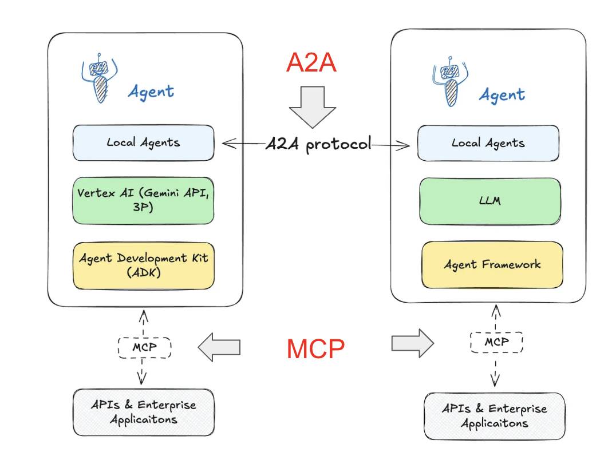
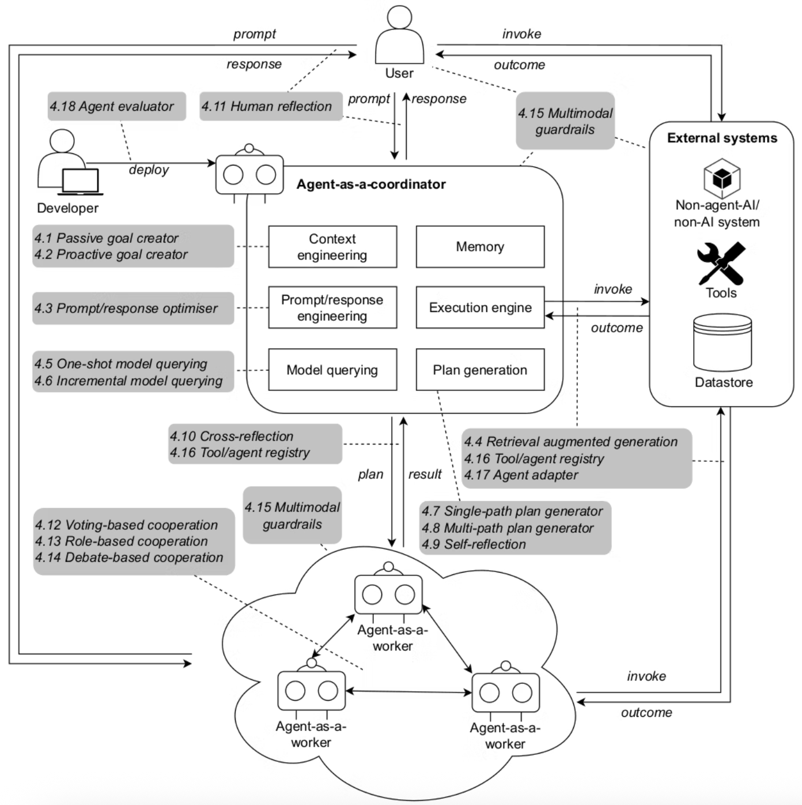

# 5. 知財業務の自動化への道筋

---

## 5. 自動化への道筋 - 概要

#### この章で学ぶこと

**主なトピック:**

- Claude Code、Cursor、Devin 等コーディングアシスタントの活用
- クラウドベンダー別 AI エージェント比較と Vellum AI LLM リーダーボード活用
- MCP（Model Context Protocol）と A2A（Agent-to-Agent）プロトコル

---

## 5-1. コーディングアシスタントの活用

#### Claude Code

- **コード生成**: 特許分析ツールの作成・カスタムスクリプトの開発
- **デバッグ支援**: エラーの自動修正・パフォーマンス最適化
- **最適化**: アルゴリズム改善・メモリ使用量の最適化
- **ドキュメント生成**: コードの自動ドキュメント化・API 仕様書作成

---

#### Cursor

- **IDE 統合**: 開発環境での直接支援・リアルタイムコード補完
- **リアルタイム**: コード作成の即座の支援・エラー予測
- **学習機能**: プロジェクト固有の学習・コードスタイルの適応
- **リファクタリング**: 自動的なコード改善・アーキテクチャ最適化

---

#### Devin

- **自律開発**: 完全自動のソフトウェア開発・要件から実装まで
- **要件理解**: 自然言語からの仕様理解・技術選択の自動化
- **継続改善**: フィードバックによる改善・継続的デプロイメント
- **プロジェクト管理**: タスク分割・進捗管理・品質保証

---

#### 知財業務での活用例

Claude Code を使用した特許分析ツールの自動生成例：

**参照ファイル**: [`code-examples/claude-code-patent-analysis-tool.py`](../code-examples/claude-code-patent-analysis-tool.py)

この例では、Claude Code のプロンプトエンジニアリング機能を活用して、特許文献の自動分析ツールを段階的に開発するプロセスを示しています。プロンプトには以下の要素が含まれています：

- **Role**: 専門家としての役割定義
- **Context**: 開発の背景と要件
- **Task**: 具体的な開発手順
- **Output Format**: 出力形式の指定
- **Constraints**: 制約条件の明示

---

## 5-2. Gemini CLI について

#### 特徴

- **コマンドライン統合**: ターミナルからの直接利用・シェルスクリプト統合
- **スクリプト化**: 自動化の容易な実装・バッチ処理の支援
- **ファイル操作**: ローカルファイルの直接処理・一括変換
- **API 連携**: 外部サービスとの統合・データ取得・処理

---

#### インストールと設定

**インストール手順**

```bash
# Claude Code CLI のインストール
npm install -g @google/gemini-cli

```

実際の画面はこちら（Cursor 利用の場合）

---

※以下のコマンド（process,generate-report など）は、MCP 拡張で実現します。

#### 活用例

```bash
# 特許文献の一括処理
gemini process patents/*.pdf --output analysis/ --format json

# 定期レポートの自動生成
gemini generate-report --template weekly --data patents.json --output reports/

# 技術動向の監視
gemini monitor-trends --keywords "AI,patent" --interval daily --output trends/

# 文書の自動翻訳
gemini translate --input japanese_patents/ --output english_patents/ --source ja --target en
```

---

#### 知財業務での具体的活用

**特許文献の一括分析**

```bash
# 複数の特許文献を一括で分析
gemini analyze-patents \
  --input-dir ./patent_documents/ \
  --output-dir ./analysis_results/ \
  --analysis-type "technical_trends,competitor_analysis,classification" \
  --format "json,csv,pdf"
```

**技術動向の自動監視**

```bash
# 特定技術分野の動向を自動監視
gemini setup-monitoring \
  --technology "artificial intelligence" \
  --keywords "machine learning,deep learning,neural networks" \
  --frequency "daily" \
  --notification "email,slack" \
  --output "./monitoring_results/"
```

---

## 5-3. Claude Code CLI の活用

#### Claude Code CLI の基本概念

**Claude Code CLI とは**

- **コマンドライン統合**: ターミナルからの直接利用
- **コード生成**: 自然言語からのコード自動生成
- **プロジェクト管理**: 既存プロジェクトの理解と改善
- **デバッグ支援**: エラーの自動修正と最適化

---

**主要機能**

- **ファイル操作**: 既存ファイルの読み込み・分析・修正
- **コード生成**: 新規ファイルの作成・機能追加
- **プロジェクト分析**: プロジェクト全体の構造理解
- **自動テスト**: テストコードの生成・実行

---

#### インストールと設定

**インストール手順**

```bash
# Claude Code CLI のインストール
npm install -g @anthropic-ai/claude-code-cli

# または
pip install claude-code-cli

# 認証設定
claude-code auth
```

実際の画面はこちら（Cursor 利用の場合）

---

**基本設定**

```bash
# 設定ファイルの作成
claude-code init

# プロジェクトの設定
claude-code config --project-path ./my-project
claude-code config --language python
claude-code config --framework flask
```

---

#### 知財業務での活用例

**特許分析スクリプトの生成**

```bash
# 特許分析スクリプトの生成（Claude API使用例）
claude --prompt "特許文献を分析するPythonスクリプトを作成してください。\
PDFファイルを読み込み、テキストを抽出し、キーワード分析を行い、
結果をCSVファイルに出力する機能が必要です。" > patent_analyzer.py

# 生成されたスクリプトの実行
python patent_analyzer.py --input patents/ --output results/
```

---

**既存コードの改善**

```bash
# 既存の特許検索スクリプトを改善（Claude API使用例）
claude --prompt "以下のファイルのエラーハンドリングを追加し、
ログ機能を実装し、パフォーマンスを最適化してください。
" --file patent_search.py > improved_patent_search.py

# 特定の関数を改善
claude --prompt "search_patents関数の検索精度を向上させ、
結果の並び替え機能を追加してください。\
" --file patent_search.py > optimized_patent_search.py
```

---

#### 活用パターン

**プロジェクト全体の分析**

```bash
# プロジェクト全体の構造分析（treeコマンド使用）
tree ./patent-analysis-system > project_structure.txt

# 改善提案の生成（Claude API使用例）
claude --prompt "以下のプロジェクト構造を分析し、パフォーマンス、
セキュリティ、保守性の観点から改善提案をしてください。\
" --file project_structure.txt > analysis_report.md
```

---

**自動テストの生成**

```bash
# 既存コードに対するテストの生成（Claude API使用例）
claude --prompt "patent_analyzer.pyのテストコードを
pytestフレームワークで作成してください。\
 --file patent_analyzer.py > test_patent_analyzer.py

# テストの実行
pytest test_patent_analyzer.py
```

---

#### 高度な活用例

**特許監視システムの構築**

```bash
# 特許監視システムの生成（Claude API使用例）
claude --prompt "特許監視システムを作成してください。以下の機能が必要です：
1. 定期的な特許検索（毎日午前2時）
2. 新規特許の自動検出
3. 重要度評価
4. メール通知機能
5. データベース保存
6. Web ダッシュボード" > patent_monitor_system.py

# システムの実行
python patent_monitor_system.py
```

---

**API クライアントの生成**

```bash
# 特許庁API クライアントの生成（Claude API使用例）
claude --prompt "特許庁API を使用するPython クライアントを作成してください。
- 特許検索機能
- 特許詳細取得機能
- エラーハンドリング
- レート制限対応
- キャッシュ機能" > patent_api_client.py
```

---

#### 設定とカスタマイズ

**プロジェクト固有の設定**

```bash
# プロジェクト設定ファイルの作成（手動作成例）
cat > pyproject.toml << EOF
[build-system]
requires = ["setuptools", "wheel"]
build-backend = "setuptools.build_meta"

[project]
name = "patent-analysis"
version = "0.1.0"
dependencies = ["fastapi", "langchain", "psycopg2-binary", "pytest"]
EOF

# カスタムテンプレートの設定（Claude API使用例）
claude --prompt "特許分析用のクラステンプレートを作成してください。" > template.py
```

---

**ワークフローの自動化**

```bash
# 自動化ワークフローの設定（cron使用例）
cat > daily_patent_analysis.sh << EOF
#!/bin/bash
cd /path/to/patent-analysis
python search_patents.py
python analyze_results.py
python generate_report.py
python send_notification.py
EOF

chmod +x daily_patent_analysis.sh

# crontabに追加（毎日午前2時実行）
echo "0 2 * * * /path/to/daily_patent_analysis.sh" | crontab -
```

---

#### 効果測定と改善

**コード品質の測定**

```bash
# コード品質の分析（pylint使用例）
pylint patent_analyzer.py --output-format=json > quality_report.json

# 改善提案の生成（Claude API使用例）
claude --prompt "以下のコード品質レポートを基に、patent_analyzer.pyの改善提案をしてください。\
" --file quality_report.json > improved_patent_analyzer.py
```

---

**パフォーマンス最適化**

```bash
# コード例: claude-code-cli-commands.sh (続き)
# 詳細は code-examples/claude-code-cli-commands.sh を参照

```

---

## 5-4. 寝てる間に進めてもらう(サンプル)

#### 自動化戦略

- **スケジューリング**: 定期的なタスク実行・時間帯最適化
- **条件分岐**: 状況に応じた処理選択・優先度の動的調整
- **通知機能**: 完了・異常の自動通知・進捗レポート
- **継続学習**: 実行結果からの学習・改善の自動化

---

#### 実装例

コード例: nightly-patent-analysis.py
詳細は code-examples/nightly-patent-analysis.py を参照

---

#### 注意点

- **品質管理**: 自動処理結果の確認・検証システムの構築
- **エラーハンドリング**: 異常時の対応・復旧機能の実装
- **セキュリティ**: 機密情報の保護・アクセス制御の強化
- **監視・ログ**: 実行状況の監視・詳細ログの記録

---

## 5-5. 自動化システムの構築

#### システムアーキテクチャ

```python
# コード例: fully-automated-patent-system.py
# 詳細は code-examples/fully-automated-patent-system.py を参照
```

---

## 5-6. 自動化の効果測定

#### 定量的効果

**効率性指標**

- **処理時間**: 自動化前後の処理時間比較
- **処理量**: 単位時間あたりの処理件数
- **コスト**: 人的コスト・運用コストの削減
- **精度**: 自動化による精度向上

---

**品質指標**

- **エラー率**: 人的エラーの削減
- **一貫性**: 処理結果の標準化
- **完全性**: 処理漏れの防止
- **タイムリー性**: リアルタイム処理の実現

---

## 5-7. AI エージェントのクラウドベンダー比較

#### 主要クラウドベンダーの AI エージェントサービス

出典:[生成 AI の AI エージェントを大手 3 社（AWS、Azure、Google Cloud）で徹底比較してみた](https://blog.g-gen.co.jp/entry/comparing-agent-architecture-across-cloud-vendors) [7]

---

**Amazon Bedrock Agents（AWS）**

- **構成要素**: エージェント、ツール、ナレッジベース、アクション
- **対応モデル**: Claude 3.5 Sonnet、Claude 3 Haiku、Llama 3.1 405B
- **主要機能**:
  - 自然言語での複雑なタスク実行
  - ツールの動的呼び出し
  - ナレッジベースとの統合
  - アクションの実行（Lambda 関数等）
- **料金**: 入力トークン $0.00015/1K、出力トークン $0.0006/1K

---

#### Azure AI Agent Services（Azure）

**構成要素**

- **AI Agent**: 自然言語処理と意思決定
- **Tools**: 外部サービスとの連携
- **Knowledge Base**: 企業データの統合
- **Actions**: 具体的なタスク実行

**対応モデル**

- **GPT-4.1**: 最新の高性能モデル（2025 年 4 月リリース）
- **o1-pro**: 高度な推論能力を持つ最新モデル（2025 年 3 月リリース）
- **GPT-4o**: 高性能なマルチモーダルモデル
- **GPT-4o mini**: コスト効率を重視した軽量モデル
- **GPT-4 Turbo**: バランスの取れた性能
- **GPT-3.5 Turbo**: コスト効率重視

---

#### Azure AI Agent Services（Azure）の機能

**主要機能**

- **マルチエージェントシステム**: 複数エージェントの協調
- **高度なツール連携**: カスタムツールの開発・統合
- **セキュリティ**: エンタープライズレベルのセキュリティ
- **スケーラビリティ**: 大規模システムへの対応

---

#### Vertex AI Agents（Google Cloud）

**構成要素**

- **Agent**: 自律的な意思決定を行う AI エージェント
- **Tools**: 外部サービスとの連携・API 呼び出し
- **Knowledge Base**: 企業データの統合・RAG システム
- **Actions**: 具体的なタスク実行・ワークフロー管理

**対応モデル**

- **Gemini 2.5 Pro**: 最新の高性能モデル
- **Gemini 2.5 Flash**: 高速処理重視

---

#### Vertex AI Agents（Google Cloud）の機能

**主要機能**

- **自律的エージェント**: 複雑なタスクの自動実行
- **マルチターン対話**: 継続的な対話による課題解決
- **高度なツール連携**: カスタムツールの開発・統合
- **セキュリティ**: エンタープライズレベルのセキュリティ
- **スケーラビリティ**: 大規模システムへの対応

---

#### 3 社比較：機能面での違い

| 機能                   | AWS Bedrock Agents | Azure AI Agent Services | Vertex AI Agents   |
| ---------------------- | ------------------ | ----------------------- | ------------------ |
| **マルチエージェント** | 対応               | 対応                    | 対応               |
| **カスタムツール**     | 対応               | 対応                    | 対応               |
| **ナレッジベース**     | 対応               | 対応                    | 対応               |
| **アクション実行**     | Lambda 等          | カスタムアクション      | カスタムアクション |
| **自律的対話**         | 制限的             | 制限的                  | マルチターン対話   |
| **セキュリティ**       | 高                 | 高                      | 高                 |

---

#### 3 社比較：料金面での違い

**想定シナリオ：社内ナレッジシステム（月間 100 万トークン）**

| ベンダー         | モデル           | 月間料金 | 特徴             |
| ---------------- | ---------------- | -------- | ---------------- |
| **AWS**          | Claude 4 Opus    | $200     | 最高性能         |
| **AWS**          | Claude 4 Sonnet  | $150     | バランス型       |
| **Azure**        | GPT-4.1          | $1,800   | 最新高性能       |
| **Azure**        | GPT-4o           | $1,500   | マルチモーダル   |
| **Google Cloud** | Gemini 2.5 Pro   | $2,000   | 最新思考型モデル |
| **Google Cloud** | Gemini 2.5 Flash | $50      | 高速・低コスト   |
| **Anthropic**    | Claude 4 Opus    | $200     | 最高品質         |
| **OpenAI**       | GPT-4.1          | $1,800   | 最新汎用性       |

---

#### 選択の指針

**AWS Bedrock Agents が適している場合**

- **安定性重視**: 実績のある Claude モデルの活用
- **コスト効率**: 比較的安価な料金体系
- **AWS 環境**: 既存の AWS インフラとの統合
- **シンプルな構成**: 基本的なエージェント機能で十分

**Azure AI Agent Services が適している場合**

- **高性能要求**: GPT-5 の最新機能が必要
- **Microsoft 環境**: 既存の Microsoft 製品との統合
- **エンタープライズ**: 大企業向けのセキュリティ・ガバナンス
- **マルチエージェント**: 複雑な協調システムの構築

---

#### 選択の指針（続き）

**Vertex AI Agents が適している場合**

- **最新技術**: Gemini 2.5 Pro の最新機能を活用
- **自律的エージェント**: 複雑なタスクの自動実行
- **Google 環境**: 既存の Google Cloud サービスとの統合
- **高速処理**: Gemini 2.5 Flash による高速処理
- **マルチターン対話**: 継続的な問題解決が必要

---

#### 実装時の考慮事項

**技術的考慮事項**

- **既存インフラ**: 現在使用中のクラウド環境
- **統合要件**: 既存システムとの連携
- **スケーラビリティ**: 将来的な拡張性
- **セキュリティ**: データ保護・アクセス制御

**組織的考慮事項**

- **スキルセット**: チームの技術力
- **予算**: 初期投資・運用コスト
- **タイムライン**: 開発・導入スケジュール
- **リスク**: 技術的・組織的リスク

---

## 5-8. Vellum AI LLM リーダーボードの活用

#### Vellum AI リーダーボードの概要

出典: [Vellum AI LLM Leaderboard](https://www.vellum.ai/llm-leaderboard) [21]

**最新の LLM 性能比較**

- **更新日**: 2025 年 8 月 7 日
- **対象モデル**: 2024 年 4 月以降にリリースされた最新モデル
- **評価基準**: 非飽和ベンチマーク、独立評価
- **特徴**: 実用的なベンチマークに焦点

---

#### 主要タスク別トップモデル

**推論能力（GPQA Diamond）**

- **Grok 4**: 87.5%
- **GPT-5**: 87.3%
- **Gemini 2.5 Pro**: 86.4%
- **Grok 3 [Beta]**: 84.6%
- **OpenAI o3**: 83.3%

**高校数学（AIME 2025）**

- **GPT-5**: 100%
- **GPT oss 20b**: 98.7%
- **OpenAI o3**: 98.4%
- **GPT oss 120b**: 97.9%
- **Grok 3 [Beta]**: 93.3%

---

#### エージェント・コーディング性能

**エージェントコーディング（SWE Bench）**

- **Grok 4**: 75%
- **GPT-5**: 74.9%
- **Claude Opus 4.1**: 74.5%
- **Claude 4 Sonnet**: 72.7%
- **Claude 4 Opus**: 72.5%

**ツール使用（BFCL）**

- **Llama 3.1 405b**: 81.1%
- **Llama 3.3 70b**: 77.3%
- **GPT-4o**: 72.08%
- **GPT-4.5**: 69.94%
- **Nova Pro**: 68.4%

---

#### 速度・コスト性能

**最速モデル（トークン/秒）**

- **Llama 4 Scout**: 2,600 t/s
- **Llama 3.3 70b**: 2,500 t/s
- **Llama 3.1 70b**: 2,100 t/s
- **Llama 3.1 8b**: 1,800 t/s
- **Llama 3.1 405b**: 969 t/s

**最低遅延（TTFT）**

- **Nova Micro**: 0.3 秒
- **Llama 3.1 8b**: 0.32 秒
- **Llama 4 Scout**: 0.33 秒
- **Gemini 2.0 Flash**: 0.34 秒
- **GPT-4o mini**: 0.35 秒

---

#### コスト効率

**最も安価なモデル（100 万トークンあたり）**

- **Nova Micro**: $0.04（入力）/ $0.14（出力）
- **Gemma 3 27b**: $0.07（入力）/ $0.07（出力）
- **Gemini 1.5 Flash**: $0.075（入力）/ $0.3（出力）
- **GPT oss 20b**: $0.08（入力）/ $0.35（出力）

**知財業務での選択指針**

- **高精度要求**: GPT-5、Grok 4、Gemini 2.5 Pro
- **コスト効率**: Nova Micro、Gemma 3 27b
- **高速処理**: Llama 4 Scout、Llama 3.3 70b
- **バランス型**: Claude 3.5 Sonnet、GPT-4o

---

#### 知財業務での活用戦略

**用途別モデル選択**

**特許分析・技術評価**

- **推奨モデル**: GPT-5、Grok 4、Gemini 2.5 Pro
- **理由**: 高い推論能力、複雑な技術文書の理解

**大量データ処理**

- **推奨モデル**: Llama 4 Scout、Nova Micro
- **理由**: 高速処理、低コスト

---

**エージェント開発**

- **推奨モデル**: Grok 4、GPT-5、Claude Opus 4.1
- **理由**: 高いエージェントコーディング性能

**日常業務支援**

- **推奨モデル**: Claude 3.5 Sonnet、GPT-4o
- **理由**: バランスの取れた性能とコスト

---

## 5-9. MCP (Model Context Protocol) と A2A (Agent-to-Agent) プロトコル

#### MCP と A2A の基本概念

**MCP (Model Context Protocol)**

- **標準化プロトコル**: AI モデルとアプリケーション間の標準プロトコル
- **相互運用性**: 異なるシステム間の連携
- **拡張性**: 新機能の追加が容易
- **オープンソース**: オープンな標準規格

---

**A2A (Agent-to-Agent)**

- **エージェント間通信**: AI エージェント間の通信プロトコル
- **協調作業**: 複数エージェントの協調
- **タスク分担**: 効率的なタスク分担
- **結果統合**: 複数結果の統合

---

#### MCP/A2A アーキテクチャ




---

**アーキテクチャの構成要素（例）**

**左側の Agent システム**

- **Local Agents**: 他の Agent システムとの A2A 通信の起点
- **Vertex AI (Gemini API, 3P)**: Google Cloud の Vertex AI、Gemini API、サードパーティ AI サービス
- **Agent Development Kit (ADK)**: Agent 開発キット

**右側の Agent システム**

- **Local Agents**: 他の Agent システムとの A2A 通信の起点
- **LLM**: 大規模言語モデル
- **Agent Framework**: Agent 構築フレームワーク

---

**通信プロトコル**

- **A2A Protocol**: Agent 間の直接通信
- **MCP**: 外部 API・エンタープライズアプリケーションとの連携

---

#### 知財業務での活用例

**USPTO Patent MCP Server**

[FlowHunt USPTO Patent MCP](https://www.flowhunt.io/integrations/uspto/) [32] ：米国特許商標庁（USPTO）の特許データにアクセスするための MCP サーバー

**主要機能:**

- **特許検索**: USPTO Public Search API を使用した特許・出願の検索
- **全文取得**: 特許文書の完全なテキスト取得（クレーム、明細書等）
- **PDF ダウンロード**: USPTO ソースからの直接 PDF 取得
- **包括的メタデータ**: 特許の書誌情報、譲渡、訴訟データの取得
- **Claude Desktop 統合**: 安全なローカル分析とレポート生成

---

**利用可能なツール:**

- `ppubs_search_patents`: 特許検索
- `ppubs_search_applications`: 出願検索
- `ppubs_get_full_document`: 完全文書取得
- `get_app_metadata`: メタデータ取得
- `get_app_assignment`: 譲渡履歴取得
- `get_app_litigation`: 訴訟データ取得

**知財業務での活用:**

- 先行技術調査の自動化
- 競合分析の効率化
- 特許ポートフォリオ管理
- 技術動向の監視

---

**Google Patents MCP Server**

[Google Patents MCP Server](https://github.com/KunihiroS/google-patents-mcp) [33] ：Google Patents の情報を検索するための MCP サーバー。SerpApi Google Patents API をバックエンドとして使用

**主要機能:**

- **Google Patents 検索**: SerpApi を使用した Google Patents 検索
- **高度な検索フィルター**: 発明者、譲受人、国、言語、ステータス等での絞り込み
- **日付フィルター**: 出願日、公開日、優先日での期間指定
- **ソート機能**: 関連性、新着順、古い順での並び替え
- **npx 実行**: ローカルインストール不要での直接実行

---

**利用可能なツール:**

- `search_patents`: Google Patents 検索（主要ツール）

**検索パラメータ:**

- `q`: 検索クエリ（必須）
- `page`: ページ番号
- `num`: 1 ページあたりの結果数（10-100）
- `sort`: ソート方法（relevance, new, old）
- `before/after`: 日付フィルター
- `inventor`: 発明者名フィルター
- `assignee`: 譲受人名フィルター
- `country`: 国コードフィルター
- `language`: 言語フィルター
- `status`: ステータスフィルター（GRANT/APPLICATION）
- `type`: 特許タイプ（PATENT/DESIGN）

---

**知財業務での活用:**

- Google Patents での包括的な特許検索
- 多言語特許文献の検索
- 時系列での技術動向分析
- 特定企業・発明者による特許調査

---

**Perplexity AI 特許研究ツール**

[Perplexity AI Patent Research Tool](https://www.theverge.com/news/811340/perplexity-ai-patent-research-tool) [54]：自然言語で特許を検索できるAIツール。キーワード検索ではなく、自然な質問形式で特許を検索可能

**主要機能:**

- **自然言語検索**: キーワードの羅列ではなく、自然な質問形式で特許を検索
- **AI生成サマリー**: 各特許に対してAIが生成した要約を提供
- **関連用語の拡張検索**: 検索語の関連用語も自動的に検索（例：「fitness trackers」で「activity bands」「step-counting watches」も検索）
- **先行技術調査**: 学術論文、公開ソフトウェアリポジトリ、その他の情報源からの先行技術も検索可能

**利用例:**

- 「AI言語学習に関する特許はありますか？」
- 「2024年以降の主要な量子コンピューティング特許」
- 「フィットネストラッカーの特許」

**料金:**

- ベータ期間中は無料で利用可能
- Pro および Max サブスクライバーは追加の使用クォータと設定オプションを利用可能

**知財業務での活用:**

- 自然言語での直感的な特許検索
- 技術分野の包括的な先行技術調査
- 関連技術の自動発見
- 特許の迅速な理解と要約

---

**知財業務での活用:**

(手前味噌で住みませんが)
Playwright MCP を使って特許調査
https://www.enlighton.co.jp/post/playwright-mcp%E3%82%92%E4%BD%BF%E3%81%A3%E3%81%A6%E7%89%B9%E8%A8%B1%E8%AA%BF%E6%9F%BB [31]

---

- MCP サーバを使った事例・エコシステムは知財分野でもどんどん増えるはず。
- 欲しい機能を持った MCP に、**言葉で**話しかけるだけで用事が済む
- A2A でもっと便利に（１人目の Agent に話しかければ全部済む）

---

#### 知財業務での活用例(作ってみる)

**分散特許調査システム**

```python
# コード例: distributed-patent-research.py
# 詳細は code-examples/distributed-patent-research.py を参照
```

**特許分析エージェントの実装例**

```python
# コード例: distributed-patent-research.py (続き)
# 詳細は code-examples/distributed-patent-research.py を参照
```

---

#### MCP/A2A の導入戦略

**段階的導入アプローチ**

**Phase 1: 基盤構築（1-2 ヶ月）**

```
1. MCP クライアントの設定
   - プロトコルの理解
   - 基本設定の実装
   - テスト環境の構築

2. 単一エージェントの開発
   - 基本的なエージェント機能
   - MCP との連携
   - 品質保証の実装
```

---

**Phase 2: マルチエージェント化（2-3 ヶ月）**

```
1. A2A プロトコルの実装
   - エージェント間通信の設定
   - タスク分配ロジックの実装
   - 結果統合機能の開発

2. 協調作業の実装
   - 複数エージェントの協調
   - 競合解決の仕組み
   - 品質管理の強化
```

---

**Phase 3: 本格運用（3-6 ヶ月）**

```
1. 大規模システムへの展開
   - スケーラビリティの確保
   - パフォーマンスの最適化
   - 監視・ログ機能の強化

2. 継続的改善
   - 効果測定の実施
   - 新機能の追加
   - ベストプラクティスの確立
```

---

**効果測定と改善**

```python
# コード例: mcp-a2a-metrics.py
# 詳細は code-examples/mcp-a2a-metrics.py を参照
```

---

#### 将来展望と課題 **技術的展望**

**短期（1 年以内）**

- **プロトコル標準化**: MCP/A2A の標準化の進展
- **ツールエコシステム**: 開発ツールの充実
- **パフォーマンス向上**: 通信効率の改善

**中期（1-3 年）**

- **高度な協調**: より複雑な協調作業の実現
- **自律性の向上**: エージェントの自律性強化
- **セキュリティ強化**: セキュアな通信の実現

---

#### 将来展望と課題 **技術的展望**

**課題と対策**

**技術的課題**

- **プロトコル標準化**: 業界標準の確立
- **相互運用性**: 異なるシステム間の連携
- **セキュリティ**: セキュアな通信の確保
- **スケーラビリティ**: 大規模システムへの対応

---

[Agent Design Catalogue](https://arxiv.org/abs/2405.10467)ーどんな AI エージェントアーキテクチャがあるか



---

## 5-10. 2026 年以降の主要トレンドと知財業務への影響

#### この節で扱うこと

2026 年に入り、AI を取り巻く環境は「フロンティアモデル競争」から「**エージェントの実用化**」「**規制への適応**」「**知財制度との接続**」のフェーズに移行しています。本節では 2026 年〜 2028 年に知財業務へ大きな影響を与えると見込まれるトレンドを 6 つの軸で整理します。

---

#### トレンド全体像

| # | テーマ                                            | 想定タイムライン | 知財業務への直接影響 |
| - | ------------------------------------------------- | ---------------- | -------------------- |
| 1 | 高度推論モデル（Reasoning Models）の実装定着      | 2026〜           | 発明性判断、無効資料調査の高度化 |
| 2 | Computer Use / Browser Agent の業務組み込み       | 2026〜           | J-PlatPat / Espacenet / USPTO PAIR の自動操作 |
| 3 | AI Agent ガバナンスと規制（EU AI Act / 日本ガイドライン）| 2026 H2〜      | 機密情報・出願前情報の取り扱い |
| 4 | AI 発明者性・AI 生成著作物の判例蓄積              | 2026〜2028       | 出願実務・契約条項 |
| 5 | 主権 AI（Sovereign AI）/ オンプレ LLM の普及       | 2026〜2027       | 出願前案件の社内処理 |
| 6 | 合成先行技術（Synthetic Prior Art）問題           | 2027〜           | 調査範囲・新規性判断 |

---

#### 1. 高度推論モデル（Reasoning Models）の定着

**何が変わったか**

- OpenAI o 系・Claude Opus 4.X・Gemini 2.5 Deep Think 系など、**長時間推論**を前提とするモデルが標準化
- 「秒で答える」モデルから「数分〜数十分かけて深く考える」モデルへの使い分けが定着
- 推論コストは依然高いが、**重要判断タスク**に限定すれば費用対効果が成立

**知財業務への適用**

- **発明性・進歩性の予備評価**: 引用文献との詳細比較を AI が推論ステップで提示
- **無効資料調査の絞り込み**: 数千件の候補から本当に効く資料を推論モデルで再評価
- **クレーム解釈の複数シナリオ生成**: 侵害論・無効論の両面からの検討

---

#### 2. Computer Use / Browser Agent の業務組み込み

**何が変わったか**

- Anthropic Computer Use、OpenAI Operator、Google Project Mariner 系の **GUI 操作エージェント**が API 経由で安定利用可能に
- ログイン・CAPTCHA・PDF ダウンロード等を含む現実のワークフローを自動化できる水準に到達

**知財業務での具体例**

```
- J-PlatPat: 経過情報・包袋資料の定期ダウンロード
- Espacenet / Google Patents: 国際出願ファミリーの収集
- USPTO Patent Center / PAIR: OAレスポンス締切のモニタリング
- 各国特許庁の年金支払サイトの自動巡回（注意：実運用は要法務確認）
```

**留意点**

- 各特許庁の **利用規約・ロボット排除規定**を必ず確認
- 認証情報の取り扱いと監査ログの保存が必須

---

#### 3. AI Agent ガバナンスと規制対応

**EU AI Act（2026 年が分水嶺）**

- 2026 年 8 月: **GPAI（汎用 AI モデル）提供者**への義務が本格適用
- ハイリスク AI システムの規定が段階的に拡大
- EU 域内向け知財サービスは **モデル提供者ではなく利用者側にも**透明性義務の波及あり

**日本国内**

- AI 推進法（2025 年成立）に基づく事業者ガイドラインの改訂継続
- 文化庁「AI と著作権に関する考え方」のアップデート
- 個人情報保護委員会の生成 AI に関する注意喚起の継続

**知財実務への落とし込み**

- 出願前情報を扱う AI ツールの **データ取扱いポリシー**監査
- ベンダー選定時の **学習利用オプトアウト**の契約上の明確化
- ログ保存・監査証跡の整備（AI Act の透明性要件への先行対応）

---

#### 4. AI 発明者性・AI 生成著作物の判例蓄積

**主要論点**

- **DABUS 事案の各国判決**: 英・豪・米・独・日など、AI 単独発明者性は概ね否定される方向
- **AI 利用発明の人間関与基準**: USPTO ガイダンス（2024 年）以降、各国で「人間の significant contribution」の解釈が分かれる
- **著作物**: 米著作権局の「人間の創作的寄与」要件、日本の「思想又は感情の創作的表現」の AI 適用解釈

**実務影響**

- 明細書中の **AI 利用の記載**をどこまで開示するか
- 共同発明者判定における **プロンプト設計者**の位置付け
- 委託契約・職務発明規程への **AI 利用条項**追加

---

#### 5. 主権 AI（Sovereign AI）/ オンプレ LLM の普及

**背景**

- 出願前案件は **第三者クラウドに出せない**という根強いニーズ
- オープンウェイトモデル（Llama 4 系、DeepSeek 系、Qwen 系、Mistral 系）の性能がフロンティアモデルに肉薄
- 国産モデル（Sakana AI、PFN、Stockmark、NTT tsuzumi 等）の選択肢拡充

**知財業務での実装パターン**

```
- 社内 GPU サーバ + vLLM/Ollama で 70B〜100B 級モデルをホスティング
- 出願前明細書の校正・要約・先行技術抽出はオンプレで処理
- 公知情報の調査・翻訳のみ外部 API を利用するハイブリッド構成
- RAG の埋め込みモデルもオンプレ化（多言語 E5、BGE-M3 など）
```

---

#### 6. 合成先行技術（Synthetic Prior Art）問題

**現象**

- AI が大量生成したアイデア・技術文書が Web/プレプリント/SNS に流通
- 先行技術調査で **生成物と人間の発明**の区別が困難に
- 一部企業は **防衛的公開（defensive publication）**を AI で大量化

**論点**

- **新規性喪失例外**の適用判断
- **公知性**の要件（誰がいつアクセス可能だったか）
- 検索ノイズの増大による調査コスト増

**対応策**

- 信頼できる **キュレーション済みデータベース**の重視
- 出典の **真正性検証**（タイムスタンプ、Web Archive 等）
- 自社の **防衛的公開ポリシー**の整備

---

#### まとめ: 2026 年以降の準備チェックリスト

```
□ 推論モデルと通常モデルの使い分けポリシー策定
□ Browser Agent 利用時の特許庁サイト利用規約レビュー
□ EU AI Act / 日本ガイドラインへの社内対応プロセス整備
□ AI 利用に関する明細書記載・契約条項の見直し
□ 出願前案件のオンプレ/プライベート LLM 環境の準備
□ 合成先行技術を踏まえた調査ワークフローの再設計
□ AI ベンダーの学習利用オプトアウト・データ保存ポリシーの監査
```

---

## 5-11. 2026 年の知財 × 生成 AI 主要ニュース

#### この節で扱うこと

2026 年に入って実際に起きた、知財実務に直接影響する 5 領域のニュースを整理します。

1. **法制度・規制**: EU AI Act 罰則開始、JPO 意匠法改正、AI 事業者ガイドライン v1.2
2. **判例・上級審**: 米最高裁 AI 著作者性・発明者性、USPTO 改訂ガイダンス
3. **著作権訴訟・和解**: Anthropic $1.5B 和解、UMG $3.1B 提訴、Meta 書籍訴訟
4. **AI ツール市場**: Harvey $11B、LexisNexis 提携、特許 AI エージェント
5. **国内事業者の動き**: NEC 知財 DX SaaS 外販、JPO の AI 審査支援

---

## 5-11. ニュース ①: 法制度・規制（1）EU AI Act の罰則開始

**2026 年 8 月 2 日**: EU AI Act の **罰則適用が本格開始**

- GPAI（汎用 AI モデル）提供者の義務自体は 2025 年 8 月から適用済み
- 2026 年 8 月から **違反に対する罰金**が発動可能に
- GPAI Code of Practice が 3 章構成で発効: **Transparency / Copyright / Safety & Security**

#### 知財実務への直接影響

- GPAI 提供者は **学習データの十分に詳細な要約を公開**する義務
- 著作権法を尊重する **方針策定**と **オプトアウト機械可読シグナル**（robots.txt 拡張、TDM 留保等）の遵守
- EU 域内に向けて知財サービスを提供する場合、**利用者側にも透明性ログ**の連鎖義務が及ぶ可能性

---

## 5-11. ニュース ①: 法制度・規制（2）日本の動き

**AI 事業者ガイドライン v1.2**（2026 年 3 月末公表）

- **AI エージェント**と **フィジカル AI**（ロボット・身体性 AI）を初めて規制対象として明示
- AI 推進法（2025 年成立）に基づく事業者の責務を具体化
- 知財業務の自動化エージェントを開発・利用する事業者にも適用範囲

**JPO 意匠法改正へ（2026 年目標）**

- 生成 AI による **大量デザイン先回り公開**問題への対策
- 第三者が AI で意匠を大量公開し、正規開発者が意匠登録できなくなる事態を抑止
- 仮想空間（メタバース）内の意匠保護も併せて検討

**JPO 商標審査**

- AI が作成したロゴ・文字商標は **現行制度で登録可能**（特許庁小委員会の見解）
- 他者商標を AI 学習に用いること自体は法的問題なし、と整理

---

## 5-11. ニュース ②: 判例・上級審（1）米国

**米最高裁 AI 著作者性・発明者性**（2026 年 3 月 2 日）

- AI を著者・発明者として認めるか争われた事案について **上告不受理**を決定
- これにより「**自然人のみが発明者・著作者**」という連邦巡回区判決（Thaler 系）が確定的に
- 実務的には DABUS 路線の決着、ただし **AI 支援発明の人間関与基準**は引き続き解釈問題

**USPTO 改訂発明者性ガイダンス**（2025 年 11 月 28 日付、2026 年実務適用）

- 2024 年 2 月のガイダンスを **全面差し替え**
- 「**Conception（着想）**テスト」を中心に据え、AI は実験装置と同じ位置付け
- 自然人による **definite and permanent idea** の形成が要件
- 優先権主張は少なくとも 1 人の自然人発明者の **重複**を要求
- **意匠特許・植物特許**にも同基準が適用

---

## 5-11. ニュース ②: 判例・上級審（2）USPTO §101 ガイダンス

**USPTO §101 適格性ガイダンス改訂**（2025 年 12 月、"§101 Reset for 2026"）

- AI 関連発明の **特許適格性**判断を実務的に整理
- 早期 §101 動議（motion）の有効性に踏み込み
- AI 発明の **技術的効果**（technical effect）を明示する書き方の重要性が増大

**EPO の方針**

- AI 発明には **技術的問題の解決**または **具体的技術応用**を要求（既存方針）
- UK・豪州含むほぼ全主要法域で同様の運用

---

## 5-11. ニュース ③: 著作権訴訟・和解（1）Anthropic 和解

**Bartz v. Anthropic 和解**（2025 年 9 月成立、2026 年に分配実行）

- 和解金 **約 15 億ドル（約 2,200 億円）**：公表ベースで **史上最大の著作権回収**
- 約 50 万点の著作物に **1 作品あたり約 3,000 ドル**を分配
- LibGen・PiLiMi 等の **海賊版コーパス**を学習に使用したことが争点
- AI 学習の合法性そのものは判決で決着せず、**和解で先送り**

#### 知財実務への含意

- 「**海賊版データを学習に使ったかどうか**」が今後の訴訟・和解の中核論点
- AI ベンダー選定時の **データソース監査**の重要性が決定的に上昇
- 自社の研究データ・出願前データを学習に流用させない契約条項が必須

---

## 5-11. ニュース ③: 著作権訴訟・和解（2）2026 年の新規訴訟ラッシュ

**Universal Music / Concord / ABKCO v. Anthropic**（2026 年 1 月 28 日提訴）

- **31 億ドル（約 4,600 億円）**規模の著作権侵害訴訟
- 楽曲歌詞（Rolling Stones, Bruno Mars 等）を Claude が出力した点
- **BMG Rights Management** も同様の訴訟を別途提起

**出版 5 社 + ベストセラー作家 v. Meta**（2026 年 5 月 5 日提訴）

- Meta の生成 AI 学習データに **海賊版書籍・記事を数百万点**含むと主張
- クラスアクション形式

**NYT v. OpenAI** 進行中の証拠開示

- 2026 年 1 月 5 日: 裁判所が **2,000 万件の出力ログ**提出を命令
- 2026 年 3 月 9 日: 追加ログの提出命令
- AI 企業の **対話履歴の保存・開示**が知財訴訟の新しい論点に

---

## 5-11. ニュース ④: AI ツール市場（1）Legal AI の急成長

**Harvey の急成長**（2026 年 3 月）

- **評価額 110 億ドル**、Sequoia/GIC 主導で **2 億ドル調達**
- **500+ ユースケースエージェント**を提供、**Agent Builder** を early access で公開
- 法律事務所が独自ナレッジ・手順でカスタムエージェントを構築可能に

**Harvey × LexisNexis 戦略提携**

- 信頼性のある法律コンテンツ × 生成 AI ワークフローの統合
- **CoCounsel Patent**（Thomson Reuters）、**Westlaw Precision AI**、**Lexis+ AI** も特許向け強化
- 各社とも **BAA（業務提携契約）/ エンタープライズテナント**前提の運用が主流に

---

## 5-11. ニュース ④: AI ツール市場（2）特許検索 AI エージェント

**2026 年に揃った専門ツール**

| ベンダー       | 製品                              | 2026 年のキー機能                                    |
| -------------- | --------------------------------- | ---------------------------------------------------- |
| **PatSnap**    | Eureka Enterprise                 | 自律エージェントによる調査・分析                     |
| **Clarivate**  | Derwent + Rowan Tels（2024 買収） | AI 駆動の審査官インサイト統合                        |
| **Questel**    | Orbit Intelligence                | AI Strategy Advisor、自動 FTO、ブロックチェーン IP |
| **LexisNexis** | LexisNexis IP / PatentSight       | 法律 AI と統合                                       |
| **Anaqua**     | AQX + AI                          | ポートフォリオ管理統合                               |
| **IP.com**     | InnovationQ Plus                  | セマンティック検索の強化                             |

**市場規模**: AI 特許検索市場は **2035 年に 53.7 億ドル**規模に達する見通し（SNS Insider）

---

## 5-11. ニュース ⑤: 国内事業者の動き

**NEC 知財 DX SaaS 外販開始**（2026 年 4 月）

- 生成 AI ＋ RAG で **特許調査を 22 時間 → 3 時間**（最大 94% 効率化）に短縮
- 自社実践で培ったワークフローを外販モデルとして提供開始
- 国内大手の **本格的な知財 AI 商用化**の代表事例

**特許庁の動き**

- **AI 審査支援チーム**を継続運用、AI 関連発明の審査事例を蓄積・共有
- **AI 関連発明審査事例集**を継続改訂（2024 年 3 月に 10 事例追加済み、以降も追加検討）
- 進歩性・記載要件・発明該当性の判断ポイントを明示

**国内法律事務所・特許事務所**

- パテント・インテグレーションが **生成 AI × 知財実務関連特許**を 4 件取得（累計 9 件）
- 大手事務所・知財部での **CLAUDE.md / AGENTS.md 整備**が本格化
- **オンプレ LLM**（Llama 4 系、Qwen 系、Sakana AI、NTT tsuzumi）導入の検討事例が増加

---

## 5-11. 2026 年タイムライン（要約）

```
2025-11-28  USPTO 改訂発明者性ガイダンス公表
2025-12     USPTO §101 適格性ガイダンス改訂（"2026 Reset"）
2026-01-05  NYT v. OpenAI で 2,000 万ログ提出命令
2026-01-28  UMG ら $3.1B で Anthropic 提訴
2026-03-02  米最高裁、AI 著作・発明者性事案を上告不受理
2026-03-09  NYT v. OpenAI で追加ログ提出命令
2026-03    Harvey が $11B 評価額で $200M 調達
2026-03末   日本 AI 事業者ガイドライン v1.2 公表
2026-04     NEC 知財 DX SaaS 外販開始
2026-05-05  出版社・著者が Meta を集団提訴（書籍海賊版）
2026-08-02  EU AI Act 罰則適用本格開始
2026 内     JPO 意匠法改正の検討まとめ予定
```

---

## 5-11. ニュースから読み取れる 3 つの実務インパクト

1. **学習データの来歴（provenance）が訴訟リスクの中心に**
   - 「学習データに海賊版が含まれているか」が和解 / 損害賠償の決定因子
   - AI ベンダー選定時に **データソースのデューデリ**が必須化

2. **AI 支援発明の "人間関与" 立証が出願実務に常駐**
   - USPTO Conception テストに耐える **発明過程のドキュメンテーション**
   - **AI 寄与の範囲・人間の significant contribution** を案件ごとに記録

3. **エンタープライズ向け Legal/IP AI 製品の選択肢が急拡大**
   - Harvey・CoCounsel Patent・Lexis+ AI などの **エンタープライズテナント**前提のツール
   - 特許検索は PatSnap / Clarivate / Questel など **専門ベンダー**の AI エージェント機能が成熟
   - 国内では NEC のような **大手事業者の商用提供**が選択肢に加わる

---

## 5-12. 日本企業の知財 × AI / 生成 AI サービス・マップ

#### この節で扱うこと

2026 年は **日本企業の知財 AI サービス**が「実証」から「商用提供」へ
本格的に移行した年。海外ベンダーだけでなく、**国内の選択肢**を体系的に
押さえておくことが、特に **守秘・日本語特化・国内法対応**の観点で重要です。

#### マップの 3 レイヤ

```
┌─────────────────────────────────────┐
│ 1. 大手企業の自社開発外販            │ ← 「自社の知財DXのSaaS化」
│   （島津・NEC・パナソニック群）      │
├─────────────────────────────────────┤
│ 2. 知財 AI 専業スタートアップ        │ ← 単機能特化〜エージェント化
│   （AI Samurai・Tokkyo.Ai 等）       │
├─────────────────────────────────────┤
│ 3. 国産基盤モデル（オンプレ候補）    │ ← 主権AI・出願前案件向け
│   （NTT tsuzumi・Sakana 等）         │
└─────────────────────────────────────┘
```

---

## 5-12. 大手企業の自社開発外販（1）島津製作所 Genzo AI

#### 2026 年最大級の動き

```
■ 設立: 2026 年 4 月、島津製作所と IP Agent との合弁子会社
■ 由来: 島津製作所 知財部の独自開発プラットフォームを社外提供
■ サービスメニュー:
   - 発明明細書の自動ドラフト
   - 特許翻訳
   - OA（拒絶理由通知）応答案作成
   - 特許侵害予防
   - 契約書レビュー

■ 自社実績（外販前の社内成果）
   - 年間 8,000 万円の外注コスト削減
   - 発明届提出業務の 50% 削減
   - 競合特許スクリーニングの 90% 削減

■ 事業目標
   - FY2030 までに 320 社採用、年商 15 億円
   - 料金レンジ: 年 100 万円〜1,500 万円
```

**戦略の核心**: 「**論理構造化可能な知的作業を生成 AI に置き換える**」を方針として、
ベテラン専門家の思考プロセス（暗黙知）を **AI プロンプトを通じて形式知化**。

---

## 5-12. 大手企業の自社開発外販（2）NEC とパナソニック群

#### NEC 知財 DX 事業（2026 年 4 月外販開始）

```
■ 中核技術: 生成 AI + RAG
■ 実績: 特許調査を 22 時間 → 3 時間（最大 94% 効率化）
■ 提供形態: SaaS 型ツール + コンサルティング
■ 事業目標: 2030 年度末に売上 30 億円
```

#### パナソニック ソリューションテクノロジー × 富士通 × 三菱電機

```
■ 共同開発: 高精度特許検索 AI（Zinrai 搭載）
■ 効果: 検索精度が従来比 1.5〜2 倍に向上
■ 提供: PatentSQUARE / ATMS PatentSQUARE のオプション機能
■ 特徴: 数千万件の国内特許公報からセマンティック検索
```

#### トヨタ テクニカル ディベロップメント

```
■ 2025-06: AI Samurai を完全子会社化
■ 統合: トヨタの知財支援プラットフォーム "swimy" と AI Samurai 技術
■ 意義: 大手 SIer 系による業界再編の先駆け
```

---

## 5-12. 知財 AI 専業スタートアップ（1）出願・明細書系

| 企業                          | サービス                          | 特徴                                                          |
| ----------------------------- | --------------------------------- | ------------------------------------------------------------- |
| **AI Samurai**（トヨタ傘下）  | **AI Samurai ONE / ZERO**         | 阪大・JAIST 発。出願支援、審査シミュレーション、対話型明細書 |
| **リーガルテック**            | **Tokkyo.Ai** / Private AI 特許 | **日本初の AI エージェント搭載**特許支援。技術メモから明細書自動生成 |
| **ユアサポAI**                | **ユアサポAI**                    | 事務所/会社の文体を学習、約 **50% 時間削減**                  |
| **Smart-IP**                  | **アッピアエンジン**              | 明細書作成特化のクラウド。スピード・案件管理・品質一貫性     |
| **パテント・インテグレーション** | **サマライア（Summaria）**        | 文書読解・スクリーニング・分類・発明評価支援                 |
| **Patentfield**               | **Patentfield / AIR**             | セマンティック検索＋分析、日米対応、最大 80% 時間削減        |
| **Toreru**                    | **Toreru**（商標特化）            | 商標出願クラウド。生成 AI で商標ネーミング・調査支援          |
| **IP Force**                  | 知財ポータル                      | ニュース・求人・セミナーのハブ                                |

---

## 5-12. 知財 AI 専業スタートアップ（2）2026 年のキートレンド

```
■ エージェント搭載の本格化
   - 単機能ツール → AI エージェント・プラットフォームへ
   - Tokkyo.Ai "日本初の AI エージェント搭載特許支援"

■ ハイブリッド（オンプレ + クラウド）の普及
   - Tokkyo.Ai Private AI のような機密配慮型が主流に
   - 出願前案件と公開後案件で経路を分離

■ M&A・業界再編の開始
   - トヨタ × AI Samurai が先行事例
   - SIer・基盤メーカーによるスタートアップ取り込み
   - 海外ベンダー（PatSnap/Clarivate/Questel）との競合・提携も

■ 「文体学習」「ハウススタイル適合」が差別化軸
   - ユアサポAI が代表例
   - 章 2-26 のハーネスエンジニアリングと地続き
```

---

## 5-12. 国産基盤モデル（オンプレ / 主権 AI 候補）

#### 知財業務での想定用途

| 企業                  | モデル                        | 知財での想定用途                                 |
| --------------------- | ----------------------------- | ------------------------------------------------ |
| **NTT**               | **tsuzumi**（軽量・日本語）   | オンプレ展開、**出願前案件の処理**               |
| **Sakana AI**         | 進化的アプローチ              | 高効率・低コストの **専門領域特化**              |
| **Preferred Networks**| **PLaMo**                     | ドメイン適応（医療特許・化学特許等）             |
| **Stockmark**         | Stockmark LLM                 | 日本語ビジネス文書、**社内文書活用**             |
| **ELYZA**             | ELYZA-japanese                | 日本語特化の汎用 LLM、社内ファインチューニング  |

**選定の観点**

```
- ライセンス: 商用利用可否、再配布、改変条件
- 推論コスト: GPU メモリ要件、オンプレ運用コスト
- ファインチューニング: 自社案件でのドメイン適応容易性
- セキュリティ認証: ISMS・SOC2 等の準拠
- サポート体制: トラブル時の応答速度
```

---

## 5-12. 海外ベンダーとの使い分けマトリクス

#### 何を国産で、何を海外で

```
■ 出願前案件（最高機密）
   → 国産オンプレ（NTT tsuzumi / Sakana / PFN）優先
   → 海外なら Anthropic / OpenAI Azure テナント

■ 日本語特許明細書のドラフト・OA 応答
   → 国産専業（島津 Genzo AI / Tokkyo.Ai / ユアサポAI）
   → 海外汎用モデル（Claude / GPT）+ 自社ハーネス

■ 国際出願ファミリーの英語化・調査
   → 海外汎用 LLM（Claude Opus 4.7 / GPT-5.5 / Gemini 3.1 Pro）
   → PatSnap / Clarivate / Questel の特許特化

■ 商標
   → Toreru（国内商標）
   → 海外汎用 LLM（多国出願・調査）

■ 経過情報・包袋自動取得
   → ChatGPT Atlas / Project Mariner / Claude Computer Use
   → 国産は今後の対応待ち
```

---

## 5-12. 注目すべき 2026 年特有の動き（サマリ）

```
1. "自社の知財DXを外販化" モデルの本格化
   - 島津製作所 Genzo AI、NEC 知財 DX が代表
   - 自社で 5〜10 年磨いた harness を SaaS 化

2. 大手 SIer による知財スタートアップ M&A
   - トヨタテクニカル × AI Samurai
   - 今後さらに業界再編が進む見通し

3. エージェント・プラットフォーム化
   - 単機能ツール → エージェント駆動の業務自動化へ
   - Tokkyo.Ai "日本初の AI エージェント搭載"

4. プライベート AI / 機密配慮型の標準化
   - 出願前情報の取り扱いが製品差別化の柱に
   - VPC・オンプレ・テナント分離が標準オプションに

5. 国産基盤モデルの実運用
   - tsuzumi / Sakana / PLaMo / Stockmark / ELYZA の採用例増加
   - 海外フロンティアモデルとのハイブリッド構成が現実解
```

参考: 島津製作所リリース [120]、Genzo AI 公式 [121]、NEC 知財DX [87]、
Tokkyo.Ai [122]、AI Samurai [123]、Patentfield [124]、サマライア [125]、
ユアサポAI [126]、アッピアエンジン [127]、Toreru [128]、IP Force [129]、
京セラ・島津・旭化成 知財責任者対談 [130]
