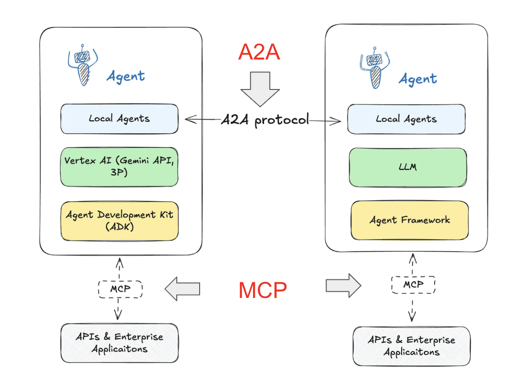

# 6. 完全自動化への道筋

---

## 6-1. コーディングアシスタントの活用

#### Claude Code

- **コード生成**: 特許分析ツールの作成・カスタムスクリプトの開発
- **デバッグ支援**: エラーの自動修正・パフォーマンス最適化
- **最適化**: アルゴリズム改善・メモリ使用量の最適化
- **ドキュメント生成**: コードの自動ドキュメント化・API 仕様書作成

---

#### Cursor

- **IDE 統合**: 開発環境での直接支援・リアルタイムコード補完
- **リアルタイム**: コード作成の即座の支援・エラー予測
- **学習機能**: プロジェクト固有の学習・コードスタイルの適応
- **リファクタリング**: 自動的なコード改善・アーキテクチャ最適化

---

#### Devin

- **自律開発**: 完全自動のソフトウェア開発・要件から実装まで
- **要件理解**: 自然言語からの仕様理解・技術選択の自動化
- **継続改善**: フィードバックによる改善・継続的デプロイメント
- **プロジェクト管理**: タスク分割・進捗管理・品質保証

---

#### 知財業務での活用例

```python
# Claude Code による特許分析ツールの自動生成
<role>
あなたは特許分析システム開発の専門家で、PythonとAI技術に精通しています。
効率的で保守性の高いコード作成と、特許業務の自動化を得意としています。
</role>

<context>
特許文献の自動分析ツールを開発する必要があります。
特許データベースからの情報取得、技術分類、競合分析、レポート生成を統合したシステムが求められています。
</context>

<task>
以下の要件で特許文献の自動分析ツールを作成してください：

機能要件：
- 特許データベースからの情報取得
- 技術分類の自動化
- 競合分析の実行
- レポート生成機能
- Web インターフェース

以下の手順で段階的に開発してください：
1. まず、データベース連携機能を実装
2. 次に、分析アルゴリズムを実装
3. そして、レポート生成機能を追加
4. 最後に、Web インターフェースを構築
</task>

<output_format>
出力形式：
- クラスベースの設計
- 設定可能なパラメータ
- 詳細なログ出力
- エラーハンドリング
- 拡張性のある構造
</output_format>

<constraints>
制約：
- 保守性の高いコード設計
- 適切なエラーハンドリング
- メモリ効率の考慮
- セキュリティの確保
</constraints>

# 自動生成されるコード例
class PatentAnalysisTool:
    def __init__(self):
        self.api_client = PatentAPIClient()
        self.llm = OpenAI()
        self.vectorstore = Chroma()

    def analyze_patent_landscape(self, technology_domain):
        # 自動生成された分析ロジック
        patents = self.api_client.search_patents(technology_domain)
        analysis = self.perform_analysis(patents)
        report = self.generate_report(analysis)
        return report
```

---

## 6-2. GeminiCli について

#### 特徴

- **コマンドライン統合**: ターミナルからの直接利用・シェルスクリプト統合
- **スクリプト化**: 自動化の容易な実装・バッチ処理の支援
- **ファイル操作**: ローカルファイルの直接処理・一括変換
- **API 連携**: 外部サービスとの統合・データ取得・処理

---

#### 活用例

```bash
# 特許文献の一括処理
gemini process patents/*.pdf --output analysis/ --format json

# 定期レポートの自動生成
gemini generate-report --template weekly --data patents.json --output reports/

# 技術動向の監視
gemini monitor-trends --keywords "AI,patent" --interval daily --output trends/

# 文書の自動翻訳
gemini translate --input japanese_patents/ --output english_patents/ --source ja --target en
```

#### 知財業務での具体的活用

**特許文献の一括分析**

```bash
# 複数の特許文献を一括で分析
gemini analyze-patents \
  --input-dir ./patent_documents/ \
  --output-dir ./analysis_results/ \
  --analysis-type "technical_trends,competitor_analysis,classification" \
  --format "json,csv,pdf"
```

**技術動向の自動監視**

```bash
# 特定技術分野の動向を自動監視
gemini setup-monitoring \
  --technology "artificial intelligence" \
  --keywords "machine learning,deep learning,neural networks" \
  --frequency "daily" \
  --notification "email,slack" \
  --output "./monitoring_results/"
```

---

## 6-3. Claude Code CLI の活用

#### Claude Code CLI の基本概念

**Claude Code CLI とは**

- **コマンドライン統合**: ターミナルからの直接利用
- **コード生成**: 自然言語からのコード自動生成
- **プロジェクト管理**: 既存プロジェクトの理解と改善
- **デバッグ支援**: エラーの自動修正と最適化

**主要機能**

- **ファイル操作**: 既存ファイルの読み込み・分析・修正
- **コード生成**: 新規ファイルの作成・機能追加
- **プロジェクト分析**: プロジェクト全体の構造理解
- **自動テスト**: テストコードの生成・実行

#### インストールと設定

**インストール手順**

```bash
# Claude Code CLI のインストール
npm install -g @anthropic-ai/claude-code-cli

# または
pip install claude-code-cli

# 認証設定
claude-code auth
```

**基本設定**

```bash
# 設定ファイルの作成
claude-code init

# プロジェクトの設定
claude-code config --project-path ./my-project
claude-code config --language python
claude-code config --framework flask
```

#### 知財業務での活用例

**特許分析スクリプトの生成**

```bash
# 特許分析スクリプトの生成
claude-code generate \
  --prompt "特許文献を分析するPythonスクリプトを作成してください。PDFファイルを読み込み、テキストを抽出し、キーワード分析を行い、結果をCSVファイルに出力する機能が必要です。" \
  --output patent_analyzer.py \
  --language python

# 生成されたスクリプトの実行
python patent_analyzer.py --input patents/ --output results/
```

**既存コードの改善**

```bash
# 既存の特許検索スクリプトを改善
claude-code improve \
  --file patent_search.py \
  --prompt "エラーハンドリングを追加し、ログ機能を実装し、パフォーマンスを最適化してください。"

# 特定の関数を改善
claude-code improve \
  --file patent_search.py \
  --function search_patents \
  --prompt "検索精度を向上させ、結果の並び替え機能を追加してください。"
```

#### 活用パターン

**プロジェクト全体の分析**

```bash
# プロジェクト全体の構造分析
claude-code analyze \
  --project-path ./patent-analysis-system \
  --output analysis_report.md

# 改善提案の生成
claude-code suggest \
  --project-path ./patent-analysis-system \
  --focus "performance,security,maintainability"
```

**自動テストの生成**

```bash
# 既存コードに対するテストの生成
claude-code test \
  --file patent_analyzer.py \
  --output test_patent_analyzer.py \
  --framework pytest

# テストの実行
pytest test_patent_analyzer.py
```

#### 高度な活用例

**特許監視システムの構築**

```bash
# 特許監視システムの生成
claude-code generate \
  --prompt "特許監視システムを作成してください。以下の機能が必要です：
  1. 定期的な特許検索（毎日午前2時）
  2. 新規特許の自動検出
  3. 重要度評価
  4. メール通知機能
  5. データベース保存
  6. Web ダッシュボード" \
  --output patent_monitor/ \
  --structure "modular"

# システムの実行
cd patent_monitor
python main.py
```

**API クライアントの生成**

```bash
# 特許庁API クライアントの生成
claude-code generate \
  --prompt "特許庁API を使用するPython クライアントを作成してください。
  - 特許検索機能
  - 特許詳細取得機能
  - エラーハンドリング
  - レート制限対応
  - キャッシュ機能" \
  --output patent_api_client.py
```

#### 設定とカスタマイズ

**プロジェクト固有の設定**

```bash
# プロジェクト設定ファイルの作成
claude-code config create \
  --name "patent-analysis" \
  --language python \
  --framework "fastapi,langchain" \
  --database "postgresql" \
  --testing "pytest"

# カスタムテンプレートの設定
claude-code template create \
  --name "patent-analyzer" \
  --template "特許分析用のクラステンプレート" \
  --file template.py
```

**ワークフローの自動化**

```bash
# 自動化ワークフローの設定
claude-code workflow create \
  --name "daily-patent-analysis" \
  --steps "search,analyze,report,notify" \
  --schedule "daily 02:00" \
  --output workflow.yaml

# ワークフローの実行
claude-code workflow run daily-patent-analysis
```

#### 効果測定と改善

**コード品質の測定**

```bash
# コード品質の分析
claude-code quality \
  --file patent_analyzer.py \
  --metrics "complexity,coverage,maintainability"

# 改善提案の生成
claude-code improve \
  --file patent_analyzer.py \
  --focus "quality" \
  --output improved_patent_analyzer.py
```

**パフォーマンス最適化**

```bash
# パフォーマンス分析
claude-code profile \
  --file patent_analyzer.py \
  --input large_patent_dataset/

# 最適化提案の生成
claude-code optimize \
  --file patent_analyzer.py \
  --focus "performance" \
  --output optimized_patent_analyzer.py
```

---

## 6-4. 寝てる間に進めてもらう

#### 自動化戦略

- **スケジューリング**: 定期的なタスク実行・時間帯最適化
- **条件分岐**: 状況に応じた処理選択・優先度の動的調整
- **通知機能**: 完了・異常の自動通知・進捗レポート
- **継続学習**: 実行結果からの学習・改善の自動化

#### 実装例

```python
# 夜間自動処理システムの生成プロンプト
<role>
あなたは自動化システム開発の専門家で、スケジューリングとバッチ処理に精通しています。
安定した長時間運用とエラーハンドリングの実装を得意としています。
</role>

<context>
夜間の特許分析自動化システムを開発する必要があります。
定期的な特許検索、分析、レポート生成、通知を自動実行するシステムが求められています。
</context>

<task>
以下の要件で夜間自動処理システムを作成してください：

機能要件：
- 定期的な特許検索実行
- 重要度評価と優先順位付け
- 技術動向分析
- レポート自動生成
- 通知システム

技術要件：
- Python 3.8以上
- schedule ライブラリ使用
- ログ機能
- エラーハンドリング
- 通知機能（メール・Slack）

以下の手順で段階的に開発してください：
1. まず、スケジューリング機能を実装
2. 次に、分析エンジンを実装
3. そして、レポート生成機能を追加
4. 最後に、通知・エラーハンドリング機能を実装
</task>

<output_format>
出力形式：
- クラスベースの設計
- 設定可能なスケジュール
- 詳細なログ出力
- エラーハンドリング
- 通知機能
</output_format>

<constraints>
制約：
- 安定した長時間運用
- 適切なエラーハンドリング
- リソース効率の考慮
- セキュリティの確保
</constraints>

# 自動生成されるコード例
import schedule
import time
from datetime import datetime
import logging

class NightlyPatentAnalysis:
    def __init__(self):
        self.logger = self.setup_logging()
        self.analysis_engine = PatentAnalysisEngine()
        self.notification_system = NotificationSystem()

    def setup_schedule(self):
        """スケジュール設定"""
        # 毎日午前2時に実行
        schedule.every().day.at("02:00").do(self.nightly_patent_analysis)

        # 毎週月曜日の午前3時に週次レポート生成
        schedule.every().monday.at("03:00").do(self.weekly_report_generation)

        # 毎月1日の午前4時に月次分析実行
        schedule.every().month.at("04:00").do(self.monthly_analysis)

    def nightly_patent_analysis(self):
        """夜間特許分析"""
        try:
            self.logger.info("夜間特許分析を開始")

            # 1. 新規特許の自動検索
            new_patents = self.analysis_engine.search_new_patents()

            # 2. 重要度評価
            prioritized_patents = self.analysis_engine.evaluate_importance(new_patents)

            # 3. 技術動向分析
            trend_analysis = self.analysis_engine.analyze_trends(prioritized_patents)

            # 4. レポート生成
            report = self.analysis_engine.generate_daily_report(trend_analysis)

            # 5. 通知送信
            self.notification_system.send_daily_report(report)

            self.logger.info("夜間特許分析が完了")

        except Exception as e:
            self.logger.error(f"夜間分析でエラーが発生: {e}")
            self.notification_system.send_error_notification(e)

    def run(self):
        """スケジューラー実行"""
        self.setup_schedule()

        while True:
            schedule.run_pending()
            time.sleep(60)  # 1分ごとにチェック

# 実行
if __name__ == "__main__":
    nightly_analysis = NightlyPatentAnalysis()
    nightly_analysis.run()
```

#### 注意点

- **品質管理**: 自動処理結果の確認・検証システムの構築
- **エラーハンドリング**: 異常時の対応・復旧機能の実装
- **セキュリティ**: 機密情報の保護・アクセス制御の強化
- **監視・ログ**: 実行状況の監視・詳細ログの記録

---

## 6-5. 完全自動化システムの構築

#### システムアーキテクチャ

```python
# 完全自動化システムの生成プロンプト
<role>
あなたは完全自動化システム開発の専門家で、AIと機械学習に精通しています。
自律的な意思決定と継続的改善を実現するシステム設計を得意としています。
</role>

<context>
完全自動化された特許分析システムを開発する必要があります。
データ収集から分析、品質評価、レポート生成、通知まで、人間の介入なしで動作するシステムが求められています。
</context>

<task>
以下の要件で完全自動化システムを作成してください：

機能要件：
- 自動データ収集
- 自律的分析実行
- 品質評価と改善
- レポート自動生成
- 通知システム
- 継続的学習

技術要件：
- Python 3.8以上
- AI/ML ライブラリ
- 品質評価システム
- 通知機能
- 学習機能

以下の手順で段階的に開発してください：
1. まず、データ収集・分析機能を実装
2. 次に、品質評価システムを実装
3. そして、自律的改善機能を追加
4. 最後に、完全自動化ワークフローを構築
</task>

<output_format>
出力形式：
- モジュラー設計
- 設定可能な品質閾値
- 詳細なログ出力
- 学習機能
- 通知システム
</output_format>

<constraints>
制約：
- 完全自律的な動作
- 継続的な学習と改善
- 品質管理の自動化
- エラー時の自動復旧
</constraints>

# 自動生成されるコード例
class FullyAutomatedPatentSystem:
    def __init__(self):
        self.data_collector = DataCollector()
        self.analyzer = PatentAnalyzer()
        self.report_generator = ReportGenerator()
        self.notification_system = NotificationSystem()
        self.quality_checker = QualityChecker()

    def automated_workflow(self):
        """完全自動化ワークフロー"""
        while True:
            try:
                # 1. データ収集
                new_data = self.data_collector.collect_new_data()

                # 2. 自動分析
                analysis_results = self.analyzer.analyze_all(new_data)

                # 3. 品質チェック
                quality_score = self.quality_checker.check_quality(analysis_results)

                # 4. レポート生成
                if quality_score > 0.8:  # 品質閾値
                    report = self.report_generator.generate_report(analysis_results)

                    # 5. 自動配信
                    self.notification_system.distribute_report(report)

                # 6. 学習・改善
                self.analyzer.learn_from_results(analysis_results, quality_score)

                time.sleep(3600)  # 1時間待機

            except Exception as e:
                self.notification_system.send_error_notification(e)
                time.sleep(300)  # エラー時は5分待機
```

#### 自動化レベル

**Level 1: 基本自動化**

- 定期的なデータ収集
- 基本的な分析実行
- 単純なレポート生成

**Level 2: 高度自動化**

- 条件分岐による処理選択
- 品質評価と自動改善
- 異常検知と自動対応

**Level 3: 完全自動化**

- 自律的な意思決定
- 継続的な学習と最適化
- 人間の介入なしでの運用

---

## 6-6. 自動化の効果測定

#### 定量的効果

**効率性指標**

- **処理時間**: 自動化前後の処理時間比較
- **処理量**: 単位時間あたりの処理件数
- **コスト**: 人的コスト・運用コストの削減
- **精度**: 自動化による精度向上

**品質指標**

- **エラー率**: 人的エラーの削減
- **一貫性**: 処理結果の標準化
- **完全性**: 処理漏れの防止
- **タイムリー性**: リアルタイム処理の実現

#### 効果測定例

```python
class AutomationEffectiveness:
    def __init__(self):
        self.metrics = {}
        self.baseline = self.load_baseline_data()

    def measure_effectiveness(self, automated_system):
        """自動化効果の測定"""
        # 処理時間の測定
        processing_time = self.measure_processing_time(automated_system)

        # 処理量の測定
        processing_volume = self.measure_processing_volume(automated_system)

        # 精度の測定
        accuracy = self.measure_accuracy(automated_system)

        # コストの測定
        cost_savings = self.calculate_cost_savings(automated_system)

        return {
            "processing_time_improvement":
                (self.baseline["processing_time"] - processing_time) / self.baseline["processing_time"] * 100,
            "processing_volume_improvement":
                (processing_volume - self.baseline["processing_volume"]) / self.baseline["processing_volume"] * 100,
            "accuracy_improvement":
                (accuracy - self.baseline["accuracy"]) / self.baseline["accuracy"] * 100,
            "cost_savings_percentage": cost_savings / self.baseline["cost"] * 100
        }
```

#### ROI 計算

```python
def calculate_roi(automation_investment, annual_savings):
    """ROI 計算"""
    roi = (annual_savings - automation_investment) / automation_investment * 100

    payback_period = automation_investment / annual_savings * 12  # 月数

    return {
        "roi_percentage": roi,
        "payback_period_months": payback_period,
        "annual_savings": annual_savings,
        "investment": automation_investment
    }

# 計算例
investment = 5000000  # 500万円
annual_savings = 15000000  # 1,500万円
roi_result = calculate_roi(investment, annual_savings)
# ROI: 200%, 回収期間: 4ヶ月
```

---

## 6-7. 将来展望と課題

#### 技術的展望

**短期（1-2 年）**

- **AGI の進歩**: より高度な自律的処理の実現
- **マルチモーダル対応**: 画像・音声・動画の統合処理
- **リアルタイム処理**: 即座の応答と分析
- **エッジコンピューティング**: ローカルでの高速処理

**中期（3-5 年）**

- **完全自律システム**: 人間の介入なしでの運用
- **予測分析**: 将来の技術動向・リスク予測
- **創造的 AI**: 新規発明・技術の創出支援
- **量子コンピューティング**: 超高速計算による分析

**長期（5 年以上）**

- **AGI 統合**: 汎用人工知能との協働
- **量子コンピューティング**: 超高速計算による分析
- **脳型 AI**: 人間の思考プロセスの模倣
- **AI 社会**: AI と人間の共生社会

#### 課題と対策

**技術的課題**

- **精度向上**: 継続的な学習・改善
- **セキュリティ**: 高度なセキュリティ対策
- **スケーラビリティ**: 大規模システム対応
- **信頼性**: システムの安定性確保

**社会的課題**

- **雇用への影響**: 新しい役割の創出・スキルアップ
- **倫理的配慮**: AI の意思決定の透明性
- **法的規制**: AI 利用に関する法整備
- **プライバシー**: 個人情報保護の強化

**組織的課題**

- **変化管理**: 組織文化の変革
- **スキル開発**: AI 活用スキルの向上
- **ガバナンス**: AI 利用の適切な管理
- **リスク管理**: AI リスクの特定・対策

---

## 6-8. Claude Code、Cursor、GeminiCli 等による自動化

#### Claude Code の活用

**Claude Code の特徴**

- **高度なコード生成**: 複雑なロジックの自動生成
- **コンテキスト理解**: プロジェクト全体の理解
- **デバッグ支援**: エラーの自動修正と最適化
- **ドキュメント生成**: コードの自動ドキュメント化

**知財業務での活用例**

````python
# Claude Code による特許分析システムの自動生成
<role>
あなたは特許分析システム開発の専門家で、PythonとAI技術に精通しています。
効率的で保守性の高いコード作成と、特許業務の自動化を得意としています。
</role>

<context>
特許文献の自動分析ツールを開発する必要があります。
特許データベースからの情報取得、技術分類、競合分析、レポート生成を統合したシステムが求められています。
</context>

<task>
以下の要件で特許文献の自動分析ツールを作成してください：

機能要件：
- 特許データベースからの情報取得
- 技術分類の自動化
- 競合分析の実行
- レポート生成機能
- Web インターフェース

以下の手順で段階的に開発してください：
1. まず、データベース連携機能を実装
2. 次に、分析アルゴリズムを実装
3. そして、レポート生成機能を追加
4. 最後に、Web インターフェースを構築
</task>

<output_format>
出力形式：
- クラスベースの設計
- 設定可能なパラメータ
- 詳細なログ出力
- エラーハンドリング
- 拡張性のある構造
</output_format>

<constraints>
制約：
- 保守性の高いコード設計
- 適切なエラーハンドリング
- メモリ効率の考慮
- セキュリティの確保
</constraints>

#### Cursor の活用

**Cursor の特徴**

- **IDE 統合**: 開発環境での直接支援
- **リアルタイム支援**: コード作成の即座の支援
- **学習機能**: プロジェクト固有の学習
- **リファクタリング**: 自動的なコード改善

**知財業務での活用例**

```python
# Cursor による特許データ処理システムの開発
class PatentDataProcessor:
    def __init__(self):
        self.api_client = PatentAPIClient()
        self.llm = OpenAI()
        self.vectorstore = Chroma()

    def process_patent_data(self, patent_ids):
        """特許データの一括処理"""
        results = []

        for patent_id in patent_ids:
            # 特許情報の取得
            patent_data = self.api_client.get_patent(patent_id)

            # 技術分析の実行
            analysis = self.analyze_technology(patent_data)

            # 結果の保存
            results.append({
                'patent_id': patent_id,
                'analysis': analysis,
                'timestamp': datetime.now()
            })

        return results

    def analyze_technology(self, patent_data):
        """技術分析の実行"""
        # 技術要素の抽出
        technical_elements = self.extract_technical_elements(patent_data)

        # 重要度の評価
        importance_score = self.calculate_importance(technical_elements)

        # 関連技術の検索
        related_technologies = self.find_related_technologies(technical_elements)

        return {
            'technical_elements': technical_elements,
            'importance_score': importance_score,
            'related_technologies': related_technologies
        }
````

#### GeminiCli の活用

**GeminiCli の特徴**

- **コマンドライン統合**: ターミナルからの直接利用
- **スクリプト自動化**: シェルスクリプトの自動生成
- **システム管理**: システム設定の自動化
- **バッチ処理**: 大量データの一括処理

**知財業務での活用例**

```bash
# GeminiCli による特許監視システムの自動化
#!/bin/bash

# 特許監視スクリプトの自動生成
gemini-cli generate-script --type "patent-monitoring" \
  --input "patent_keywords.txt" \
  --output "monitor_patents.sh" \
  --schedule "daily" \
  --notification "email"

# 生成されたスクリプトの例
#!/bin/bash
# 特許監視スクリプト

# 設定ファイルの読み込み
source config.sh

# 特許検索の実行
python3 patent_search.py --keywords "$KEYWORDS" --output "$OUTPUT_DIR"

# 新規特許の検出
python3 detect_new_patents.py --input "$OUTPUT_DIR" --threshold "$THRESHOLD"

# 通知の送信
if [ -f "new_patents.txt" ]; then
    python3 send_notification.py --file "new_patents.txt" --method "email"
fi

# ログの記録
echo "$(date): Patent monitoring completed" >> "$LOG_FILE"
```

#### 統合的な自動化システム

**複数ツールの連携**

```python
# 統合自動化システムの例
class IntegratedAutomationSystem:
    def __init__(self):
        self.claude_code = ClaudeCodeClient()
        self.cursor = CursorClient()
        self.gemini_cli = GeminiCliClient()
        self.scheduler = TaskScheduler()

    def setup_automation_pipeline(self, requirements):
        """自動化パイプラインの設定"""

        # 1. Claude Code によるシステム設計
        system_design = self.claude_code.design_system(requirements)

        # 2. Cursor によるコード生成
        code_files = self.cursor.generate_code(system_design)

        # 3. GeminiCli による自動化スクリプト生成
        automation_scripts = self.gemini_cli.generate_scripts(code_files)

        # 4. スケジューラーへの登録
        self.scheduler.register_tasks(automation_scripts)

        return {
            'system_design': system_design,
            'code_files': code_files,
            'automation_scripts': automation_scripts
        }

    def monitor_and_optimize(self):
        """システムの監視と最適化"""

        # 性能監視
        performance_metrics = self.collect_metrics()

        # 自動最適化
        if performance_metrics['efficiency'] < 0.8:
            optimization_suggestions = self.claude_code.optimize_system(performance_metrics)
            self.apply_optimizations(optimization_suggestions)

        # レポート生成
        self.generate_performance_report(performance_metrics)
```

#### 導入方法

**段階的な導入**

1. **準備フェーズ**

   - ツールのインストールと設定
   - 基本的な使用方法の習得
   - 小規模なテストの実施

2. **実装フェーズ**

   - 特定業務の自動化
   - 効果測定の実施
   - 改善の継続

3. **拡張フェーズ**
   - 複数業務の統合
   - 高度な自動化の実現
   - 組織全体への展開

**効果測定と改善**

- **定量的指標**: 処理時間、処理量、精度、コスト
- **定性的指標**: 品質向上、一貫性、満足度
- **継続的改善**: 定期的な評価と改善の実施
- **ベストプラクティス**: 成功パターンの蓄積と共有

---

## 6-4. AI エージェントのクラウドベンダー比較

#### 主要クラウドベンダーの AI エージェントサービス

出典:[生成 AI の AI エージェントを大手 3 社（AWS、Azure、Google Cloud）で徹底比較してみた](https://blog.g-gen.co.jp/entry/comparing-agent-architecture-across-cloud-vendors)

---

**Amazon Bedrock Agents（AWS）**

- **構成要素**: エージェント、ツール、ナレッジベース、アクション
- **対応モデル**: Claude 3.5 Sonnet、Claude 3 Haiku、Llama 3.1 405B
- **主要機能**:
  - 自然言語での複雑なタスク実行
  - ツールの動的呼び出し
  - ナレッジベースとの統合
  - アクションの実行（Lambda 関数等）
- **料金**: 入力トークン $0.00015/1K、出力トークン $0.0006/1K

---

#### Azure AI Agent Services（Azure）

**構成要素**

- **AI Agent**: 自然言語処理と意思決定
- **Tools**: 外部サービスとの連携
- **Knowledge Base**: 企業データの統合
- **Actions**: 具体的なタスク実行

**対応モデル**

- **GPT-4o**: 最新の高性能モデル
- **GPT-4 Turbo**: バランスの取れた性能
- **GPT-3.5 Turbo**: コスト効率重視

---

#### Azure AI Agent Services（Azure）の機能

**主要機能**

- **マルチエージェントシステム**: 複数エージェントの協調
- **高度なツール連携**: カスタムツールの開発・統合
- **セキュリティ**: エンタープライズレベルのセキュリティ
- **スケーラビリティ**: 大規模システムへの対応

**料金体系**

- **GPT-4o**: 入力 $0.0025/1K、出力 $0.01/1K
- **GPT-4 Turbo**: 入力 $0.01/1K、出力 $0.03/1K
- **GPT-3.5 Turbo**: 入力 $0.0005/1K、出力 $0.0015/1K

---

#### Vertex AI Playbooks（Google Cloud）

**構成要素**

- **Playbook**: タスク実行の手順定義
- **Tools**: 外部サービスとの連携
- **Knowledge Base**: 企業データの統合
- **Actions**: 具体的なタスク実行

**対応モデル**

- **Gemini 1.5 Pro**: 最新の高性能モデル
- **Gemini 1.5 Flash**: 高速処理重視
- **Gemini 1.0 Pro**: 安定性重視

---

#### Vertex AI Playbooks（Google Cloud）の機能

**主要機能**

- **Playbook 設計**: 視覚的なタスク設計
- **高度なツール連携**: カスタムツールの開発・統合
- **セキュリティ**: エンタープライズレベルのセキュリティ
- **スケーラビリティ**: 大規模システムへの対応

**料金体系**

- **Gemini 1.5 Pro**: 入力 $0.0035/1K、出力 $0.0105/1K
- **Gemini 1.5 Flash**: 入力 $0.000075/1K、出力 $0.0003/1K
- **Gemini 1.0 Pro**: 入力 $0.0005/1K、出力 $0.0015/1K

---

#### 3 社比較：機能面での違い

| 機能                   | AWS Bedrock Agents | Azure AI Agent Services | Google Cloud Playbooks |
| ---------------------- | ------------------ | ----------------------- | ---------------------- |
| **マルチエージェント** | 対応               | 対応                    | 対応                   |
| **カスタムツール**     | 対応               | 対応                    | 対応                   |
| **ナレッジベース**     | 対応               | 対応                    | 対応                   |
| **アクション実行**     | Lambda 等          | カスタムアクション      | カスタムアクション     |
| **視覚的設計**         | 制限的             | 制限的                  | Playbook 設計          |
| **セキュリティ**       | 高                 | 高                      | 高                     |

---

#### 3 社比較：料金面での違い

**想定シナリオ：社内ナレッジシステム（月間 100 万トークン）**

| ベンダー         | モデル            | 月間料金 | 特徴           |
| ---------------- | ----------------- | -------- | -------------- |
| **AWS**          | Claude 3.5 Sonnet | $150     | バランス型     |
| **AWS**          | Claude 3.5 Haiku  | $75      | 高速・低コスト |
| **Azure**        | GPT-4o            | $1,500   | 高性能         |
| **Azure**        | GPT-3.5 Turbo     | $300     | コスト効率     |
| **Google Cloud** | Gemini 1.5 Pro    | $2,000   | 最新技術       |
| **Google Cloud** | Gemini 1.5 Flash  | $50      | 高速・低コスト |
| **Anthropic**    | Claude 3.5 Sonnet | $150     | 高品質         |
| **OpenAI**       | GPT-4o            | $1,500   | 汎用性         |

---

#### 選択の指針

**AWS Bedrock Agents が適している場合**

- **安定性重視**: 実績のある Claude モデルの活用
- **コスト効率**: 比較的安価な料金体系
- **AWS 環境**: 既存の AWS インフラとの統合
- **シンプルな構成**: 基本的なエージェント機能で十分

**Azure AI Agent Services が適している場合**

- **高性能要求**: GPT-5 の最新機能が必要
- **Microsoft 環境**: 既存の Microsoft 製品との統合
- **エンタープライズ**: 大企業向けのセキュリティ・ガバナンス
- **マルチエージェント**: 複雑な協調システムの構築

---

#### 選択の指針（続き）

**Google Cloud Playbooks が適している場合**

- **最新技術**: Gemini 2.5 の最新機能を活用
- **視覚的設計**: Playbook による直感的な設計
- **Google 環境**: 既存の Google Cloud サービスとの統合
- **高速処理**: Gemini 1.5 Flash による高速処理

---

#### 実装時の考慮事項

**技術的考慮事項**

- **既存インフラ**: 現在使用中のクラウド環境
- **統合要件**: 既存システムとの連携
- **スケーラビリティ**: 将来的な拡張性
- **セキュリティ**: データ保護・アクセス制御

**組織的考慮事項**

- **スキルセット**: チームの技術力
- **予算**: 初期投資・運用コスト
- **タイムライン**: 開発・導入スケジュール
- **リスク**: 技術的・組織的リスク

---

#### 段階的な導入戦略

**フェーズ 1: 評価・検証**

```
1. 各ベンダーの無料トライアル利用
2. 小規模なPoC（概念実証）の実施
3. 機能・性能・コストの比較評価
4. 組織要件との適合性確認
```

**フェーズ 2: パイロット導入**

```
1. 選択したベンダーでの小規模導入
2. 特定業務での実証実験
3. 効果測定と改善
4. 組織内での展開準備
```

**フェーズ 3: 本格展開**

```
1. 組織全体への展開
2. 複数業務での統合活用
3. 継続的な最適化
4. ベストプラクティスの確立
```

---

## 6-9. Vellum AI LLM リーダーボードの活用

#### Vellum AI リーダーボードの概要

出典: [Vellum AI LLM Leaderboard](https://www.vellum.ai/llm-leaderboard)

**最新の LLM 性能比較**

- **更新日**: 2025 年 8 月 7 日
- **対象モデル**: 2024 年 4 月以降にリリースされた最新モデル
- **評価基準**: 非飽和ベンチマーク、独立評価
- **特徴**: 実用的なベンチマークに焦点

---

#### 主要タスク別トップモデル

**推論能力（GPQA Diamond）**

- **Grok 4**: 87.5%
- **GPT-5**: 87.3%
- **Gemini 2.5 Pro**: 86.4%
- **Grok 3 [Beta]**: 84.6%
- **OpenAI o3**: 83.3%

**高校数学（AIME 2025）**

- **GPT-5**: 100%
- **GPT oss 20b**: 98.7%
- **OpenAI o3**: 98.4%
- **GPT oss 120b**: 97.9%
- **Grok 3 [Beta]**: 93.3%

---

#### エージェント・コーディング性能

**エージェントコーディング（SWE Bench）**

- **Grok 4**: 75%
- **GPT-5**: 74.9%
- **Claude Opus 4.1**: 74.5%
- **Claude 4 Sonnet**: 72.7%
- **Claude 4 Opus**: 72.5%

**ツール使用（BFCL）**

- **Llama 3.1 405b**: 81.1%
- **Llama 3.3 70b**: 77.3%
- **GPT-4o**: 72.08%
- **GPT-4.5**: 69.94%
- **Nova Pro**: 68.4%

---

#### 速度・コスト性能

**最速モデル（トークン/秒）**

- **Llama 4 Scout**: 2,600 t/s
- **Llama 3.3 70b**: 2,500 t/s
- **Llama 3.1 70b**: 2,100 t/s
- **Llama 3.1 8b**: 1,800 t/s
- **Llama 3.1 405b**: 969 t/s

**最低遅延（TTFT）**

- **Nova Micro**: 0.3 秒
- **Llama 3.1 8b**: 0.32 秒
- **Llama 4 Scout**: 0.33 秒
- **Gemini 2.0 Flash**: 0.34 秒
- **GPT-4o mini**: 0.35 秒

---

#### コスト効率

**最も安価なモデル（100 万トークンあたり）**

- **Nova Micro**: $0.04（入力）/ $0.14（出力）
- **Gemma 3 27b**: $0.07（入力）/ $0.07（出力）
- **Gemini 1.5 Flash**: $0.075（入力）/ $0.3（出力）
- **GPT oss 20b**: $0.08（入力）/ $0.35（出力）

**知財業務での選択指針**

- **高精度要求**: GPT-5、Grok 4、Gemini 2.5 Pro
- **コスト効率**: Nova Micro、Gemma 3 27b
- **高速処理**: Llama 4 Scout、Llama 3.3 70b
- **バランス型**: Claude 3.5 Sonnet、GPT-4o

---

#### 知財業務での活用戦略

**用途別モデル選択**

**特許分析・技術評価**

- **推奨モデル**: GPT-5、Grok 4、Gemini 2.5 Pro
- **理由**: 高い推論能力、複雑な技術文書の理解

**大量データ処理**

- **推奨モデル**: Llama 4 Scout、Nova Micro
- **理由**: 高速処理、低コスト

---

**エージェント開発**

- **推奨モデル**: Grok 4、GPT-5、Claude Opus 4.1
- **理由**: 高いエージェントコーディング性能

**日常業務支援**

- **推奨モデル**: Claude 3.5 Sonnet、GPT-4o
- **理由**: バランスの取れた性能とコスト

---

## 6-10. MCP (Model Context Protocol) と A2A (Agent-to-Agent) プロトコル

#### MCP と A2A の基本概念

**MCP (Model Context Protocol)**

- **標準化プロトコル**: AI モデルとアプリケーション間の標準プロトコル
- **相互運用性**: 異なるシステム間の連携
- **拡張性**: 新機能の追加が容易
- **オープンソース**: オープンな標準規格

**A2A (Agent-to-Agent)**

- **エージェント間通信**: AI エージェント間の通信プロトコル
- **協調作業**: 複数エージェントの協調
- **タスク分担**: 効率的なタスク分担
- **結果統合**: 複数結果の統合

---

#### MCP/A2A アーキテクチャ



**アーキテクチャの構成要素**

**左側の Agent システム**

- **Local Agents**: 他の Agent システムとの A2A 通信の起点
- **Vertex AI (Gemini API, 3P)**: Google Cloud の Vertex AI、Gemini API、サードパーティ AI サービス
- **Agent Development Kit (ADK)**: Agent 開発キット

**右側の Agent システム**

- **Local Agents**: 他の Agent システムとの A2A 通信の起点
- **LLM**: 大規模言語モデル
- **Agent Framework**: Agent 構築フレームワーク

**通信プロトコル**

- **A2A Protocol**: Agent 間の直接通信
- **MCP**: 外部 API・エンタープライズアプリケーションとの連携

---

#### 知財業務での活用例

**分散特許調査システム**

```python
# MCP/A2A を使用した分散調査システム
class DistributedPatentResearch:
    def __init__(self):
        self.agents = {
            "technical": TechnicalAnalysisAgent(),
            "legal": LegalAnalysisAgent(),
            "market": MarketAnalysisAgent(),
            "competitor": CompetitorAnalysisAgent()
        }
        self.coordinator = CoordinatorAgent()
        self.mcp_client = MCPClient()

    def research(self, query):
        """分散特許調査の実行"""
        # 1. タスクの分析と分配
        tasks = self.coordinator.analyze_and_distribute(query)

        # 2. 各エージェントへのタスク分配
        agent_results = {}
        for agent_type, task in tasks.items():
            agent_results[agent_type] = self.agents[agent_type].execute(task)

        # 3. 外部APIとの連携（MCP経由）
        external_data = self.mcp_client.fetch_external_data(query)

        # 4. 結果の統合
        final_report = self.coordinator.integrate_results(agent_results, external_data)

        return final_report

    def continuous_monitoring(self, keywords):
        """継続的な特許監視"""
        # 各エージェントによる並列監視
        monitoring_tasks = {
            "new_patents": self.agents["technical"].monitor_new_patents,
            "legal_changes": self.agents["legal"].monitor_legal_changes,
            "market_trends": self.agents["market"].monitor_market_trends,
            "competitor_activity": self.agents["competitor"].monitor_competitor_activity
        }

        # 並列実行
        results = {}
        for task_name, task_func in monitoring_tasks.items():
            results[task_name] = task_func(keywords)

        return self.coordinator.analyze_monitoring_results(results)
```

**特許分析エージェントの実装例**

```python
class TechnicalAnalysisAgent:
    def __init__(self):
        self.llm = OpenAI()
        self.vectorstore = Chroma()
        self.mcp_client = MCPClient()

    def execute(self, task):
        """技術分析タスクの実行"""
        # 1. 特許文献の検索
        patents = self.search_patents(task["keywords"])

        # 2. 技術分析の実行
        analysis = self.analyze_technology(patents)

        # 3. 外部データの取得（MCP経由）
        external_data = self.mcp_client.get_technical_data(task["domain"])

        # 4. 結果の統合
        return self.integrate_analysis(analysis, external_data)

    def search_patents(self, keywords):
        """特許文献の検索"""
        # ベクトル検索の実行
        results = self.vectorstore.similarity_search(keywords, k=10)
        return results

    def analyze_technology(self, patents):
        """技術分析の実行"""
        analysis_prompt = f"""
        以下の特許文献を技術的に分析してください：

        {patents}

        分析項目：
        1. 技術的新規性
        2. 実装可能性
        3. 市場性
        4. 競合技術との比較
        """

        return self.llm.generate(analysis_prompt)

class LegalAnalysisAgent:
    def __init__(self):
        self.llm = Claude()
        self.legal_database = LegalDatabase()
        self.mcp_client = MCPClient()

    def execute(self, task):
        """法的分析タスクの実行"""
        # 1. 法的リスクの分析
        legal_risks = self.analyze_legal_risks(task["patent_data"])

        # 2. 特許性の評価
        patentability = self.evaluate_patentability(task["invention"])

        # 3. 外部法務データの取得（MCP経由）
        legal_precedents = self.mcp_client.get_legal_precedents(task["technology"])

        return {
            "legal_risks": legal_risks,
            "patentability": patentability,
            "legal_precedents": legal_precedents
        }
```

---

#### MCP/A2A の導入戦略

**段階的導入アプローチ**

**Phase 1: 基盤構築（1-2 ヶ月）**

```
1. MCP クライアントの設定
   - プロトコルの理解
   - 基本設定の実装
   - テスト環境の構築

2. 単一エージェントの開発
   - 基本的なエージェント機能
   - MCP との連携
   - 品質保証の実装
```

**Phase 2: マルチエージェント化（2-3 ヶ月）**

```
1. A2A プロトコルの実装
   - エージェント間通信の設定
   - タスク分配ロジックの実装
   - 結果統合機能の開発

2. 協調作業の実装
   - 複数エージェントの協調
   - 競合解決の仕組み
   - 品質管理の強化
```

**Phase 3: 本格運用（3-6 ヶ月）**

```
1. 大規模システムへの展開
   - スケーラビリティの確保
   - パフォーマンスの最適化
   - 監視・ログ機能の強化

2. 継続的改善
   - 効果測定の実施
   - 新機能の追加
   - ベストプラクティスの確立
```

**効果測定と改善**

```python
class MCPA2AMetrics:
    def __init__(self):
        self.metrics = {}

    def measure_performance(self, system):
        """システム性能の測定"""
        metrics = {
            "response_time": self.measure_response_time(system),
            "accuracy": self.measure_accuracy(system),
            "throughput": self.measure_throughput(system),
            "cost": self.measure_cost(system),
            "scalability": self.measure_scalability(system)
        }

        return metrics

    def measure_response_time(self, system):
        """応答時間の測定"""
        start_time = time.time()
        result = system.execute_test_task()
        end_time = time.time()

        return end_time - start_time

    def measure_accuracy(self, system):
        """精度の測定"""
        test_cases = self.load_test_cases()
        correct_results = 0

        for test_case in test_cases:
            result = system.execute(test_case["input"])
            if self.evaluate_result(result, test_case["expected"]):
                correct_results += 1

        return correct_results / len(test_cases)

    def generate_performance_report(self):
        """性能レポートの生成"""
        report = {
            "timestamp": datetime.now(),
            "metrics": self.metrics,
            "trends": self.analyze_trends(),
            "recommendations": self.generate_recommendations()
        }

        return report
```

---

#### 将来展望と課題

**技術的展望**

**短期（1 年以内）**

- **プロトコル標準化**: MCP/A2A の標準化の進展
- **ツールエコシステム**: 開発ツールの充実
- **パフォーマンス向上**: 通信効率の改善

**中期（1-3 年）**

- **高度な協調**: より複雑な協調作業の実現
- **自律性の向上**: エージェントの自律性強化
- **セキュリティ強化**: セキュアな通信の実現

**長期（3 年以上）**

- **AGI 統合**: 汎用人工知能との統合
- **量子通信**: 量子通信技術の活用
- **分散 AI**: 完全分散型 AI システムの実現

**課題と対策**

**技術的課題**

- **プロトコル標準化**: 業界標準の確立
- **相互運用性**: 異なるシステム間の連携
- **セキュリティ**: セキュアな通信の確保
- **スケーラビリティ**: 大規模システムへの対応

**組織的課題**

- **スキル開発**: 新しい技術スキルの習得
- **組織文化**: 協調作業を重視する文化の構築
- **ガバナンス**: 分散システムの適切な管理
- **リスク管理**: 新技術導入のリスク管理

---
